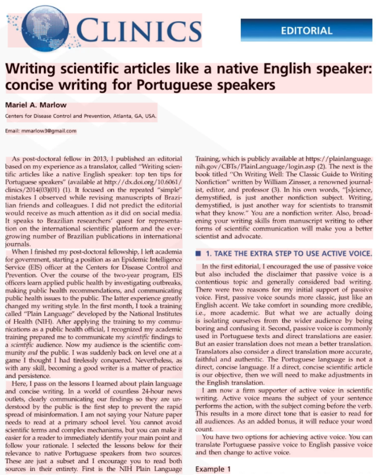

This algorithm works best with large amounts of structured text such as scanned contracts, book pages, articles, newspapers, and the like. It breaks content into larger blocks, such as paragraphs and columns. These blocks are then analyzed, read and combined into recognition results.



_\*The example article is Copyright &copy; 2016 CLINICS, distributed under the terms of the Creative Commons license._

However, it may not be suitable for analyzing photographs and small amounts of irregular text - try [**detect_areas_mode_enum::PHOTO**](/ocr/cpp/areas-detection/photo/) instead.

## Example

The following code sample demonstrates how to use this document areas detection algorithm:

```cpp
std::string image_path = "source.png";
const size_t len = 4096;
wchar_t buffer[len] = { 0 };
RecognitionSettings settings;
settings.detect_areas_mode = detect_areas_mode_enum::DOCUMENT;
size_t res_len = aspose::ocr::page_settings(image_path.c_str(), buffer, len, settings);
std::wcout << buffer;
```
