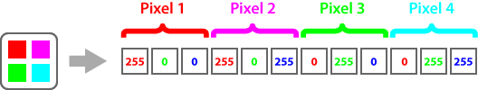

Aspose.OCR allows you to [provide](/ocr/cpp/content-for-ocr/) an image for recognition as raw pixel data. This can be useful when working with [unsupported](/ocr/cpp/supported-file-formats/) file formats or with raw bitmaps.

Pixels are listed from left to right (by line), and each line is added from top to bottom.

## Adding color image

The color image is provided in `raw_data` member of `AsposeOCRInput` structure as a string literal (`unsigned char*`), representing the amount of each color per pixel in red-green-blue (RGB) order. The amount ranges from 0 to 255, where 0 means no that color and 255 is the maximum amount of that color. For example, 2x2 pixels color bitmap is represented as following:

Because the raw pixel data does not contain an image header, you must directly specify:

`AsposeOCRInput` structure member | Type | Value
--------------------------------- | ---- | -----
`width` | `size_t` | Image width, in pixels.
`height` | `size_t` | Image height, in pixels.
`raw_data_size` | `size_t` | Raw pixel data size, equal to the number of pixels divided by 3.
`raw_data_type` | `AsposeOCRRawDataType` | Must be `AsposeOCRRawDataType.ASPOSE_OCR_RGB`.

## Adding grayscale image

The image is provided in `raw_data` member of `AsposeOCRInput` structure as a string literal (`unsigned char*`), where each byte represents the degree of pixel brightness (one byte per pixel). The value ranges from 0 to 255, where 0 means black and 255 means white.

Because the raw pixel data does not contain an image header, you must directly specify:

`AsposeOCRInput` structure member | Type | Value
--------------------------------- | ---- | -----
`width` | `size_t` | Image width, in pixels.
`height` | `size_t` | Image height, in pixels.
`raw_data_size` | `size_t` | Raw pixel data size, equal to the number of pixels.
`raw_data_type` | `AsposeOCRRawDataType` | Must be `AsposeOCRRawDataType.ASPOSE_OCR_GRAYSCALE`.
