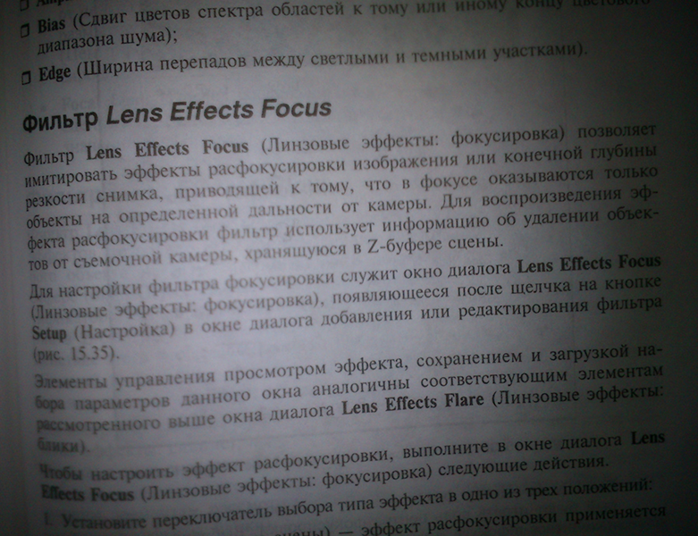

<style>
	button {
		cursor: pointer;
		margin-right: 20px;
		padding: 7px 15px;
		border: none;
		border-radius: 5px;
		background-color: #1a89d0;
		font-weight: 700;
		font-size: 15px;
		color: #ffffff;
	}

	button:hover {
		background-color: #3071a9;
	}

	button:focus {
		outline: none;
	}

	#sample {
		position: relative;
	}

	#sample > div {
		position: absolute;
		display: none;
		border: dashed 1px #de4444;
		background-color: rgba(222,68,68,0.2);
	}

	#area1 {
		top: 0px;
		left: 0px;
		width: 60px;
		height: 50px;
	}

	#area2 {
		top: 0px;
		left: 560px;
		width: 220px;
		height: 590px;
	}

	#area3 {
		top: 550px;
		left: 0px;
		width: 90px;
		height: 40px;
	}
</style>

Image defects can significantly impact the accuracy of OCR. They can be caused by the quality of the image acquisition process, environmental conditions, and the hardware used to capture the image. To improve recognition accuracy, it is essential to [preprocess and enhance](/ocr/cpp/image-preprocessing/) images to mitigate these defects whenever possible.

Aspose.OCR for C++ can automatically find potentially problematic areas of image during [recognition](/ocr/cpp/recognition/). In order to enable this functionality, specify the type of image defects to be detected in `defect_type` member of [recognition settings](/ocr/cpp/settings/) or use a specialized `asposeocr_detect_defects()` function. The latter approach only returns the information about defects without recognizing the image.

The following types of defects can be found:

Defect | Enumeration | Description | Impact | How to mitigate
------ | ----------- | ----------- | ------ | ---------------
[Salt-and-pepper noise](https://en.wikipedia.org/wiki/Salt-and-pepper_noise) | `AsposeOCRDefectType.ASPOSE_OCR_SALT_PEPPER_NOISE` | Appears as random white and black pixels scattered across the area. Often occurs in digital photographs. | <ul><li>Some characters are misidentified</li><li>Unnecessary dots or commas appear in recognition results</li></ul> | <ul><li>Apply [median filter](/ocr/cpp/median/)</li><li>Use [automatic noise removal](/ocr/cpp/denoise/)</li></ul>
Low contrast between text and background | `AsposeOCRDefectType.ASPOSE_OCR_DARK_IMAGES` | Highlights and shadows typically appear on curved pages. | <ul><li>Low recognition accuracy</li><li>Text not recognized (ignored by OCR engine)</li></ul> | <ul><li>[Automatically adjust contrast](/ocr/cpp/contrast/)</li><li>[Convert to grayscale](/ocr/cpp/grayscale/)</li><li>[Binarize with high threshold](/ocr/cpp/binarization/#using-binarization-threshold)</li></ul>
Curved text | `AsposeOCRDefectType.ASPOSE_OCR_CURVED_TEXT` | Cylindrical curvature of the page that often appear when photographing pages of books and magazine articles. | <ul><li>Some characters are misidentified</li><li>Text not recognized</li></ul> | <ul><li>Use [detect_areas_mode_enum::CURVED_TEXT](/ocr/cpp/areas-detection/curved_text/) areas detection mode</li></ul>
Blur | `AsposeOCRDefectType.ASPOSE_OCR_BLURED_IMAGE` | The entire image or some of its areas are out of focus.<br />**Important:** This detection algorithm can only identify the entire image as blurry. Specific areas cannot be detected. | <ul><li>Characters are not recognized correctly</li><li>Text not recognized (ignored by OCR engine)</li></ul> | <ul><li>Use [automatic contrast correction](/ocr/cpp/contrast/)</li><li>[Convert image to grayscale](/ocr/cpp/grayscale/)</li></ul>
Glare | `AsposeOCRDefectType.ASPOSE_OCR_GLARE` | Highlight areas in an image caused by uneven lighting, such as spot lights or flash. | <ul><li>Low recognition accuracy</li><li>Text not recognized (ignored by OCR engine)</li></ul> | <ul><li>[Automatically adjust contrast](/ocr/cpp/contrast/)</li><li>[Convert to grayscale](/ocr/cpp/grayscale/)</li><li>[Binarize with high threshold](/ocr/cpp/binarization/#using-binarization-threshold)</li></ul>
Thick text | `AsposeOCRDefectType.ASPOSE_OCR_EXTRA_BOLD_TEXT` | Extra-bold text. | <ul><li>Some characters are misidentified</li></ul> | <ul><li>At the moment, Aspose.OCR engine does not have a preprocessing algorithm that can deal with such text.</li></ul>

{}
If the value of the `defect_type` member in [recognition settings](/ocr/cpp/settings/) is not specified, the image will not be analyzed for problems. This can speed up the OCR speed and lower resource usage.
{}

The number of areas with problems are returned in `defects_count` property of [`AsposeOCRRecognizedPage`](https://reference.aspose.com/ocr/cpp/struct/aspose_o_c_r_recognized_page/) structure returned in [recognition results](https://reference.aspose.com/ocr/cpp/struct/aspose_o_c_r_recognition_result). The areas of the image with defects are returned in `defect_areas` property of [`AsposeOCRRecognizedPage`](https://reference.aspose.com/ocr/cpp/struct/aspose_o_c_r_recognized_page/) structure. It contains the following members:

Member | Type | Description
------ | ---- | -----------
`type` | `AsposeOCRDefectType` | Identified defect type:<ul><li>`AsposeOCRDefectType.ASPOSE_OCR_SALT_PEPPER_NOISE` - [salt-and-pepper noise](https://en.wikipedia.org/wiki/Salt-and-pepper_noise).</li><li>`AsposeOCRDefectType.ASPOSE_OCR_DARK_IMAGES` - low contrast between text and background.</li><li>`AsposeOCRDefectType.ASPOSE_OCR_CURVED_TEXT` - curved lines.</li><li>`AsposeOCRDefectType.ASPOSE_OCR_BLURED_IMAGE` - blur.</li><li>`AsposeOCRDefectType.ASPOSE_OCR_GLARE` - glare.</li><li>`AsposeOCRDefectType.ASPOSE_OCR_EXTRA_BOLD_TEXT` - extra-bold (thick) text.</li></ul>
`area` | [`rect`](https://reference.aspose.com/ocr/cpp/structrect) | Coordinates of the image are with defect (top/left corner, width and height).<br />**Important:** When using `AsposeOCRDefectType.ASPOSE_OCR_DETECT_BLURED_IMAGE` detection algorithm, the entire image area is returned.

You can highlight problem areas when previewing an image and even OCR them using alternative recognition settings to get a better result.

## Live demo

<div id="sample">
	
	<div id="area1"></div>
	<div id="area2"></div>
	<div id="area3"></div>
</div>

<button onclick="extract(this)">Highlight low-contrast areas</button>

<script>
	function extract(obj)
	{
		$("#sample > div").show(200);
		$("#results").show(200);
	}
</script>

## Example

The following code example shows how to detect problematic areas of an image:



```cpp
int main()
{
	// Provide the image  for recognition
	string file = "source.png";
	AsposeOCRInput source;
	source.url = file.c_str();
	vector<AsposeOCRInput> content = {source};
	// Enable detection of low-contrast areas
	RecognitionSettings settings;
	settings.defect_type = defect_type::ASPOSE_OCR_DETECT_DARK_IMAGES;
	// Extract text from the image
	AsposeOCRRecognitionResult result = asposeocr_recognize(content.data(), content.size(), settings);
	// Show low-contrast areas
	print(result);
	// Release the resources
	asposeocr_free_result(result);
}

std::ostream& operator<<(std::ostream& op, const rect& input)
{
	op << "top: " << input.y << "; left: " << input.x << "; width: " << input.width << "; height:" << input.height;
	return op;
}

void print(const AsposeOCRRecognitionResult& input)
{
	for (size_t p_number = 0; p_number < input.pages_amount; ++p_number)
	{
		cout << "Page " << p_number << ";\n";
		const auto& page = input.recognized_pages[p_number];
		for (size_t defect_number = 0; defect_number < page.defects_count; ++defect_number)
		{
			const auto& defect_area = page.defect_areas[defect_number];
			cout << "Low-contrast area " << defect_number << ":" << defect_area.area << std::endl;
		}
	}
}
```


```cpp
string f = current_dir + "path/to/file";
// Provide the image
AsposeOCRInput input;
input.url = f.c_str();
std::vector<AsposeOCRInput> inputs{ input };
// Detect low contrast areas and glares
auto result = asposeocr_detect_defects(inputs.data(), inputs.size(), defect_type::ASPOSE_OCR_DARK_IMAGES | defect_type::ASPOSE_OCR_GLARE);
size_t out_buffer_size = 0;
auto serilization = asposeocr_serialize_result(result, out_buffer_size, export_format::json);
// Show problematic areas
std::cout << std::wstring(serialization) << std::endl;
asposeocr_free_result(result);
delete[] buffer;
```


