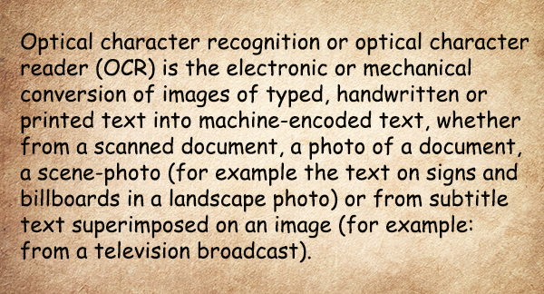
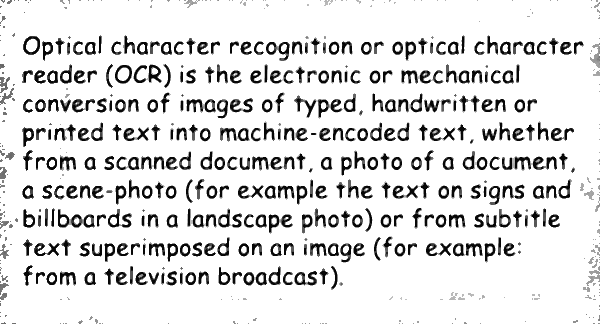

<style>
	button {
		cursor: pointer;
		margin-right: 20px;
		padding: 7px 15px;
		border: none;
		border-radius: 5px;
		background-color: #1a89d0;
		font-weight: 700;
		font-size: 15px;
		color: #ffffff;
	}

	button:hover {
		background-color: #3071a9;
	}

	button:focus {
		outline: none;
	}

	.duo {
		position: relative;
		width: 600px;
		height: 324px;
		margin-bottom: 20px;
	}

	.duo > img {
		position: absolute;
	}
</style>

Low contrast and blurring are the most typical distortions when text is photographed with a smartphone camera, especially in low light conditions. They make it difficult for the OCR algorithms to operate successfully, significantly reducing the recognition accuracy.

Aspose.OCR can automatically increase the contrast of images before proceeding to recognition.

{} 
Contrast correction automatically converts the image to [black and white](/ocr/cpp/binarization/#automatically-converting-the-image-to-black-and-white).
{}

## Automatic contrast adjustments

To automatically increase the image contrast before recognition, run the image through `OCR_IMG_PREPROCESS_CONTRAST_CORRECTION` preprocessing filter or enable `auto_contrast` property in [recognition settings](https://reference.aspose.com/ocr/cpp/struct/recognition_settings).



```cpp
std::string image_path = "source.png";
custom_preprocessing_filters filters_;
filters_.filter_1 = OCR_IMG_PREPROCESS_CONTRAST_CORRECTION;
asposeocr_preprocess_page_and_save(image_path.c_str(), "result.png", filters_);
```


```cpp
std::string image_path = "source.png";
const size_t len = 4096;
wchar_t buffer[len] = { 0 };
RecognitionSettings settings;
settings.auto_contrast = true;
size_t res_len = aspose::ocr::page_settings(image_path.c_str(), buffer, len, settings);
std::wcout << buffer;
```



<div class="duo">
	
	
</div>
<button onclick="triggerSkew(this)">Increase contrast</button>
<script>
	function triggerSkew(obj)
	{
		let images = $(".duo > img");
		let skewed = images.eq(0).is(":visible");
		if(skewed)
		{
			images.eq(1).show(200);
			images.eq(0).hide(200);
			$(obj).text("Revert to original image");
		}
		else
		{
			images.eq(0).show(200);
			images.eq(1).hide(200);
			$(obj).text("Increase contrast");
		}
	}
</script>

## Usage scenarios

Automatic contrast adjustment is recommended for the following images:

- Photos, especially those taken in low light conditions without optical or digital image stabilization.
- Old papers.
- Text on a background.
