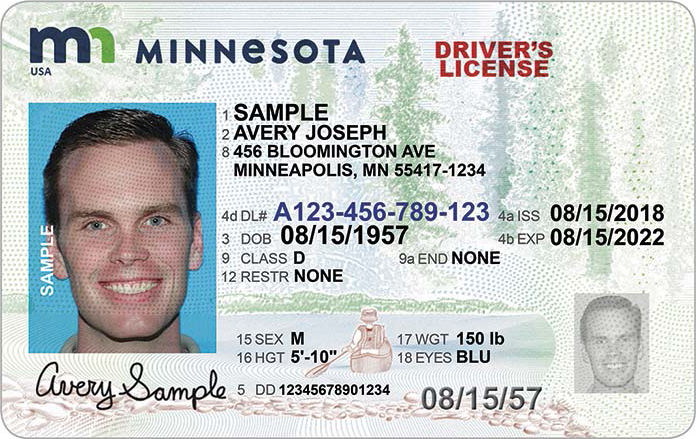

<style>
	button {
		cursor: pointer;
		margin-right: 20px;
		padding: 7px 15px;
		border: none;
		border-radius: 5px;
		background-color: #1a89d0;
		font-weight: 700;
		font-size: 15px;
		color: #ffffff;
	}

	button:hover {
		background-color: #3071a9;
	}

	button:focus {
		outline: none;
	}

	#sample {
		position: relative;
	}

	#sample > div {
		position: absolute;
		display: none;
		border: dashed 1px #de4444;
		background-color: rgba(222,68,68,0.2);
	}

	#dl-name {
		top: 101px;
		left: 231px;
		width: 430px;
		height: 42px;
	}

	#dl-exp {
		top: 224px;
		left: 546px;
		width: 123px;
		height: 26px;
	}

	#results {
		display: none;
		max-width: 50%;
	}
</style>

Aspose.OCR allows you to extract names, dates, numbers, and other blocks from certain areas of uniform images, such as ID cards, visas, driver's licenses, applications, and so on. Regions can be provided manually, or found automatically using the [paragraph](/ocr/cpp/image-regions-paragraph-find/), [line](/ocr/cpp/image-regions-line-find/) or [word](/ocr/cpp/image-regions-word-find/) detection.

To extract text from one or more areas of an image, provide region boundaries (the upper left corner and the width and height) to one of the following methods:

Method | Description
------ | -----------
[`page_rect()`](https://reference.aspose.com/ocr/cpp/groupAspose#ga752eb6fb406f683226968d7341563bdc) | Extract text from specified image areas.
[`page_rect_from_raw_bytes()`](https://reference.aspose.com/ocr/cpp/groupAspose#gaf6758b200672ceb42669fc731028cd9e) | Extract text from specified areas of an image provided as an array of pixels.
[`asposeocr_page_rect_abc()`](https://reference.aspose.com/ocr/cpp/groupAspose#gad7e08c99ddd2cc79af2084bf73e7cdcf) | Read only the predefined list of characters from specified image areas.
[`asposeocr_page_rect_abc_from_raw_bytes()`](https://reference.aspose.com/ocr/cpp/groupAspose#ga53a31eb5322a721596029fd72259409d) | Read only the predefined list of characters from specified areas of an image provided as an array of pixels.

```cpp
std::string image_path = "source.png";
const size_t len = 4096;
wchar_t buffer[len] = { 0 };
int x = 138, y = 352, w = 2033, h = 537;
size_t size = aspose::ocr::page_rect(image_path.c_str(), buffer, len, x, y, w, h);
std::wcout << buffer << L"\n";
```

## Live demo

<div id="sample">
	
	<div id="dl-name"></div>
	<div id="dl-exp"></div>
</div>

<button onclick="extract(this)">Extract name and expiry date</button>

<script>
	function extract(obj)
	{
		$("#sample > div").show(200);
		$("#results").show(200);
	}
</script>

<table id="results">
	<tr>
		<th>Block</th>
		<th>Coordinates</th>
		<th>Extracted text</th>
	</tr>
	<tr>
		<td>Name</td>
		<td>{X=231, Y=101, Width=430, Height=42}</td>
		<td>SAMPLE<br />AVERY JOSEPH</td>
	</tr>
	<tr>
		<td>Expiry date</td>
		<td>{X=546, Y=224, Width=123, Height=26}</td>
		<td>08/15/2022</td>
	</tr>
</table>
