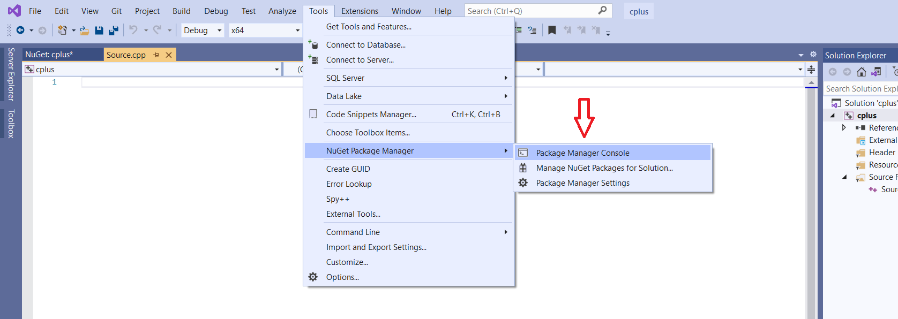
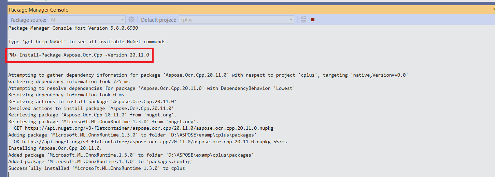
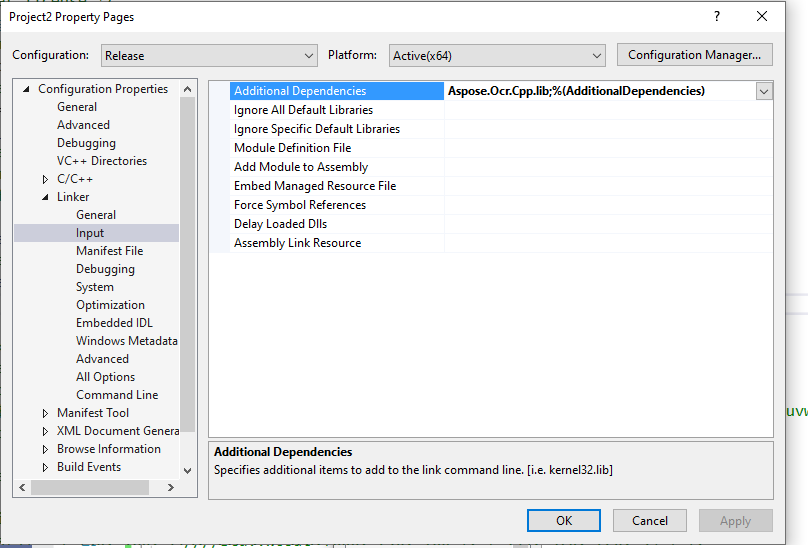
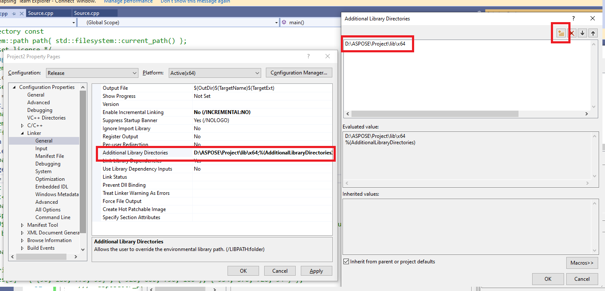
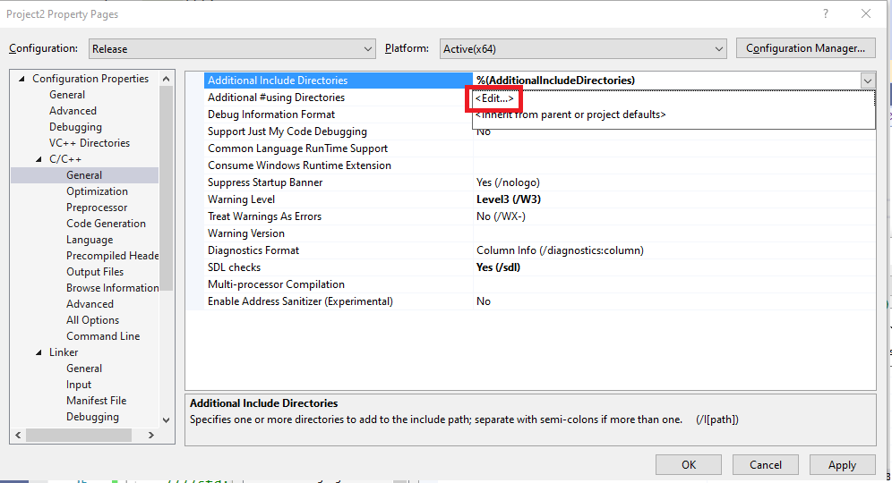

## **WINDOWS**

## **Installing Aspose.OCR for C++**

## **Installing Aspose.Ocr.Cpp through NuGet**

NuGet is the easiest way to download and install Aspose APIs. Open **Microsoft Visual Studio**. Select **TOOLS** menu, goto **NuGet Package Manager** and select Manage NuGet Packages for solution. Search **‘aspose.ocr.cpp’** keyword. 
This will find the desired Aspose API. Click on “Install” button, the selected API will be downloaded and referenced in your project.

You can choose Aspose.Ocr.Cpp and Aspose.Ocr.Cpp-GPU versions. Notice that GPU version requires **CUDA 10.1** in your system

## **Install or Update Aspose.Ocr.Cpp using the Package Manager Console**

You can follow the steps below to install or upgrade the Aspose.OCR API using the **package manager console**: 
Open your solution/project in Visual Studio. Select **TOOLS -> NuGet Package Manager -> Package Manager Console** from the top menu. This will open the package manager console.

Type the command `“Install-Package Aspose.Ocr.Cpp -Version x.x.0”` and press enter to install the latest full release into your application. 

If you are not familiar with the Aspose EULA https://company.aspose.com/legal/eula then it is a good idea to read the license referenced in the URL. 

In the package manager console, you can use the command Update-Package Aspose.Ocr.Cpp and press enter to check for any updates to the Aspose.Ocr.Cpp package and install them if present. 

## **Referencing the Component**

To use any component in your application, you must add a reference to it. The following steps assume that you use Visual Studio 2019 C++ project.

 - Download package from [Aspose.OCR for C++ download page] https://downloads.aspose.com/ocr/cpp. Unzip archive. Put lib and include folders into your project.

 - Right-click the project’s **Properties** node and select **Linker/Input**. In the field **Additional dependencies** write *Aspose.Ocr.Cpp.lib*

 - Select **Linker/General** and in the field **Additional Library Directories** select path to the *lib/x64* folder
 
 
 
 - Select **C/C++/General** and in the field **Additional Include Directories** select path to the *include* folder
 
  

 - Additionally, you have to install dependencies packages from nuget (for example for Aspose.Ocr.Cpp 20.11.0 version you have to install Microsoft.ML.OnnxRuntime 1.3.0

 - Notice that **GPU** version requires **CUDA** in your system.

 - Write `#include "aspose_ocr.h"` in your code.
