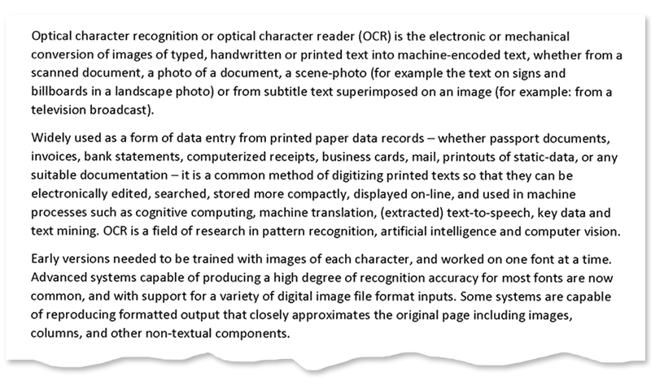

<style>
	button {
		cursor: pointer;
		margin-right: 20px;
		padding: 7px 15px;
		border: none;
		border-radius: 5px;
		background-color: #1a89d0;
		font-weight: 700;
		font-size: 15px;
		color: #ffffff;
	}

	button:hover {
		background-color: #3071a9;
	}

	button:focus {
		outline: none;
	}

	.code-sample {
		display: flex;
	}

	.code-sample > div {
		display: flex;
		align-items: center;
		padding: 5px 10px;
		border-radius: 5px;
		white-space: nowrap;
		background-color: rgba(0,0,0,5%);
		font-size: 16px;
		font-weight: 700;
	}

	.unseen {
		display: none !important;
	}

	.duo {
		position: relative;
		width: 800px;
		height: 474px;
	}

	.duo > img {
		position: absolute;
	}
</style>

When a page is fed to a flatbed scanner (mechanically or manually) or photographed with a smartphone, it is nearly impossible to achieve perfect alignment. As a result, a slight skew (tilt) inevitably occurs in scanned images or photographs.

Skew angle detection and image straightening is critical to the OCR process as it directly affects the reliability and efficiency of segmentation and text extraction. Aspose.OCR offers automated processing algorithms to correct image tilt (deskew) before proceeding to recognition.

## Detecting skew angle

To find out the skew angle, use `CalcSkewImage` or `CalcSkewImageFromUri` methods of [`AsposeOCR`](https://reference.aspose.com/ocr/java/com.aspose.ocr/AsposeOCR) class.



```java
AsposeOCR api = new AsposeOCR();
double skew = api.CalcSkewImage("source.png");
System.out.println("Skew angle: " + skew + "°.");
```


```java
AsposeOCR api = new AsposeOCR();
BufferedImage image = ImageIO.read(new File("source.png"));
double skew = api.CalcSkewImage(image);
System.out.println("Skew angle: " + skew + "°.");
```


```java
AsposeOCR api = new AsposeOCR();
double skew = api.CalcSkewImageFromUri("https://www.aspose.com/sample-ocr-page.png");
System.out.println("Skew angle: " + skew + "°.");
```




<div id="skew-angle" class="code-sample">
	<button onclick="calculateSkewAngle(this)">Calculate skew angle</button>
	<div class="unseen"><code>&gt; Skew angle: 5.9°</code></div>
</div>
<script>
	function calculateSkewAngle(obj)
	{
		$(obj).siblings("div").removeClass("unseen");
	}
</script>

## Automatic skew correction

To automatically straighten skewed image before recognition, run the image through [`AutoSkew`](https://reference.aspose.com/ocr/java/com.aspose.ocr/PreprocessingFilter#AutoSkew--) preprocessing filter or [enable skew correction](https://reference.aspose.com/ocr/java/com.aspose.ocr/RecognitionSettings#setAutoSkew-boolean-) in recognition settings.



```java
AsposeOCR api = new AsposeOCR();
PreprocessingFilter filters = new PreprocessingFilter();
filters.add(PreprocessingFilter.AutoSkew());
// Save preprocessed image to file
BufferedImage imageRes = api.PreprocessImage("source.png", filters);
File outputSource = new File("result.png");
ImageIO.write(imageRes, "png", outputSource);
// Append preprocessing filters to recognition settings
RecognitionSettings recognitionSettings = new RecognitionSettings();
recognitionSettings.setPreprocessingFilters(filters);
// Recognize image
RecognitionResult result = api.RecognizePage("source.png", recognitionSettings);
System.out.println("Recognition result:\n" + result.recognitionText + "\n\n");
```


```java
AsposeOCR api = new AsposeOCR();
// Enable automatic deskew in recognition settings
RecognitionSettings recognitionSettings = new RecognitionSettings();
recognitionSettings.setAutoSkew(true);
// Recognize image
RecognitionResult result = api.RecognizePage("source.png", recognitionSettings);
System.out.println("Recognition result:\n" + result.recognitionText + "\n\n");
```



<div class="duo">
	
	
</div>
<button onclick="triggerSkew(this)">Deskew image</button>
<script>
	function triggerSkew(obj)
	{
		let images = $(".duo > img");
		let skewed = images.eq(0).is(":visible");
		if(skewed)
		{
			images.eq(1).show(200);
			images.eq(0).hide(200);
			$(obj).text("Revert to original image");
		}
		else
		{
			images.eq(0).show(200);
			images.eq(1).hide(200);
			$(obj).text("Deskew image");
		}
	}
</script>

## Manual skew correction

In rare cases, automatic skew correction may incorrectly determine the angle of the image. This can happen to poor quality photos with significant perspective distortions.

To deal with such situations, you can rotate the image by the specified degree using [`Rotate`](https://reference.aspose.com/ocr/java/com.aspose.ocr/PreprocessingFilter#Rotate-float-) preprocessing filter or manually define the skew angle for such images using the [`setSkew`](https://reference.aspose.com/ocr/java/com.aspose.ocr/RecognitionSettings#setSkew-double-) method of recognition settings. The rotation angle is passed in degrees:

- `-360` to `0`: rotate counterclockwise;
- `0` to `360`: rotate clockwise.



```java
AsposeOCR api = new AsposeOCR();
PreprocessingFilter filters = new PreprocessingFilter();
filters.add(PreprocessingFilter.Rotate(-90));
// Save preprocessed image to file
BufferedImage imageRes = api.PreprocessImage("source.png", filters);
File outputSource = new File("result.png");
ImageIO.write(imageRes, "png", outputSource);
// Append preprocessing filters to recognition settings
RecognitionSettings recognitionSettings = new RecognitionSettings();
recognitionSettings.setPreprocessingFilters(filters);
// Recognize image
RecognitionResult result = api.RecognizePage("source.png", recognitionSettings);
System.out.println("Recognition result:\n" + result.recognitionText + "\n\n");
```


```java
AsposeOCR api = new AsposeOCR();
// Enable automatic deskew in recognition settings
RecognitionSettings recognitionSettings = new RecognitionSettings();
recognitionSettings.setSkew(-90);
// Recognize image
RecognitionResult result = api.RecognizePage("source.png", recognitionSettings);
System.out.println("Recognition result:\n" + result.recognitionText + "\n\n");
```



## Image regions preprocessing

Automatic skew correction and manual rotation filters can be applied to specific regions of an image. For example, you can straighten an illustration on a page while leaving the rest of the content unchanged.

{} 
The original size of an image does not change when its area is rotated. Parts of the rotated area that do not match the original size of the area are cropped.

It is recommended to apply the automatic deskew and manual rotation filters only to square areas.
{}

To apply a filter to an area, specify its top left corner along with width and height as [`Rectangle`](https://docs.oracle.com/javase/8/docs/api/java/awt/Rectangle.html) object. If the region is omitted, the filter is applied to the entire image.

```java
Rectangle rectangle = new Rectangle(5, 161, 340, 340);
PreprocessingFilter filters = new PreprocessingFilter();
filters.add(PreprocessingFilter.Rotate(90, rectangle));
```

## Usage scenarios

- Automatic skew correction is recommended in almost all cases, except for perfectly straight scans.
- Manual rotation is recommended for:
    - photos of low quality;
    - images with a significant angle of inclination.
