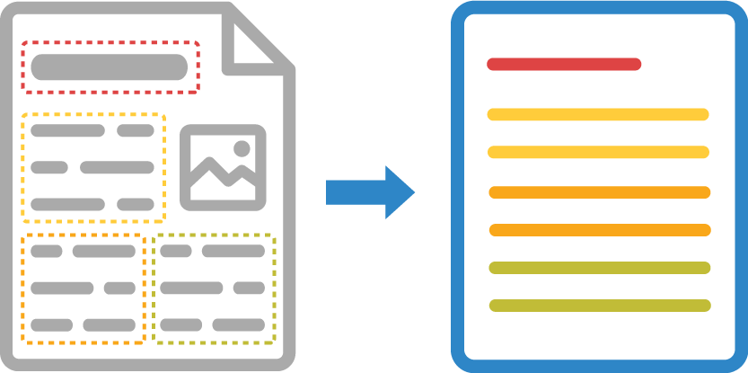

A scanned image or photograph of a text document may contain a large number of blocks of various content - text paragraphs, tables, illustrations, formulas, and the like. Detecting, ordering, and classifying areas of interest on a page is the cornerstone of successful and accurate OCR. This process is called _document areas detection_.



Aspose.OCR offers several document areas detection algorithms, allowing you to choose the one that works best for your specific content.

## Area detection modes

You can manually override the default document areas detection method if you are unhappy with the results or get unwanted artifacts.

Document structure analysis algorithm is specified using [`setDetectAreasMode`](https://reference.aspose.com/ocr/java/com.aspose.ocr/RecognitionSettings#setDetectAreasMode-com.aspose.ocr.DetectAreasMode-) method of [recognition settings](https://reference.aspose.com/ocr/java/com.aspose.ocr/RecognitionSettings).

```java
// Create instance of OCR API
AsposeOCR api = new AsposeOCR();
// Enable automatic document areas detection
RecognitionSettings recognitionSettings = new RecognitionSettings();
recognitionSettings.setDetectAreasMode(DetectAreasMode.UNIVERSAL);
// Prepare batch
OcrInput images = new OcrInput(InputType.SingleImage);
images.add("image.png");
// Recognize images
ArrayList<RecognitionResult> results = api.Recognize(images, recognitionSettings);
System.out.println("Recognition result:\n" + results[0].recognitionText + "\n\n");
```

Aspose.OCR for Java supports the following document structure analysis methods provided in `DetectAreasMode` enumeration:

Name              | Description | Use cases
----------------- | ----------- | ---------
`DetectAreasMode.UNIVERSAL` | Finds small text blocks inside complex images.<br />See [**DetectAreasMode.UNIVERSAL**](/ocr/java/areas-detection/universal/) for additional details. | Driver’s licenses<br />Social security cards<br />Government and work IDs<br />Visas<br />Photos<br />Screenshots<br />Advertisements<br />Street photos
`DetectAreasMode.MULTICOLUMN` | Detects large blocks of text formatted in columns. Optimal for multi-column documents with illustrations.<br />See [**DetectAreasMode.MULTICOLUMN**](/ocr/java/areas-detection/multicolumn/) for additional details. | Contracts<br />Books<br />Articles<br />Newspapers<br />High-quality scans
`DetectAreasMode.TABLE` | Detects cells in tabular structures.<br />See [**DetectAreasMode.TABLE**](/ocr/java/areas-detection/table/) for additional details. | Tables<br />Invoices
`DetectAreasMode.CURVED_TEXT` | Auto-straightens curved lines and finds text blocks inside the resulting image.<br />See [**DetectAreasMode.CURVED_TEXT**](/ocr/java/areas-detection/curved_text/) for additional details. | Photos of books, magazine articles, and other curved pages.
`DetectAreasMode.NONE` | Prioritizes speed and reduces resource consumption by omitting support for complex layouts. | Simple images containing a few lines of text without illustrations or formatting.<br />Applications requiring maximum recognition speed<br />Web applications
