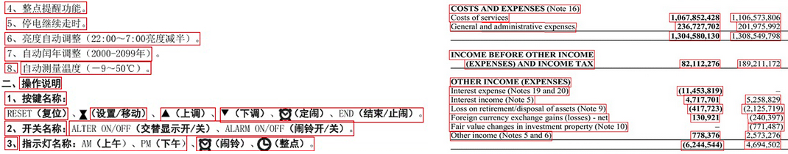

This algorithm works best with sparse irregular text and low-quality photos. It detects smaller text areas in an image, such as individual words, phrases, or lines, and then positions them relative to each other in recognition results.



It is optimal for invoices, screenshots, driver's licenses, social security cards, government and work IDs, visas, math formulas, code snippets, and more. It can also detect small texts such as notes, signatures or stamps. In addition, it is well suited for reading smartphone photos and low-quality scans.

However, this algorithm may be less efficient when dealing with large amounts of structured textual data, such as articles and books, and does not support multi-column layout. Try [**DetectAreasMode.DOCUMENT**](/ocr/java/areas-detection/document/) instead.

## Example

The following code sample demonstrates how to use this document areas detection algorithm:

```java
// Create instance of OCR API
AsposeOCR api = new AsposeOCR();
// Enable automatic document areas detection
RecognitionSettings recognitionSettings = new RecognitionSettings();
recognitionSettings.setDetectAreasMode(DetectAreasMode.PHOTO);
// Prepare batch
OcrInput images = new OcrInput(InputType.SingleImage);
images.add("image.png");
// Recognize images
ArrayList<RecognitionResult> results = api.Recognize(images, recognitionSettings);
System.out.println("Recognition result:\n" + results[0].recognitionText + "\n\n");
```
