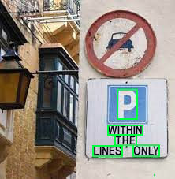

{} 
To use this structure detection algorithm, [install](/ocr/java/modules/) sparse text recognition model (**aspose-ocr-text-in-wild-v1**) in your project.
{}

When this mode is enabled, Aspose.OCR engine finds individual words on images with sparse text. It is very effective when dealing with the following images:

- Street photos.
- Road signs.
- Signboards.
- Price tags.
- Food labels, nutritional information, ingredient lists.
- Menus.
- Catalogs.

This algorithm automatically activates detection of the coordinates of image regions containing [words](/ocr/java/image-regions-word-find/). There is no need to use `DetectRectangles()` method.



However, this algorithm is very inefficient when dealing with large amounts of text, such as pages from books and newspaper articles. Try [**DetectAreasMode.DOCUMENT**](/ocr/java/areas-detection/document/) instead.

## Example

The following code sample demonstrates how to use this document areas detection algorithm:

```java
AsposeOCR api = new AsposeOCR();
RecognitionSettings recognitionSettings = new RecognitionSettings();
recognitionSettings.setDetectAreasMode(DetectAreasMode.TEXT_IN_WILD);
// Load an image
OcrInput images = new OcrInput(InputType.SingleImage);
images.add("source.png");
// Recognize images
ArrayList<RecognitionResult> results = api.Recognize(images, recognitionSettings);
System.out.println("Recognition result:\n" + results[0].recognitionText + "\n\n");
```

## Limitations

The algorithm only works with Latin letters and numbers. You cannot specify the [recognition language](/ocr/java/languages/) and provide [whitelisted/blacklisted characters](/ocr/java/recognition-settings-common/). 
