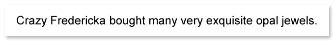

Aspose.OCR can automatically build a list of characters found in an image and provide 4 less likely alternatives of each character (in descending order of probability). This list is provided in [`recognitionCharactersList`](https://reference.aspose.com/ocr/java/com.aspose.ocr/RecognitionResult#recognitionCharactersList) property of [`RecognitionResult`](https://reference.aspose.com/ocr/java/com.aspose.ocr/RecognitionResult) object.





```java
AsposeOCR api = new AsposeOCR();
// Add an image to OcrInput object
OcrInput input = new OcrInput(InputType.SingleImage);
input.Add("source.png");
// Recognize image
ArrayList<RecognitionResult> results = recognitionEngine.Recognize(input);
RecognitionResult result = results[0];
// Output recognition result
System.out.println("Result: "+result.RecognitionText);
// Get list of characters
ArrayList<char[]> characterList = result.recognitionCharactersList;
// Character alternatives
characterList.forEach((c) -> {
	System.out.println(String.join(" | ", c));
});
```


```
Result: Crazy Fredericka bought many very exquisite opal jewels.

C | c | C | C | G
r | C | n | T | r
a | a | a | a | a
z | Z | c | E | x
y | y | y | s | }
  | C | y | _ | .
F |   | E | P | R
r | C | f | F | e
e | C | e | d | e
d | d | C | d | H
e | d | C | e | B
r | r | f | r | C
i | C | I | i | i
c | e | C | c | d
k | h | k | < | b
a | o | a | a | a
{...}
```



The list of _unique characters_ can later be used for identifying a [whitelist](/ocr/java/characters-whitelist/) to greatly improve the accuracy and performance of recognition.

_Alternatives_ can be used to find out patterns in common recognition errors, such as misidentifying certain characters in a font used in an image, and to take corrective action, such as automatic substitution.
