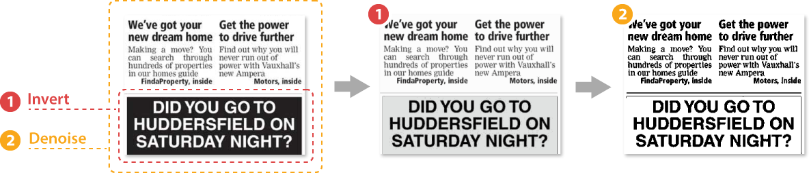

<style>
	#filters-chain > div {
		display: flex;
		align-items: center;
	}

	#filters-chain > div > label {
		margin: 0 0 0 7px;
		font-weight: 700;
	}

	.hidden {
		display: none !important;
	}
</style>

The accuracy and reliability of text recognition is highly dependent on the quality of the original image. Aspose.OCR offers a large number of fully automated and manual image processing filters that enhance an image before it is sent to the OCR engine.

Each preprocessing filter increases the image processing time. The approximate amount of additional time required for pre-processing (as a percentage of the minimum image processing pipeline) is listed in the **Performance Impact** column.

Filter | Action | Performance impact | Usage scenarios
------ | ------ | ------------------ | ---------------
[Skew correction](/ocr/java/deskew/#automatic-skew-correction) | Automatically straighten images aligned at a slight angle to the horizontal. | 12% | Skewed images
[Rotation](/ocr/java/deskew/#manual-skew-correction) | Manually rotate severely skewed images. | 7.5% | Rotated images
[Noise removal](/ocr/java/denoise/) | Automatically remove dirt, spots, scratches, glare, unwanted gradients, and other noise from photos and scans. | 175% extra time<br />38% more memory <sup>(1)</sup> | Photos<br />Old books<br />Newspapers<br />Postcards<br />Documents with stains and dirt
[Contrast correction](/ocr/java/contrast/) | Automatically adjust the image contrast. | 7.5% | Photos<br />Old papers<br />Text on a background
[Resizing](/ocr/java/resize/) | Proportionally scale images up / down, or manually define the width and height of the image. | up to 100% <sup>(2)</sup> | Medication guides<br />Food labels<br />Full-sized photos from modern cameras and smartphones<br />Scanned images at very high DPI
[Binarization](/ocr/java/binarization/) | Convert images to black and white automatically or manually adjust the criteria that determines whether a pixel is considered black or white. | 0.9% |  Always used for text detection and most automatic image corrections
[Conversion to grayscale](/ocr/java/grayscale/) | Discard color information from images and leave only shades of gray. | 0.5% | Photos<br />Scanned ID cards<br />Full-color scans
[Color inversion](/ocr/java/invert/) | Swap image colors so that light areas appear dark and dark areas appear light. | 0.25% | White text on black background<br />Advertisements<br />Business cards<br />Screenshots
[Dilation](/ocr/java/dilate/) | Increase the thickness of characters in an image by adding pixels to the edges of high-contrast objects, such as letters. | 3.1% | Receipts<br />Printouts with very thin font
[Median filter](/ocr/java/median/) | Blur noisy images while preserving the edges of high-contrast objects like letters. | 6.25% | Photos taken in low light conditions<br />Poor quality printouts<br />Highly compressed JPEG’s
[Dewarping](/ocr/net/dewarp/) | Straighten page curvature and fix camera lens distortion for page photos.<br />**This method requires significant resources and time!** Consider using it only if the image has geometric distortions preventing accurate recognition. | **30-40 seconds**;<br />**Up to 4 times more memory**&nbsp;<sup>(3)</sup> | Photos of curved pages<br />Ultra wide-angle and fisheye photos<br />Photos from entry-level smartphones

{}
**Notes**

1. Automatic noise removal uses a powerful artificial intelligence algorithm that consumes significant computing resources and RAM. Use it with care, especially when developing public websites and mobile apps.
2. Resizing takes between 6% and 100% more time than the minimum processing pipeline, depending on the original image size.
3. Due to the high complexity of the underlying neural network, dewarping is resource- and time-intensive. Actual numbers may vary greatly depending on the performance of the computer and the characteristics of the original image.
{}

## Chaining preprocessing filters

Multiple preprocessing filters can be applied to the same image to further improve the recognition quality. The filters are applied one by one in the order they are added to [`PreprocessingFilter`](https://reference.aspose.com/ocr/java/com.aspose.ocr/PreprocessingFilter) object.

Note that each filter requires additional time and resources on the computer running the application. Do not add extra filters if you are satisfied with the recognition accuracy, especially when developing web applications.

<div id="filters-chain">
	<div>
		<input type="checkbox" id="threshold" impact="0.9" />
		<label for="threshold">Set binarization threshold</label>
	</div>
	<div>
		<input type="checkbox" id="deskew" impact="12" />
		<label for="deskew">Correct skew</label>
	</div>
	<div>
		<input type="checkbox" id="rotate" impact="7.5" />
		<label for="rotate">Rotate</label>
	</div>
	<div>
		<input type="checkbox" id="denoise" impact="175" />
		<label for="denoise">Remove noise</label>
	</div>
	<div>
		<input type="checkbox" id="contrast" impact="7.5" />
		<label for="contrast">Adjust contrast</label>
	</div>
	<div>
		<input type="checkbox" id="scale" impact="6" />
		<label for="scale">Scale</label>
	</div>
	<div>
		<input type="checkbox" id="resize" impact="6" />
		<label for="resize">Resize</label>
	</div>
	<div>
		<input type="checkbox" id="grayscale" impact="0.5" />
		<label for="grayscale">Convert to grayscale</label>
	</div>
	<div>
		<input type="checkbox" id="invert" impact="0.25" />
		<label for="invert">Invert colors</label>
	</div>
	<div>
		<input type="checkbox" id="dilate" impact="3.1" />
		<label for="dilate">Dilate</label>
	</div>
	<div>
		<input type="checkbox" id="median" impact="6.25" />
		<label for="median">Apply median filter</label>
	</div>
</div>

<div class="highlight" id="filters-code"><pre tabindex="0" style="background-color:#f8f8f8;-moz-tab-size:4;-o-tab-size:4;tab-size:4;"><code class="language-java" data-lang="java"><span style="display:flex;"><span><span style="color:#000">PreprocessingFilter</span> <span style="color:#000">filters</span> <span style="color:#ce5c00;font-weight:bold">=</span> <span style="color:#204a87;font-weight:bold">new</span> <span style="color:#000">PreprocessingFilter</span><span style="color:#ce5c00;font-weight:bold">();</span>
</span></span><span style="display:flex;" id="threshold-code" class="hidden"><span><span style="color:#000">filters</span><span style="color:#ce5c00;font-weight:bold">.</span><span style="color:#c4a000">add</span><span style="color:#ce5c00;font-weight:bold">(</span><span style="color:#000">PreprocessingFilter</span><span style="color:#ce5c00;font-weight:bold">.</span><span style="color:#c4a000">Threshold</span><span style="color:#ce5c00;font-weight:bold">({</span><span style="color:#000">THRESHOLD</span><span style="color:#ce5c00;font-weight:bold">}));</span>
</span></span><span style="display:flex;" id="deskew-code" class="hidden"><span><span style="color:#000">filters</span><span style="color:#ce5c00;font-weight:bold">.</span><span style="color:#c4a000">add</span><span style="color:#ce5c00;font-weight:bold">(</span><span style="color:#000">PreprocessingFilter</span><span style="color:#ce5c00;font-weight:bold">.</span><span style="color:#c4a000">AutoSkew</span><span style="color:#ce5c00;font-weight:bold">());</span>
</span></span><span style="display:flex;" id="rotate-code" class="hidden"><span><span style="color:#000">filters</span><span style="color:#ce5c00;font-weight:bold">.</span><span style="color:#c4a000">add</span><span style="color:#ce5c00;font-weight:bold">(</span><span style="color:#000">PreprocessingFilter</span><span style="color:#ce5c00;font-weight:bold">.</span><span style="color:#c4a000">Rotate</span><span style="color:#ce5c00;font-weight:bold">({</span><span style="color:#000">ANGLE</span><span style="color:#ce5c00;font-weight:bold">}));</span>
</span></span><span style="display:flex;" id="denoise-code" class="hidden"><span><span style="color:#000">filters</span><span style="color:#ce5c00;font-weight:bold">.</span><span style="color:#c4a000">add</span><span style="color:#ce5c00;font-weight:bold">(</span><span style="color:#000">PreprocessingFilter</span><span style="color:#ce5c00;font-weight:bold">.</span><span style="color:#c4a000">AutoDenoising</span><span style="color:#ce5c00;font-weight:bold">());</span>
</span></span><span style="display:flex;" id="contrast-code" class="hidden"><span><span style="color:#000">filters</span><span style="color:#ce5c00;font-weight:bold">.</span><span style="color:#c4a000">add</span><span style="color:#ce5c00;font-weight:bold">(</span><span style="color:#000">PreprocessingFilter</span><span style="color:#ce5c00;font-weight:bold">.</span><span style="color:#c4a000">ContrastCorrectionFilter</span><span style="color:#ce5c00;font-weight:bold">());</span>
</span></span><span style="display:flex;" id="scale-code" class="hidden"><span><span style="color:#000">filters</span><span style="color:#ce5c00;font-weight:bold">.</span><span style="color:#c4a000">add</span><span style="color:#ce5c00;font-weight:bold">(</span><span style="color:#000">PreprocessingFilter</span><span style="color:#ce5c00;font-weight:bold">.</span><span style="color:#c4a000">Scale</span><span style="color:#ce5c00;font-weight:bold">({</span><span style="color:#000">RATIO</span><span style="color:#ce5c00;font-weight:bold">}));</span>
</span></span><span style="display:flex;" id="resize-code" class="hidden"><span><span style="color:#000">filters</span><span style="color:#ce5c00;font-weight:bold">.</span><span style="color:#c4a000">add</span><span style="color:#ce5c00;font-weight:bold">(</span><span style="color:#000">PreprocessingFilter</span><span style="color:#ce5c00;font-weight:bold">.</span><span style="color:#c4a000">Resize</span><span style="color:#ce5c00;font-weight:bold">({</span><span style="color:#000">WIDTH</span><span style="color:#ce5c00;font-weight:bold">},</span> <span style="color:#ce5c00;font-weight:bold">{</span><span style="color:#000">HEIGHT</span><span style="color:#ce5c00;font-weight:bold">}));</span>
</span></span><span style="display:flex;" id="grayscale-code" class="hidden"><span><span style="color:#000">filters</span><span style="color:#ce5c00;font-weight:bold">.</span><span style="color:#c4a000">add</span><span style="color:#ce5c00;font-weight:bold">(</span><span style="color:#000">PreprocessingFilter</span><span style="color:#ce5c00;font-weight:bold">.</span><span style="color:#c4a000">ToGrayscale</span><span style="color:#ce5c00;font-weight:bold">());</span>
</span></span><span style="display:flex;" id="invert-code" class="hidden"><span><span style="color:#000">filters</span><span style="color:#ce5c00;font-weight:bold">.</span><span style="color:#c4a000">add</span><span style="color:#ce5c00;font-weight:bold">(</span><span style="color:#000">PreprocessingFilter</span><span style="color:#ce5c00;font-weight:bold">.</span><span style="color:#c4a000">Invert</span><span style="color:#ce5c00;font-weight:bold">());</span>
</span></span><span style="display:flex;" id="dilate-code" class="hidden"><span><span style="color:#000">filters</span><span style="color:#ce5c00;font-weight:bold">.</span><span style="color:#c4a000">add</span><span style="color:#ce5c00;font-weight:bold">(</span><span style="color:#000">PreprocessingFilter</span><span style="color:#ce5c00;font-weight:bold">.</span><span style="color:#c4a000">Dilate</span><span style="color:#ce5c00;font-weight:bold">());</span>
</span></span><span style="display:flex;" id="median-code" class="hidden"><span><span style="color:#000">filters</span><span style="color:#ce5c00;font-weight:bold">.</span><span style="color:#c4a000">add</span><span style="color:#ce5c00;font-weight:bold">(</span><span style="color:#000">PreprocessingFilter</span><span style="color:#ce5c00;font-weight:bold">.</span><span style="color:#c4a000">Median</span><span style="color:#ce5c00;font-weight:bold">());</span>
</span></span></code></pre></div>

**Approximate increase of processing time: <span id="impact-time">0</span>%**

## Image regions preprocessing

Most preprocessing filters can be applied to specific regions of an image. For example, you can invert a newspaper headline written in white on black, leaving the rest of the article unchanged.

Multiple preprocessing filters can be applied to different regions of the same image. If the regions intersect each other, filters are applied to the intersection in their [chaining](#chaining-preprocessing-filters) order in [`PreprocessingFilter`](https://reference.aspose.com/ocr/java/com.aspose.ocr/PreprocessingFilter) object.



To apply a filter to an area, specify its top left corner along with width and height as [`Rectangle`](https://docs.oracle.com/javase/8/docs/api/java/awt/Rectangle.html) object. If the region is omitted, the filter is applied to the entire image.

```java
// Define image regions
Rectangle blackRectangle = new Rectangle(5, 161, 340, 113);
PreprocessingFilter filters = new PreprocessingFilter();
// (1) Invert black region
filters.add(PreprocessingFilter.Invert(blackRectangle));
// (2) Denoise entire image
filters.add(PreprocessingFilter.AutoDenoising());
```

The following filters can be applied to regions:

- [Skew correction](/ocr/java/deskew/#image-regions-preprocessing)
- [Noise removal](/ocr/java/denoise/#image-regions-preprocessing)
- [Contrast correction](/ocr/java/contrast/#image-regions-preprocessing)
- [Binarization](/ocr/java/binarization/#image-regions-preprocessing)
- [Color inversion](/ocr/java/invert/#image-regions-preprocessing)
- [Dilation](/ocr/java/dilate/#image-regions-preprocessing)
- [Median filter](/ocr/java/median/#image-regions-preprocessing)

## Previewing and saving processed images

Aspose.OCR for Java offers an easy way to access or save processed images using the methods of the static [`ImageProcessing`](https://reference.aspose.com/ocr/java/com.aspose.ocr/imageprocessing/) class:

Method | Return value | Description
------ | ------------ | -----------
[`Render`](https://reference.aspose.com/ocr/java/com.aspose.ocr/imageprocessing/#Render-com.aspose.ocr.OcrInput-) | [`OcrInput`](https://reference.aspose.com/ocr/java/com.aspose.ocr/ocrinput/) | Applies processing filters to all images in a [batch](/ocr/java/ocrinput/) and returns a new batch with processed images. This batch can later be submitted for recognition or used for optimization.
[`Save`](https://reference.aspose.com/ocr/java/com.aspose.ocr/imageprocessing/#Save-com.aspose.ocr.OcrInput-java.lang.String-) | [`OcrInput`](https://reference.aspose.com/ocr/java/com.aspose.ocr/ocrinput/) | Applies processing filters to all images in [batch](/ocr/java/ocrinput/) and saves the resulting images in the specified folder. That method also returns a new batch with processed images, that can be later submitted for the recognition.

You can use these methods to analyze the effectiveness of processing filters, exclude unnecessary filters that consume resources without affecting the result, or show the result of image processing in the user interface.

{}
- Processing filters are applied to all images in the batch, including those without text.
- PDF documents can contain more than one image per page. Therefore, the resulting `OcrInput` object can contain more images than the number of pages in the document.
{}

```java
// Set processing filters
PreprocessingFilter filters = new PreprocessingFilter();
filters.add(PreprocessingFilter.AutoDenoising());
filters.add(PreprocessingFilter.Median());
// Prepare batch
OcrInput images = new OcrInput(InputType.SingleImage, filters);
images.add("image1.png");
images.add("image2.jpg");
// Save processed images from the provided PDF to the folder
ImageProcessing.Save(images, "C:\\images");
```

<script>
window.addEventListener("load", function(){
	$("#filters-chain input").change(applyFilter);
});

function applyFilter()
{
	let status = $(this).prop("checked");
	switch($(this).attr("id"))
	{
		case "threshold":
			if(status) $("#threshold-code").removeClass("hidden");
			else $("#threshold-code").addClass("hidden");
			break;
		case "deskew":
			if(status) $("#deskew-code").removeClass("hidden");
			else $("#deskew-code").addClass("hidden");
			if(status)
			{
				$("#rotate").prop("checked", false);
				$("#rotate-code").addClass("hidden");
			}
			break;
		case "rotate":
			if(status) $("#rotate-code").removeClass("hidden");
			else $("#rotate-code").addClass("hidden");
			if(status)
			{
				$("#deskew").prop("checked", false);
				$("#deskew-code").addClass("hidden");
			}
			break;
		case "denoise":
			if(status) $("#denoise-code").removeClass("hidden");
			else $("#denoise-code").addClass("hidden");
			break;
		case "contrast":
			if(status) $("#contrast-code").removeClass("hidden");
			else $("#contrast-code").addClass("hidden");
			break;
		case "scale":
			if(status) $("#scale-code").removeClass("hidden");
			else $("#scale-code").addClass("hidden");
			if(status)
			{
				$("#resize").prop("checked", false);
				$("#resize-code").addClass("hidden");
			}
			break;
		case "resize":
			if(status) $("#resize-code").removeClass("hidden");
			else $("#resize-code").addClass("hidden");
			if(status)
			{
				$("#scale").prop("checked", false);
				$("#scale-code").addClass("hidden");
			}
			break;
		case "grayscale":
			if(status) $("#grayscale-code").removeClass("hidden");
			else $("#grayscale-code").addClass("hidden");
			break;
		case "invert":
			if(status) $("#invert-code").removeClass("hidden");
			else $("#invert-code").addClass("hidden");
			break;
		case "dilate":
			if(status) $("#dilate-code").removeClass("hidden");
			else $("#dilate-code").addClass("hidden");
			break;
		case "median":
			if(status) $("#median-code").removeClass("hidden");
			else $("#median-code").addClass("hidden");
			if(status)
			{
				$("#grayscale").prop("checked", false);
				$("#grayscale-code").addClass("hidden");
			}
			break;
		default:
			break;
	}
	let total=0;
	$("#filters-chain input").each(function(){
		let box = $(this);
		if(box.prop("checked")) total += parseFloat(box.attr("impact"));
	});
	$("#impact-time").text(total);
}
</script>