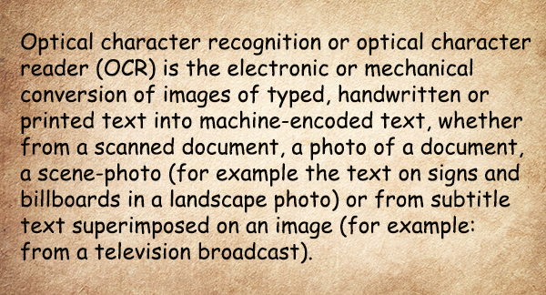

<style>
	button {
		cursor: pointer;
		margin-right: 20px;
		padding: 7px 15px;
		border: none;
		border-radius: 5px;
		background-color: #1a89d0;
		font-weight: 700;
		font-size: 15px;
		color: #ffffff;
	}

	button:hover {
		background-color: #3071a9;
	}

	button:focus {
		outline: none;
	}

	.duo {
		position: relative;
		width: 600px;
		height: 324px;
		margin-bottom: 20px;
	}

	.duo > img {
		position: absolute;
	}
</style>

Low contrast and blurring are the most typical distortions when text is photographed with a smartphone camera, especially in low light conditions. They make it difficult for the OCR algorithms to operate successfully, significantly reducing the recognition accuracy.

Aspose.OCR can automatically increase the contrast of images before proceeding to recognition.

{} 
Contrast correction automatically converts the image to [black and white](/ocr/java/binarization/#automatically-converting-the-image-to-black-and-white).
{}

## Automatic contrast adjustments

To automatically increase the image contrast before recognition, run the image through [`ContrastCorrection`](https://reference.aspose.com/ocr/java/com.aspose.ocr/PreprocessingFilter#ContrastCorrection--) preprocessing filter or [enable automatic contrast adjustments](https://reference.aspose.com/ocr/java/com.aspose.ocr/RecognitionSettings#setAutoContrast-boolean-) in recognition settings.



```java
AsposeOCR api = new AsposeOCR();
PreprocessingFilter filters = new PreprocessingFilter();
filters.add(PreprocessingFilter.ContrastCorrection());
// Save preprocessed image to file
BufferedImage imageRes = api.PreprocessImage("source.png", filters);
File outputSource = new File("result.png");
ImageIO.write(imageRes, "png", outputSource);
// Append preprocessing filters to recognition settings
RecognitionSettings recognitionSettings = new RecognitionSettings();
recognitionSettings.setPreprocessingFilters(filters);
// Recognize image
RecognitionResult result = api.RecognizePage("source.png", recognitionSettings);
System.out.println("Recognition result:\n" + result.recognitionText + "\n\n");
```


```java
AsposeOCR api = new AsposeOCR();
// Enable automatic deskew in recognition settings
RecognitionSettings recognitionSettings = new RecognitionSettings();
recognitionSettings.setAutoContrast(true);
// Recognize image
RecognitionResult result = api.RecognizePage("source.png", recognitionSettings);
System.out.println("Recognition result:\n" + result.recognitionText + "\n\n");
```



<div class="duo">
	
	
</div>
<button onclick="triggerSkew(this)">Increase contrast</button>
<script>
	function triggerSkew(obj)
	{
		let images = $(".duo > img");
		let skewed = images.eq(0).is(":visible");
		if(skewed)
		{
			images.eq(1).show(200);
			images.eq(0).hide(200);
			$(obj).text("Revert to original image");
		}
		else
		{
			images.eq(0).show(200);
			images.eq(1).hide(200);
			$(obj).text("Increase contrast");
		}
	}
</script>

## Image regions preprocessing

You can automatically adjust the contrast of certain areas of the image. For example, increase the contrast of a photo in an article while leaving the rest of the content unchanged.

To apply a filter to an area, specify its top left corner along with width and height as [`Rectangle`](https://docs.oracle.com/javase/8/docs/api/java/awt/Rectangle.html) object. If the region is omitted, the filter is applied to the entire image.

```java
Rectangle rectangle = new Rectangle(5, 161, 340, 340);
PreprocessingFilter filters = new PreprocessingFilter();
filters.add(PreprocessingFilter.ContrastCorrection(rectangle));
```

## Usage scenarios

Automatic contrast adjustment is recommended for the following images:

- Photos, especially those taken in low light conditions without optical or digital image stabilization.
- Old papers.
- Text on a background.
