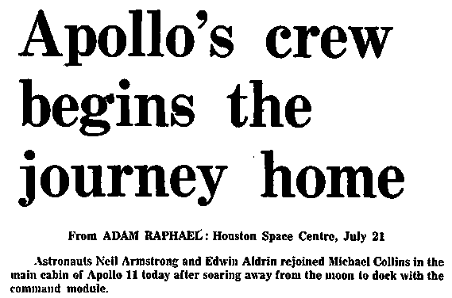

<style>
	button {
		cursor: pointer;
		margin-right: 20px;
		padding: 7px 15px;
		border: none;
		border-radius: 5px;
		background-color: #1a89d0;
		font-weight: 700;
		font-size: 15px;
		color: #ffffff;
	}

	button:hover {
		background-color: #3071a9;
	}

	button:focus {
		outline: none;
	}

	.duo {
		position: relative;
		width: 569px;
		height: 376px;
		margin-bottom: 20px;
	}

	.duo > img {
		position: absolute;
	}
</style>

Dirt, spots, scratches, glare, unwanted gradients, and other noise are a common problem when scanning low-quality sources such as newspapers or old books, or when taking photographs. These image defects can interfere with recognition, significantly reduce the accuracy of OCR, and may cause spots to be misrecognised as characters.

Aspose.OCR provides automated processing algorithms that remove noise from images before proceeding to recognition.

{} 
Noise removal automatically converts the image to [black and white](/ocr/java/binarization/#automatically-converting-the-image-to-black-and-white).
{}

## Automatic noise removal

To automatically remove the noise from the image before recognition, run the image through [`AutoDenoising`](https://reference.aspose.com/ocr/java/com.aspose.ocr/PreprocessingFilter#AutoDenoising--) preprocessing filter or [enable automatic denoising](https://reference.aspose.com/ocr/java/com.aspose.ocr/RecognitionSettings#setAutoDenoising-boolean-) in recognition settings.



```java
AsposeOCR api = new AsposeOCR();
PreprocessingFilter filters = new PreprocessingFilter();
filters.add(PreprocessingFilter.AutoDenoising());
// Save preprocessed image to file
BufferedImage imageRes = api.PreprocessImage("source.png", filters);
File outputSource = new File("result.png");
ImageIO.write(imageRes, "png", outputSource);
// Append preprocessing filters to recognition settings
RecognitionSettings recognitionSettings = new RecognitionSettings();
recognitionSettings.setPreprocessingFilters(filters);
// Recognize image
RecognitionResult result = api.RecognizePage("source.png", recognitionSettings);
System.out.println("Recognition result:\n" + result.recognitionText + "\n\n");
```


```java
AsposeOCR api = new AsposeOCR();
// Enable automatic deskew in recognition settings
RecognitionSettings recognitionSettings = new RecognitionSettings();
recognitionSettings.setAutoDenoising(true);
// Recognize image
RecognitionResult result = api.RecognizePage("source.png", recognitionSettings);
System.out.println("Recognition result:\n" + result.recognitionText + "\n\n");
```



<div class="duo">
	
	
</div>
<button onclick="triggerSkew(this)">Remove noise</button>
<script>
	function triggerSkew(obj)
	{
		let images = $(".duo > img");
		let skewed = images.eq(0).is(":visible");
		if(skewed)
		{
			images.eq(1).show(200);
			images.eq(0).hide(200);
			$(obj).text("Revert to original image");
		}
		else
		{
			images.eq(0).show(200);
			images.eq(1).hide(200);
			$(obj).text("Remove noise");
		}
	}
</script>

## Image regions preprocessing

You can automatically remove noise from certain areas of the image. For example, remove compression artifacts from the text of an article, leaving the headings unchanged.

To apply a filter to an area, specify its top left corner along with width and height as [`Rectangle`](https://docs.oracle.com/javase/8/docs/api/java/awt/Rectangle.html) object. If the region is omitted, the filter is applied to the entire image.

```java
Rectangle rectangle = new Rectangle(5, 161, 340, 340);
PreprocessingFilter filters = new PreprocessingFilter();
filters.add(PreprocessingFilter.AutoDenoising(rectangle));
```

## Usage scenarios

Automatic noise removal is recommended for the following images:

- Photos, especially those taken in low light conditions.
- Old books.
- Newspapers.
- Postcards.
- Text with a photo or picture as a background.
- Scanned papers with spots and dirt.

However, noise removal can reduce recognition accuracy when working with poor-quality prints, as it can lead to the loss of important details, such as light punctuation or heavily fragmented characters.
