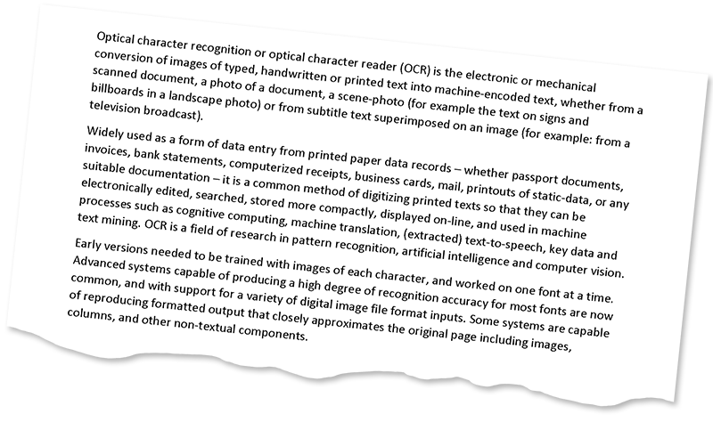

<style>
	button {
		cursor: pointer;
		margin-right: 20px;
		padding: 7px 15px;
		border: none;
		border-radius: 5px;
		background-color: #1a89d0;
		font-weight: 700;
		font-size: 15px;
		color: #ffffff;
	}

	button:hover {
		background-color: #3071a9;
	}

	button:focus {
		outline: none;
	}

	.code-sample {
		display: flex;
	}

	.code-sample > div {
		display: flex;
		align-items: center;
		padding: 5px 10px;
		border-radius: 5px;
		white-space: nowrap;
		background-color: rgba(0,0,0,5%);
		font-size: 16px;
		font-weight: 700;
	}

	.unseen {
		display: none !important;
	}

	.duo {
		position: relative;
		width: 800px;
		height: 474px;
	}

	.duo > img {
		position: absolute;
	}
</style>

When a page is fed to a flatbed scanner (mechanically or manually) or photographed with a smartphone, it is nearly impossible to achieve perfect alignment. As a result, a slight skew (tilt) inevitably occurs in scanned images or photographs.

Skew angle detection and image straightening is critical to the OCR process as it directly affects the reliability and efficiency of segmentation and text extraction. Aspose.OCR offers automated processing algorithms to correct image tilt (deskew) before proceeding to recognition.

## Detecting skew angles

To find out skew angles for all images in a [batch](/ocr/net/ocrinput/), use [`CalculateSkew`](https://reference.aspose.com/ocr/java/com.aspose.ocr/asposeocr/#CalculateSkew-com.aspose.ocr.OcrInput-) method. It returns a list of `SkewOutput` objects, one per image, with the following properties:

Property | Type | Description
-------- | ---- | -----------
`Angle` | `double` | Skew angle in degrees.
`ImageIndex` | `int` | Sequence number of the image on the page. When working with single-page images, this value is always 0.
`Page` | `int` | Page number. When working with single-page images, this value is always 0.
`Source` | `String` | The full path or URL of the source file. If the file is provided as a `BufferedImage` object, an array of pixels, or a Base64 string, this value will be empty.

{}
- Skew angles are calculated for all images in the batch, including those without text.
- PDF documents can contain more than one image per page. Therefore, the resulting list can contain more `SkewOutput` objects than the number of pages in the document.
{}

```java
AsposeOcr recognitionEngine = new AsposeOcr();
// Add PDF documents to OcrInput object
OcrInput input = new OcrInput(InputType.PDF);
input.Add("source.pdf");
// Detect skew angles
ArrayList<SkewOutput> angles = recognitionEngine.CalculateSkew(input);
angles.forEach((angle) -> {
	System.out.println("File: " + angle.Source + " | Page: " + angle.Page + " | Image: "+ angle.ImageIndex + " | Angle: " + angle.Angle +"°");
});
```



<div id="skew-angle" class="code-sample">
	<button onclick="calculateSkewAngle(this)">Calculate skew angle</button>
	<div class="unseen"><code>&gt; File: "C:\source.pdf" | Page: 0 | Image: 0 | Angle: 5.9°</code></div>
</div>
<script>
	function calculateSkewAngle(obj)
	{
		$(obj).siblings("div").removeClass("unseen");
	}
</script>

## Automatic skew correction

To automatically straighten skewed image before recognition, run the image through [`AutoSkew`](https://reference.aspose.com/ocr/java/com.aspose.ocr/PreprocessingFilter#AutoSkew--) preprocessing filter.

```java
AsposeOCR api = new AsposeOCR();
// Apply automatic skew correction
PreprocessingFilter filters = new PreprocessingFilter();
filters.add(PreprocessingFilter.AutoSkew());
// Prepare batch
OcrInput images = new OcrInput(InputType.SingleImage, filters);
images.add("image.png");
// Save processed images to the folder
ImageProcessing.Save(images, "C:\\images");
```

<div class="duo">
	
	
</div>
<button onclick="triggerSkew(this)">Deskew image</button>
<script>
	function triggerSkew(obj)
	{
		let images = $(".duo > img");
		let skewed = images.eq(0).is(":visible");
		if(skewed)
		{
			images.eq(1).show(200);
			images.eq(0).hide(200);
			$(obj).text("Revert to original image");
		}
		else
		{
			images.eq(0).show(200);
			images.eq(1).hide(200);
			$(obj).text("Deskew image");
		}
	}
</script>

## Manual skew correction

In some cases, automatic skew correction may incorrectly determine the angle of the image. This can happen to significantly rotated images (more than 20% inclination) or poor quality photos with significant perspective distortions.

To deal with such situations, you can rotate the image by the specified degree using [`Rotate`](https://reference.aspose.com/ocr/java/com.aspose.ocr/PreprocessingFilter#Rotate-float-) preprocessing filter. The rotation angle is passed in degrees:

- Negative angle (`-360` to `0`): rotate counterclockwise;
- Positive angle (`0` to `360`): rotate clockwise.

```java
AsposeOCR api = new AsposeOCR();
// Apply manual rotation
PreprocessingFilter filters = new PreprocessingFilter();
filters.add(PreprocessingFilter.Rotate(-90));
// Prepare batch
OcrInput images = new OcrInput(InputType.SingleImage, filters);
images.add("image.png");
// Save processed images to the folder
ImageProcessing.Save(images, "C:\\images");
```

## Image regions preprocessing

Automatic skew correction and manual rotation filters can be applied to specific regions of an image. For example, you can straighten an illustration on a page while leaving the rest of the content unchanged.

{} 
The original size of an image does not change when its area is rotated. Parts of the rotated area that do not match the original size of the area are cropped.

It is recommended to apply the automatic deskew and manual rotation filters only to square areas.
{}

To apply a filter to an area, specify its top left corner along with width and height as [`Rectangle`](https://docs.oracle.com/javase/8/docs/api/java/awt/Rectangle.html) object. If the region is omitted, the filter is applied to the entire image.

```java
Rectangle rectangle = new Rectangle(5, 161, 340, 340);
PreprocessingFilter filters = new PreprocessingFilter();
filters.add(PreprocessingFilter.Rotate(90, rectangle));
```

## Usage scenarios

- Automatic skew correction is recommended in almost all cases, except for perfectly straight scans.
- Manual rotation is recommended for:
    - photos of low quality;
    - images with a significant angle of inclination.
