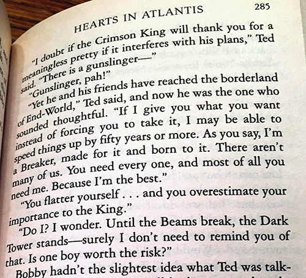

<style>
	button {
		cursor: pointer;
		margin-right: 20px;
		padding: 7px 15px;
		border: none;
		border-radius: 5px;
		background-color: #1a89d0;
		font-weight: 700;
		font-size: 15px;
		color: #ffffff;
	}

	button:hover {
		background-color: #3071a9;
	}

	button:focus {
		outline: none;
	}

	.duo {
		position: relative;
		width: 500px;
		height: 454px;
		margin-bottom: 20px;
	}

	.duo > img {
		position: absolute;
	}
</style>

Geometric distortions is a very common case when dealing with photos of books, magazines, multi-page documents, and similar content. They can be caused by physical page curvature or camera lens distortion (ultra-wide and fisheye lenses, as well as entry-level smartphone lenses).

Warped images are very hard to be processed by most OCR algorithms. Thus, image straightening and distortion removal is critical to the recognition process as it directly affects the reliability and efficiency of segmentation and text extraction. Aspose.OCR implements a preprocessing filter for automated correction of geometric distortions  before proceeding to recognition.

{}
The dewarping filter automatically converts the image to [grayscale](/ocr/java/grayscale/).
{}

## Important considerations

{}
At the moment, the dewarping filter is not intended for bulk processing. It takes a significant amount of time and has some limitations.  
We recommend using it for pinpoint processing of individual images that cannot be recognized otherwise.
{}

- Dewarping one image may take **more than a minute**.
- Due to the high complexity of the underlying neural network, dewarping is extremely resource-intensive (CPU and RAM).
- After removing the image curvature, text lines will have some wave-like distortion. Thus, it is highly recommended to use [`DetectAreasMode.CURVED_TEXT`](/ocr/java/areas-detection/curved_text/) areas detection mode to extract text from the dewarped image. Other area detection modes may produce inaccurate results.
- Dewarping also corrects image tilt. We recommend disabling [automatic skew correction](/ocr/java/deskew/) - it will have no effect and may even result in severe image distortion.

## Dewarping

To straighten the curved image, run it through [`AutoDewarping()`](https://reference.aspose.com/ocr/java/com.aspose.ocr/preprocessingfilter/#autodewarping--) preprocessing filter.

```java
AsposeOCR api = new AsposeOCR();	
RecognitionSettings settings = new RecognitionSettings();
// Apply dewarping filter 
PreprocessingFilter filters = new PreprocessingFilter();
filters.add(PreprocessingFilter.AutoDewarping());
settings.setPreprocessingFilters(filters);
// Save dewarped image to file
BufferedImage image =  api.PreprocessImage(file, filters);
File outputSource = new File("result.png");
ImageIO.write(image, "png", outputSource);
// Extract text from image
RecognitionResult result = api.RecognizePage(file, settings);
System.out.println(result);
```

<div class="duo">
	
	
</div>
<button onclick="triggerSkew(this)">Dewarp image</button>
<script>
	function triggerSkew(obj)
	{
		let images = $(".duo > img");
		let skewed = images.eq(0).is(":visible");
		if(skewed)
		{
			images.eq(1).show(200);
			images.eq(0).hide(200);
			$(obj).text("Revert to original image");
		}
		else
		{
			images.eq(0).show(200);
			images.eq(1).hide(200);
			$(obj).text("Dewarp image");
		}
	}
</script>

## Usage scenarios

Automatic dewarping is recommended for:

- Photos of book pages, magazines.
- Curved paper.
- Ultra wide-angle and fisheye photos.
