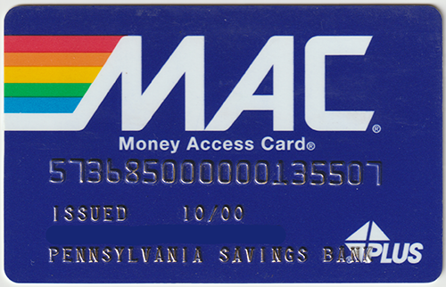

<style>
	button {
		cursor: pointer;
		margin-right: 20px;
		padding: 7px 15px;
		border: none;
		border-radius: 5px;
		background-color: #1a89d0;
		font-weight: 700;
		font-size: 15px;
		color: #ffffff;
	}

	button:hover {
		background-color: #3071a9;
	}

	button:focus {
		outline: none;
	}

	.duo {
		position: relative;
		width: 500px;
		height: 322px;
		margin-bottom: 20px;
	}

	.duo > img {
		position: absolute;
	}
</style>

In most cases, color is not needed for recognition and can even mislead OCR algorithms. Grayscale allows images to be processed more efficiently, resulting in less specks, cleaner backgrounds, and crisper text than color images. Converting to grayscale can also improve the results of other preprocessing filters, such as automatic [deskewing](/ocr/java/deskew/).

Aspose.OCR provides a method for converting an image to grayscale before proceeding with preprocessing or OCR.

{}
Grayscale conversion is automatically performed when applying the [median filter](/ocr/java/median/).
{}

## Grayscale conversion

To convert the image to grayscale, run the image through [`ToGrayscale`](https://reference.aspose.com/ocr/java/com.aspose.ocr/PreprocessingFilter#ToGrayscale--) preprocessing filter.

```java
AsposeOCR api = new AsposeOCR();
// Apply automatic grayscale conversion
PreprocessingFilter filters = new PreprocessingFilter();
filters.add(PreprocessingFilter.ToGrayscale());
// Prepare batch
OcrInput images = new OcrInput(InputType.SingleImage, filters);
images.add("image.png");
// Save processed images to the folder
ImageProcessing.Save(images, "C:\\images");
```

<div class="duo">
	
	
</div>
<button onclick="triggerSkew(this)">Convert to grayscale</button>
<script>
	function triggerSkew(obj)
	{
		let images = $(".duo > img");
		let skewed = images.eq(0).is(":visible");
		if(skewed)
		{
			images.eq(1).show(200);
			images.eq(0).hide(200);
			$(obj).text("Revert to original image");
		}
		else
		{
			images.eq(0).show(200);
			images.eq(1).hide(200);
			$(obj).text("Convert to grayscale");
		}
	}
</script>

## Usage scenarios

Grayscale conversion is recommended for the following images:

- Photos.
- Scanned ID cards and other personal documents.
- Full-color scans.

{}
Improvements in recognition accuracy and preprocessing enhancements will be highly dependent on the original image and should be empirically tested.
{}
