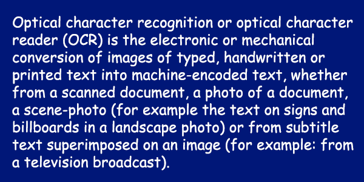

<style>
	button {
		cursor: pointer;
		margin-right: 20px;
		padding: 7px 15px;
		border: none;
		border-radius: 5px;
		background-color: #1a89d0;
		font-weight: 700;
		font-size: 15px;
		color: #ffffff;
	}

	button:hover {
		background-color: #3071a9;
	}

	button:focus {
		outline: none;
	}

	.duo {
		position: relative;
		width: 600px;
		height: 300px;
		margin-bottom: 20px;
	}

	.duo > img {
		position: absolute;
	}
</style>

When working with white (or light) text on a black (or other dark) background, recognition accuracy may suffer. It can be greatly improved by reversing the colors of the image so that light areas appear dark and dark areas appear light. In addition, other colors are also swapped: red becomes cyan, green becomes magenta, blue becomes yellow, and so on.

Aspose.OCR provides the automated preprocessing filter that inverts colors in the image before proceeding to recognition.

## Inverting image colors

To automatically invert colors in an image before recognition, run the image through [`Invert`](https://reference.aspose.com/ocr/java/com.aspose.ocr/PreprocessingFilter#Invert--) preprocessing filter.

```java
AsposeOCR api = new AsposeOCR();
// Invert colors
PreprocessingFilter filters = new PreprocessingFilter();
filters.add(PreprocessingFilter.Invert());
// Prepare batch
OcrInput images = new OcrInput(InputType.SingleImage, filters);
images.add("image.png");
// Save processed images to the folder
ImageProcessing.Save(images, "C:\\images");
```

<div class="duo">
	
	
</div>
<button onclick="triggerSkew(this)">Invert colors</button>
<script>
	function triggerSkew(obj)
	{
		let images = $(".duo > img");
		let skewed = images.eq(0).is(":visible");
		if(skewed)
		{
			images.eq(1).show(200);
			images.eq(0).hide(200);
			$(obj).text("Revert to original image");
		}
		else
		{
			images.eq(0).show(200);
			images.eq(1).hide(200);
			$(obj).text("Invert colors");
		}
	}
</script>

## Image regions preprocessing

You can invert certain areas of the image, such as black on a white headers, while leaving the rest of the content unchanged.

To apply a filter to an area, specify its top left corner along with width and height as [`Rectangle`](https://docs.oracle.com/javase/8/docs/api/java/awt/Rectangle.html) object. If the region is omitted, the filter is applied to the entire image.

```java
Rectangle rectangle = new Rectangle(5, 161, 340, 340);
PreprocessingFilter filters = new PreprocessingFilter();
filters.add(PreprocessingFilter.Invert(rectangle));
```

## Usage scenarios

Automatic color inversion is recommended for the following images:

- White text on black background.
- Advertisements.
- Business cards.
- Screenshots.
