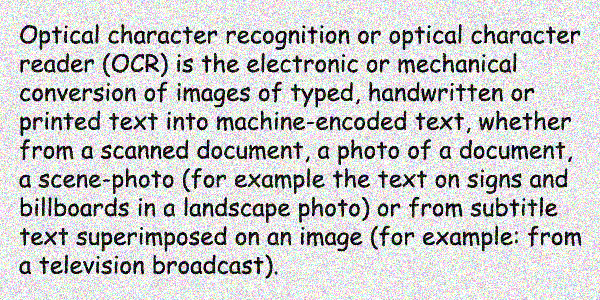

<style>
	button {
		cursor: pointer;
		margin-right: 20px;
		padding: 7px 15px;
		border: none;
		border-radius: 5px;
		background-color: #1a89d0;
		font-weight: 700;
		font-size: 15px;
		color: #ffffff;
	}

	button:hover {
		background-color: #3071a9;
	}

	button:focus {
		outline: none;
	}

	.duo {
		position: relative;
		width: 600px;
		height: 300px;
		margin-bottom: 20px;
	}

	.duo > img {
		position: absolute;
	}
</style>

Photos taken in low light conditions can have a lot of digital noise. Noise can also show up in highly compressed JPEG images in form of compression artifacts. This noise can mislead OCR algorithms and prevent other preprocessing filters from working properly.

Aspose.OCR provides an alternative method for [removing noise](/ocr/java/denoise/) from an image at the cost of some detail, called the _median filter_. This makes the image a little blurry while preserving the edges of high-contrast objects such as letters. The results can be further improved with the [auto-contrast](/ocr/java/contrast/) or [binarization](/ocr/java/binarization/) preprocessing filters.

{} 
The median filter automatically converts the image to [grayscale](/ocr/java/grayscale/).
{}

## Applying the median filter

To smooth out noise in an image, run the image through [`Median`](https://reference.aspose.com/ocr/java/com.aspose.ocr/PreprocessingFilter#Median--) preprocessing filter.

```java
AsposeOCR api = new AsposeOCR();
// Scale the image to twice its original size using bilinear interpolation
PreprocessingFilter filters = new PreprocessingFilter();
filters.add(PreprocessingFilter.Median());
// Save preprocessed image to file
BufferedImage imageRes = api.PreprocessImage("source.png", filters);
File outputSource = new File("result.png");
ImageIO.write(imageRes, "png", outputSource);
// Append preprocessing filters to recognition settings
RecognitionSettings recognitionSettings = new RecognitionSettings();
recognitionSettings.setPreprocessingFilters(filters);
// Recognize image
RecognitionResult result = api.RecognizePage("source.png", recognitionSettings);
System.out.println("Recognition result:\n" + result.recognitionText + "\n\n");
```

<div class="duo">
	
	
</div>
<button onclick="triggerSkew(this)">Smooth noise</button>
<script>
	function triggerSkew(obj)
	{
		let images = $(".duo > img");
		let skewed = images.eq(0).is(":visible");
		if(skewed)
		{
			images.eq(1).show(200);
			images.eq(0).hide(200);
			$(obj).text("Revert to original image");
		}
		else
		{
			images.eq(0).show(200);
			images.eq(1).hide(200);
			$(obj).text("Smooth noise");
		}
	}
</script>

## Image regions preprocessing

The median filter can be applied to specific areas of an image. For example, you can smooth an illustration in the newspaper article while leaving the rest of the content unchanged.

To apply a filter to an area, specify its top left corner along with width and height as [`Rectangle`](https://docs.oracle.com/javase/8/docs/api/java/awt/Rectangle.html) object. If the region is omitted, the filter is applied to the entire image.

```java
Rectangle rectangle = new Rectangle(5, 161, 340, 340);
PreprocessingFilter filters = new PreprocessingFilter();
filters.add(PreprocessingFilter.Median(rectangle));
```

## Usage scenarios

Median filter is recommended for the following images:

- Photos that were taken in low light conditions.
- Poor quality printouts.
- Highly compressed / low quality JPEG's.

{}
Improvements in recognition accuracy will be highly dependent on the original image and should be empirically tested. Applying a median filter can sometimes result in the loss of important details such as very thin characters and punctuation.
{}
