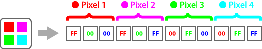

Aspose.OCR for Java allows you to [provide](/ocr/java/ocrinput/#adding-source-content) an image for recognition as an array of pixels. This can be useful when working with [unsupported](/ocr/java/supported-file-formats/) file formats or with raw bitmap data.

Pixels are listed from left to right (by line), and each line is added to the array from top to bottom.


The image is added as a flat array of integers representing the amount of each color per pixel in RGB (red-green-blue) order. The color depth ranges from 1 to 32 bits per pixel (configured in [`add` method](/ocr/java/ocrinput/#adding-source-content) of `OcrInput` object), where `0` means no that color and `FF` is the maximum amount of that color. For example, 2x2 pixels full color bitmap (24 bits per pixel without transparency) is represented as the following array:



Because the pixel array does not contain an image header, you must directly specify the image width and height, as well as the total number of bits required to code the color information of the pixel. The table below lists the most commonly used color models:

Bits per pixel | Color model
-------------- | -------------
1 | Monochrome (black and white)
8 | Grayscale (shades of gray)
24 | True color (RGB) without transparency
32 | True color (RGB) with transparency channel

## Example

```java
// Load image
URL resFile =	getClass().getClassLoader().getResource("source.bmp");
com.aspose.imaging.Image image = com.aspose.imaging.Image.load(resFile.getFile());
// Add image to batch
OcrInput source = new OcrInput(InputType.SingleImage);
try {
	com.aspose.imaging.RasterImage rasterImage = (com.aspose.imaging.RasterImage) image;
	int[] pixels = rasterImage.loadArgb32Pixels(rasterImage.getBounds());  
	source.add(pixels, rasterImage.getWidth(), rasterImage.getHeight(), rasterImage.getBitsPerPixel());
} finally {
	image.dispose(); 
}
```
