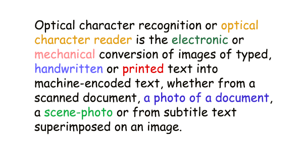
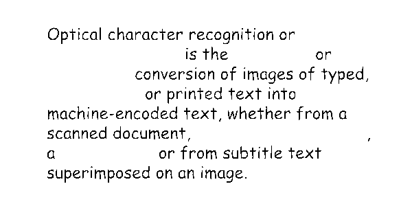
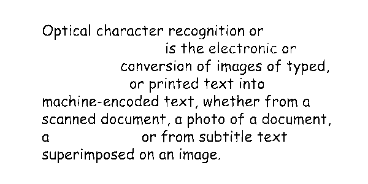

<style>
	button {
		cursor: pointer;
		padding: 7px 15px;
		border-top: solid 2px #1a89d0;
		border-bottom: solid 2px #1a89d0;
		border-left: solid 1px #1a89d0;
		border-right: solid 1px #1a89d0;
		background-color: #ffffff;
		font-weight: 700;
		font-size: 15px;
		color: #1a89d0;
	}

	button:focus {
		outline: none;
	}

	.sequence {
		position: relative;
		width: 600px;
		height: 300px;
		margin-top: 30px;
		margin-bottom: 30px;
		box-shadow: 5px 7px 10px 0px rgba(0,0,0,0.3);
	}

	.sequence > img {
		position: absolute;
	}

	.sequence > img:not(:first-child) {
		display: none;
	}

	.toolbar {
		display: flex;
		align-items: center;
		margin-bottom: 25px;
	}

	.toolbar > span {
		margin-right: 15px;
		font-weight: 700;
	}

	.toolbar > button {
		width: 90px;
	}

	.toolbar > button.active {
		background-color: #1a89d0;
		color: #ffffff;
	}

	.toolbar > button:not(.active):hover {
		background-color: #1a89d0;
		color: #ffffff;
	}

	.toolbar > button:nth-child(2) {
		border-left-width: 2px;
		border-top-left-radius: 5px;
		border-bottom-left-radius: 5px;
	}

	.toolbar > button:last-child {
		border-right-width: 2px;
		border-top-right-radius: 5px;
		border-bottom-right-radius: 5px;
	}

	.results > *:not(:first-child) {
		display: none;
	}

</style>

While you can extract text from color or grayscale scans or photographs, Aspose.OCR for JavaScript via C++ engine always uses black and white images to detect text and perform automatic corrections. The conversion to black-and-white is performed automatically; this process is called _binarization_.

In some rare cases, you may need to override the automatic binarization settings to get more accurate recognition results:

- Poor quality printouts such as faxes or receipts on thermal paper.
- Photos with glares and gradients taken in low-light conditions.
- Multicolored texts.

If you notice that part of the text disappears from the recognition results, try manually specifying the **threshold** criteria that determine whether a pixel is considered black or white. If a pixel is lighter than the threshold, it is considered a white pixel, otherwise it is considered a black pixel. In other words, the higher the threshold value, the more content will be sent for recognition, including words printed in very light colors. If the threshold set to `0`, the black and white are assigned automatically based on the content of the image.

To specify binarization threshold, set `threshold_value` property in [recognition setting](/ocr/javascript-cpp/settings/). To rely on automatic processing, do not set the `threshold_value`.

```javascript
var settings = Module.WasmAsposeOCRRecognitionSettings();
settings.threshold_value = 20;
```

## Live demo

<div class="sequence">
	
	
	
	
	
	
</div>

<div class="toolbar">
	<span>Threshold:</span>
	<button threshold="-1" class="active" onclick="showResult(this)"><i>Source</i></button>
	<button threshold="0" onclick="showResult(this)">Auto</button>
	<button threshold="50" onclick="showResult(this)">50</button>
	<button threshold="100" onclick="showResult(this)">100</button>
	<button threshold="150" onclick="showResult(this)">150</button>
	<button threshold="200" onclick="showResult(this)">200</button>
</div>

<script>
	function showResult(obj)
	{
		let button = $(obj);
		let threshold=button.attr("threshold");
		$(".sequence > img").hide();
		$(`.sequence > img[threshold="${threshold}"]`).show();
		$(".results > *").hide();
		$(`.results > *[threshold="${threshold}"]`).show();
		$(".toolbar > button").removeClass("active");
		button.addClass("active");
		$("#thresholdvalue").text((threshold<0)?0:threshold);
	}


"Optical character recognition or is the electronic or conversion of images of typed, handwritten ore text into machine-encoded text, whether from a scanned document, a photo of a document, a scene-photo or from subtitle text superImposed on an image."

</script>

### Code snippet

<div class="highlight"><pre tabindex="0" class="chroma"><code class="language-javascript hljs" data-lang="javascript"><span class="line"><span class="cl"><span class="kd"><span class="hljs-keyword">var</span></span> <span class="nx">source</span> <span class="o">=</span> <span class="nx">Module</span><span class="p">.</span><span class="nx">WasmAsposeOCRInput</span><span class="p">();</span>
</span></span><span class="line"><span class="cl"><span class="nx">source</span><span class="p">.</span><span class="nx">url</span> <span class="o">=</span> <span class="nx">filename</span><span class="p">;</span>
</span></span><span class="line"><span class="cl"><span class="kd"><span class="hljs-keyword">var</span></span> <span class="nx">content</span> <span class="o">=</span> <span class="k"><span class="hljs-keyword">new</span></span> <span class="nx">Module</span><span class="p">.</span><span class="nx">WasmAsposeOCRInputs</span><span class="p">();</span>
</span></span><span class="line"><span class="cl"><span class="nx">content</span><span class="p">.</span><span class="nx">push_back</span><span class="p">(</span><span class="nx">source</span><span class="p">);</span>
</span></span><span class="line"><span class="cl"><span class="c1"><span class="hljs-comment">// Set binarization threshold</span>
</span></span></span><span class="line"><span class="cl"><span class="c1"></span><span class="kd"><span class="hljs-keyword">var</span></span> <span class="nx">settings</span> <span class="o">=</span> <span class="nx">Module</span><span class="p">.</span><span class="nx">WasmAsposeOCRRecognitionSettings</span><span class="p">();</span>
</span></span><span class="line"><span class="cl"><span class="nx">settings</span><span class="p">.</span><span class="nx">threshold_value</span> <span class="o">=</span> <span class="mi"><span class="hljs-number" id="thresholdvalue">0</span></span><span class="p">;</span>
</span></span><span class="line"><span class="cl"><span class="c1"><span class="hljs-comment">// Recognize image</span>
</span></span></span><span class="line"><span class="cl"><span class="c1"></span><span class="kd"><span class="hljs-keyword">var</span></span> <span class="nx">result</span> <span class="o">=</span> <span class="nx">Module</span><span class="p">.</span><span class="nx">AsposeOCRRecognize</span><span class="p">(</span><span class="nx">content</span><span class="p">,</span> <span class="nx">settings</span><span class="p">);</span>
</span></span><span class="line"><span class="cl"><span class="kd"><span class="hljs-keyword">var</span></span> <span class="nx">result_str</span> <span class="o">=</span> <span class="nx">Module</span><span class="p">.</span><span class="nx">AsposeOCRSerializeResult</span><span class="p">(</span><span class="nx">result</span><span class="p">,</span> <span class="nx">Module</span><span class="p">.</span><span class="nx">ExportFormat</span><span class="p">.</span><span class="nx">text</span><span class="p">);</span>
</span></span><span class="line"><span class="cl"><span class="nx"><span class="hljs-built_in">console</span></span><span class="p">.</span><span class="nx">log</span><span class="p">(</span><span class="nx">result_str</span><span class="p">);</span>
</span></span></code></pre></div>

### Recognition result

<div class="results">

<div class="highlight" threshold="-1"><pre tabindex="0" style="background-color:#f8f8f8;-moz-tab-size:4;-o-tab-size:4;tab-size:4;"><code id="results"><span style="color:#8f5902;font-style:italic;">&lt;specify threshold value to recognize the image&gt;</span></code></pre></div>

<div class="highlight" threshold="0"><pre tabindex="0" style="background-color:#f8f8f8;-moz-tab-size:4;-o-tab-size:4;tab-size:4;"><code id="results">Optical character recognition or
is the electronic or
conversion of images of typed,
handwritten ore text into
machine-encoded text, whether from a
scanned document, a photo of a document,
a scene-photo or from subtitle text
superImposed on an image.
</code></pre></div>

<div class="highlight" threshold="50"><pre tabindex="0" style="background-color:#f8f8f8;-moz-tab-size:4;-o-tab-size:4;tab-size:4;"><code id="results">Optical character recognition or
Is the or
conversion of images of typed,
or printed text into
machine-encoded text, whether from a
scanned document,
a or from subtitle text
superimposed on an image.
</code></pre></div>

<div class="highlight" threshold="100"><pre tabindex="0" style="background-color:#f8f8f8;-moz-tab-size:4;-o-tab-size:4;tab-size:4;"><code id="results">Optical character recognition or
is the electronic or
conversion of images of typed,
or printed text into
machine-encoded text, whether from a
scanned document, a photo of a document,
a or from subtitle text
superimposed or an Image.
</code></pre></div>

<div class="highlight" threshold="150"><pre tabindex="0" style="background-color:#f8f8f8;-moz-tab-size:4;-o-tab-size:4;tab-size:4;"><code id="results">Optical character recognition or
is the electronic or
conversion of images of typed,
handwritten or printed text into
machine-encoded text, whether from a
scanned document,a photo of a document,
a scene-photo or from subtitle text
superimposed on an image.
</code></pre></div>

<div class="highlight" threshold="200"><pre tabindex="0" style="background-color:#f8f8f8;-moz-tab-size:4;-o-tab-size:4;tab-size:4;"><code id="results">Optical character recognition or optical
character reader is the electronic or
mechanical conversion of images of typed,
handwritten or printed text into
machine-encoded text, whether from a
scanned document,a photo of a document,
a scene-photo or from subtitle text
superimposed on an image.
</code></pre></div>

</div>

## Usage scenarios

Specifying custom binarization threshold is recommended when recognizing:

- Colored texts.
- Images with low contrast between text and background.
- Photos with glares caused by uneven lighting, such as spot lights or flash.
