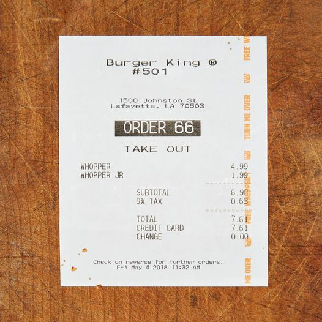

<style>
	button {
		cursor: pointer;
		margin-right: 20px;
		margin-bottom: 20px;
		padding: 7px 15px;
		border: none;
		border-radius: 5px;
		background-color: #1a89d0;
		font-weight: 700;
		font-size: 15px;
		color: #ffffff;
	}

	button:hover {
		background-color: #3071a9;
	}

	button:focus {
		outline: none;
	}

	.duo {
		display: flex;
		flex-direction: row;
		align-items: stretch;
		margin-bottom: 20px;
	}

	.duo > * {
		margin-bottom: 0 !important;
	}

	.duo > pre {
		display: none;
		margin-left: 15px;
		min-width: 300px;
	}
	
</style>

The `AsposeAI` class integrates external AI models (e.g., from Hugging Face) into OCR recognition results for **keyword and numeric value search** in OCR-recognized text.

## Constructor

```csharp
public AsposeAI();
public AsposeAI(ILogger? logger);
```

You can also pass optional logging and customization callbacks.

### 🔤 KeywordsAIProcessor Class – Postprocessor Module

- Implements: `IOcrAIPostProcessor`
- Description: A built-in module that performs AI-powered keyword and numeric value search.
- Usage: Register using `AsposeAI.SetPostProcessor(new KeywordsAIProcessor())`

## 🔗 API References

- [`AsposeAI`](https://reference.aspose.com/ocr/net/aspose.ocr.ai/asposeai/)  
  Core class to load, configure, and apply AI models (e.g., for keywords detection) to OCR results.

- [`KeywordsAIProcessor`](https://reference.aspose.com/ocr/net/aspose.ocr.ai/keywordsaiprocessor/)  
  Built-in AI postprocessor that uses a language model to keyword and numeric value search in OCR-recognized text


```csharp
   ILogger logger = new ConsoleLogger(); // can be null
   AsposeAIModelConfig modelConfig = new AsposeAIModelConfig
   {
       AllowAutoDownload = true,
       DirectoryModelPath = "D://test",
   };

   AsposeAI ai = new AsposeAI(logger);
   KeywordsAIProcessor processor = new KeywordsAIProcessor()
   processor.SetKeywords(new string[] {"Total", "Subtotal" });
   ai.SetPostProcessor(processor, modelConfig);
   ai.RunPostprocessor(res);

   Console.WriteLine("JSON RESULT\n");
   Console.WriteLine(processor.GetResult()[0].Result)
   ai.Dispose();
```

## Live demo

<div class="duo">

<pre class="rec-result">
Burger King R
#501
1500 Johnston St
LafayetteLA 70503
0RDER66
TAKE OUT
WHOPPER 4.99
WHOPPER JR 1.99
SUBTOTAL 6.98
9% TAX 0.63
TOTAL 7.6
CREDIT CARD 7.61
CHANGE 0.00
Check on reverse for fur ther orders.
Fr+ May 42018 11:32 AM
</pre>
<pre class="ai-result">
[
  {
    "keyword": "Total",
    "value": "7.6",
    "number": "7.6"
  },
  {
    "keyword": "Subtotal",
    "value": "6.98",
    "number": "6.98"
  }
]
</pre>
</div>

<button onclick="$('.rec-result').slideDown(100); $('.ai-result').slideUp(100);">Extract keywords</button>
<button onclick="$('.ai-result').slideDown(100)">AI keywords</button>

### 🐞 Logging & error handling
Pass `ILogger` to constructor to track loading and inference.
