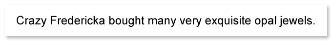

Aspose.OCR can automatically build a list of characters found in an image and provide 4 less likely alternatives of each character (in descending order of probability). This list is provided in [`RecognitionCharactersList`](https://reference.aspose.com/ocr/net/aspose.ocr/recognitionresult/recognitioncharacterslist/) property of [`Aspose.OCR.RecognitionResult`](https://reference.aspose.com/ocr/net/aspose.ocr/recognitionresult/) object.





```csharp
Aspose.OCR.AsposeOcr recognitionEngine = new Aspose.OCR.AsposeOcr();
Aspose.OCR.RecognitionResult result = recognitionEngine.RecognizeImage("source.png", new Aspose.OCR.RecognitionSettings());
// Output recognition result
Console.WriteLine($"Result: {result.RecognitionText}");
// Get list of characters
List<char[]> characterList = result.RecognitionCharactersList;
// Unique characters
List<char> uniqueCharacters = characterList.Select(x => x[0]).Distinct().OrderBy(x => x).ToList();
Console.WriteLine($"Unique characters: {string.Join("", uniqueCharacters)}");
// Alternatives
foreach(char[] chars in characterList)
{
	Console.WriteLine(string.Join(" | ", chars));
}
```


```
Result: Crazy Fredericka bought many very exquisite opal jewels.

Unique characters:  .CFabcdeghijklmnopqrstuvwxyz

C | c | C | C | G
r | C | n | T | r
a | a | a | a | a
z | Z | c | E | x
y | y | y | s | }
  | C | y | _ | .
F |   | E | P | R
r | C | f | F | e
e | C | e | d | e
d | d | C | d | H
e | d | C | e | B
r | r | f | r | C
i | C | I | i | i
c | e | C | c | d
k | h | k | < | b
a | o | a | a | a
{...}
```



The list of _unique characters_ can later be used for identifying a [whitelist](/ocr/net/characters-whitelist/) to greatly improve the accuracy and performance of recognition.

_Alternatives_ can be used to find out patterns in common recognition errors, such as misidentifying certain characters in a font used in an image, and to take corrective action, such as automatic substitution.
