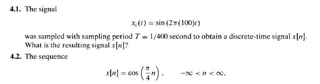
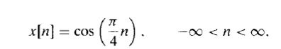

<style>
	button {
		cursor: pointer;
		margin-right: 20px;
		margin-bottom: 20px;
		padding: 7px 15px;
		border: none;
		border-radius: 5px;
		background-color: #1a89d0;
		font-weight: 700;
		font-size: 15px;
		color: #ffffff;
	}

	button:hover {
		background-color: #3071a9;
	}

	button:focus {
		outline: none;
	}

	.duo {
		display: flex;
		flex-direction: row;
		align-items: stretch;
		margin-bottom: 20px;
	}

	.duo > * {
		margin-bottom: 0 !important;
	}

	.duo > pre {
		display: none;
		margin-left: 15px;
		min-width: 300px;
	}
	
</style>


Aspose.OCR for .NET now provides a dedicated API for detecting and recognizing mathematical formulas in images, scanned documents, screenshots, or photos.
To extract formula text, simply call the universal [`Aspose.OCR.AsposeOcr.RecognizeFormula`](https://reference.aspose.com/ocr/net/aspose.ocr/asposeocr/recognizeformula/) method.

This method accepts an `OcrInput` object and optional recognition settings.
Internally, formula detection uses the [`DetectAreasMode.FORMULA`](https://reference.aspose.com/ocr/net/aspose.ocr/detectareasmode/) mode to locate mathematical expressions before recognition.

Recognition results are returned as a list of `Aspose.OCR.RecognitionResult` objects. Each result contains extracted formula text, detected regions, and allows exporting to various formats.

## DetectAreasMode.FORMULA

```csharp
Aspose.OCR.AsposeOcr recognitionEngine = new Aspose.OCR.AsposeOcr();
// Add images to OcrInput object
Aspose.OCR.OcrInput input = new Aspose.OCR.OcrInput(Aspose.OCR.InputType.SingleImage);
input.Add("source1.png");
input.Add("source2.jpg");
// Configure recognition settings for formulas
Aspose.OCR.RecognitionSettings settings = new Aspose.OCR.RecognitionSettings();
settings.DetectAreasMode = Aspose.OCR.DetectAreasMode.FORMULA;
// Recognize formulas on the image
Aspose.OCR.OcrOutput results = recognitionEngine.Recognize(input, recognitionSettings);
foreach(Aspose.OCR.RecognitionResult result in results)
{
	Console.WriteLine(result.RecognitionText);
}
```

## RecognizeFormula(OcrInput images, bool detectAreas = true)

```csharp
Aspose.OCR.AsposeOcr recognitionEngine = new Aspose.OCR.AsposeOcr();
// Add images to OcrInput object
Aspose.OCR.OcrInput input = new Aspose.OCR.OcrInput(Aspose.OCR.InputType.SingleImage);
input.Add("source1.png");
input.Add("source2.jpg");

// Recognize formulas with areas detection
Aspose.OCR.OcrOutput results = recognitionEngine.RecognizeFormula(input, true);
// Parameter bool detectAreas - if set to true, automatically detects and isolates formula regions before performing recognition. If false, processes the entire image as a formula.

foreach(Aspose.OCR.RecognitionResult result in results)
{
	Console.WriteLine(result.RecognitionText);
}
```


## Live demo 
```csharp
recognitionEngine.RecognizeFormula(input, true)
```

<div class="duo">


<pre class="rec-result">
x_{c} ( t )=\\sin\left( 2 \\pi( 1 0 0 ) t \right)
T=1 / 4 0 0
x [ n ]
x [ n ]
x [ n ]=\\cos\left( {\\frac{\\pi} {4}} n \right) , \\qquad-\\infty< n < \\infty.
</pre>
</div>


<button onclick="triggerRecogn(this)">Extract formulas</button>
<script>
	function triggerRecogn(obj)
	{
		let images = $(".duo > img");
		let skewed = images.eq(0).is(":visible");
		if(skewed)
		{
			images.eq(1).show(200);
			images.eq(0).hide(200);
			$(obj).text("Revert to original image");
			$('.rec-result').slideDown(100);
		}
		else
		{
			images.eq(0).show(200);
			images.eq(1).hide(200);
			$(obj).text("Extract formulas");
			$('.rec-result').slideUp(100);
		}
	}
</script>

## Live demo 
```csharp
recognitionEngine.RecognizeFormula(input, false)
```

<div class="duo">

<pre class="rec-result2">
x [ n ]=\\cos\left( \\frac{\\pi} {4} n \right) . \\qquad-\\infty< n < \\infty.
</pre>
</div>

<button onclick="$('.rec-result2').slideDown(100);">Extract formulas</button>