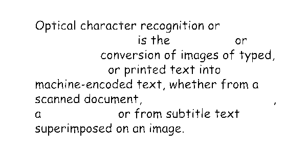
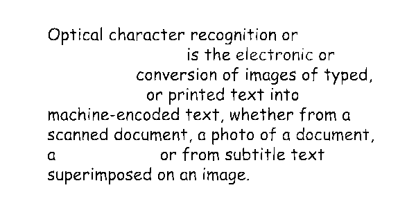

<style>
	button {
		cursor: pointer;
		padding: 7px 15px;
		border-top: solid 2px #1a89d0;
		border-bottom: solid 2px #1a89d0;
		border-left: solid 1px #1a89d0;
		border-right: solid 1px #1a89d0;
		background-color: #ffffff;
		font-weight: 700;
		font-size: 15px;
		color: #1a89d0;
	}

	button:focus {
		outline: none;
	}

	.sequence {
		position: relative;
		width: 600px;
		height: 300px;
		margin-top: 30px;
		margin-bottom: 30px;
		box-shadow: 5px 7px 10px 0px rgba(0,0,0,0.3);
	}

	.sequence > img {
		position: absolute;
	}

	.sequence > img:not(:first-child) {
		display: none;
	}

	.toolbar {
		display: flex;
		align-items: center;
		margin-bottom: 25px;
	}

	.toolbar > span {
		margin-right: 15px;
		font-weight: 700;
	}

	.toolbar > button {
		width: 90px;
	}

	.toolbar > button.active {
		background-color: #1a89d0;
		color: #ffffff;
	}

	.toolbar > button:not(.active):hover {
		background-color: #1a89d0;
		color: #ffffff;
	}

	.toolbar > button:nth-child(2) {
		border-left-width: 2px;
		border-top-left-radius: 5px;
		border-bottom-left-radius: 5px;
	}

	.toolbar > button:last-child {
		border-right-width: 2px;
		border-top-right-radius: 5px;
		border-bottom-right-radius: 5px;
	}

	.results > *:not(:first-child) {
		display: none;
	}

</style>

While you can extract text from color or grayscale scans or photographs, Aspose.OCR engine always uses black and white images to detect text and perform automatic corrections. The conversion to black-and-white is performed automatically; this process is called _binarization_.

## Automatically converting the image to black and white

By default, Aspose.OCR automatically calculates the optimal binarization parameters. To convert the image to black and white before performing the recognition, apply [`Binarize`](https://reference.aspose.com/ocr/net/aspose.ocr.models.preprocessingfilters/preprocessingfilter/binarize/) preprocessing filter:

{}
The image is automatically converted to black and white when applying the following filters:

- [Noise removal](/ocr/net/denoise/)
- [Contrast correction](/ocr/net/contrast/)
- [Dilation](/ocr/net/dilate/)
{}

```csharp
Aspose.OCR.AsposeOcr recognitionEngine = new Aspose.OCR.AsposeOcr();
// Use automatic binarization
Aspose.OCR.Models.PreprocessingFilters.PreprocessingFilter filters = new Aspose.OCR.Models.PreprocessingFilters.PreprocessingFilter();
filters.Add(Aspose.OCR.Models.PreprocessingFilters.PreprocessingFilter.Binarize());
// Save preprocessed image to file for debugging purposes
using(MemoryStream ms = recognitionEngine.PreprocessImage("source.png", filters))
{
	using(FileStream fs = new FileStream("result.png", FileMode.Create, FileAccess.Write))
	{
		ms.WriteTo(fs);
	}
}
// Append preprocessing filters to recognition settings
Aspose.OCR.RecognitionSettings recognitionSettings = new Aspose.OCR.RecognitionSettings();
recognitionSettings.PreprocessingFilters = filters;
// Recognize image
Aspose.OCR.RecognitionResult result = recognitionEngine.RecognizeImage("source.png", recognitionSettings);
Console.WriteLine(result.RecognitionText);
```

## Using binarization threshold

In some rare cases, you may need to override the automatic binarization settings to get more accurate recognition results:

- Poor quality printouts such as faxes or receipts on thermal paper.
- Photos with glares and gradients taken in low-light conditions.
- Multicolored texts.

If you notice that part of the text disappears from the recognition results, try manually specifying the **threshold** criteria that determine whether a pixel is considered black or white. If a pixel is lighter than the threshold, it is considered a white pixel, otherwise it is considered a black pixel. In other words, the higher the threshold value, the more content will be sent for recognition, including words printed in very light colors. If the threshold set to `0`, the black and white are assigned automatically based on the content of the image.

To specify binarization threshold, provide it in [`Threshold`](https://reference.aspose.com/ocr/net/aspose.ocr.models.preprocessingfilters/preprocessingfilter/threshold/) preprocessing filter or set [`ThresholdValue`](https://reference.aspose.com/ocr/net/aspose.ocr/recognitionsettings/thresholdvalue/) property in recognition settings. To rely on automatic processing, do not add a filter and do not set the `ThresholdValue`.



```csharp
Aspose.OCR.AsposeOcr recognitionEngine = new Aspose.OCR.AsposeOcr();
// Manually specify binarization threshold
Aspose.OCR.Models.PreprocessingFilters.PreprocessingFilter filters = new Aspose.OCR.Models.PreprocessingFilters.PreprocessingFilter();
filters.Add(Aspose.OCR.Models.PreprocessingFilters.PreprocessingFilter.Threshold(150));
// Save preprocessed image to file for debugging purposes
using(MemoryStream ms = recognitionEngine.PreprocessImage("source.png", filters))
{
	using(FileStream fs = new FileStream("result.png", FileMode.Create, FileAccess.Write))
	{
		ms.WriteTo(fs);
	}
}
// Append preprocessing filters to recognition settings
Aspose.OCR.RecognitionSettings recognitionSettings = new Aspose.OCR.RecognitionSettings();
recognitionSettings.PreprocessingFilters = filters;
// Recognize image
Aspose.OCR.RecognitionResult result = recognitionEngine.RecognizeImage("source.png", recognitionSettings);
Console.WriteLine(result.RecognitionText);
```


```csharp
Aspose.OCR.AsposeOcr recognitionEngine = new Aspose.OCR.AsposeOcr();
// Manually specify binarization threshold
Aspose.OCR.RecognitionSettings recognitionSettings = new Aspose.OCR.RecognitionSettings();
recognitionSettings.ThresholdValue = 150;
// Recognize image
Aspose.OCR.RecognitionResult result = recognitionEngine.RecognizeImage("source.png", recognitionSettings);
Console.WriteLine(result.RecognitionText);
```



### Live demo

<div class="sequence">
	
	
	
	
	
	
</div>

<div class="toolbar">
	<span>Threshold:</span>
	<button threshold="-1" class="active" onclick="showResult(this)"><i>Source</i></button>
	<button threshold="0" onclick="showResult(this)">Auto</button>
	<button threshold="50" onclick="showResult(this)">50</button>
	<button threshold="100" onclick="showResult(this)">100</button>
	<button threshold="150" onclick="showResult(this)">150</button>
	<button threshold="200" onclick="showResult(this)">200</button>
</div>

<script>
	function showResult(obj)
	{
		let button = $(obj);
		let threshold=button.attr("threshold");
		$(".sequence > img").hide();
		$(`.sequence > img[threshold="${threshold}"]`).show();
		$(".results > *").hide();
		$(`.results > *[threshold="${threshold}"]`).show();
		$(".toolbar > button").removeClass("active");
		button.addClass("active");
		$("#thresholdvalue").text((threshold<0)?0:threshold);
	}


"Optical character recognition or is the electronic or conversion of images of typed, handwritten ore text into machine-encoded text, whether from a scanned document, a photo of a document, a scene-photo or from subtitle text superImposed on an image."

</script>

#### Code snippet

<div class="highlight"><pre tabindex="0" style="background-color:#f8f8f8;-moz-tab-size:4;-o-tab-size:4;tab-size:4;"><code class="language-csharp" data-lang="csharp"><span style="display:flex;"><span><span style="color:#000">Aspose</span><span style="color:#000;font-weight:bold">.</span><span style="color:#000">OCR</span><span style="color:#000;font-weight:bold">.</span><span style="color:#000">AsposeOcr</span> <span style="color:#000">recognitionEngine</span> <span style="color:#000;font-weight:bold">=</span> <span style="color:#204a87;font-weight:bold">new</span> <span style="color:#000">Aspose</span><span style="color:#000;font-weight:bold">.</span><span style="color:#000">OCR</span><span style="color:#000;font-weight:bold">.</span><span style="color:#000">AsposeOcr</span><span style="color:#000;font-weight:bold">();</span>
</span></span><span style="display:flex;"><span><span style="color:#000">Aspose</span><span style="color:#000;font-weight:bold">.</span><span style="color:#000">OCR</span><span style="color:#000;font-weight:bold">.</span><span style="color:#000">RecognitionSettings</span> <span style="color:#000">recognitionSettings</span> <span style="color:#000;font-weight:bold">=</span> <span style="color:#204a87;font-weight:bold">new</span> <span style="color:#000">Aspose</span><span style="color:#000;font-weight:bold">.</span><span style="color:#000">OCR</span><span style="color:#000;font-weight:bold">.</span><span style="color:#000">RecognitionSettings</span><span style="color:#000;font-weight:bold">();</span>
</span></span><span style="display:flex;"><span><span style="color:#000">recognitionSettings</span><span style="color:#000;font-weight:bold">.</span><span style="color:#000">ThresholdValue</span> <span style="color:#000;font-weight:bold">=</span> <span id="thresholdvalue" style="color:#0000cf;font-weight:bold">0</span><span style="color:#000;font-weight:bold">;</span>
</span></span><span style="display:flex;"><span><span style="color:#000">Aspose</span><span style="color:#000;font-weight:bold">.</span><span style="color:#000">OCR</span><span style="color:#000;font-weight:bold">.</span><span style="color:#000">RecognitionResult</span> <span style="color:#000">result</span> <span style="color:#000;font-weight:bold">=</span> <span style="color:#000">recognitionEngine</span><span style="color:#000;font-weight:bold">.</span><span style="color:#000">RecognizeImage</span><span style="color:#000;font-weight:bold">(</span><span style="color:#4e9a06">"source.png"</span><span style="color:#000;font-weight:bold">,</span> <span style="color:#000">recognitionSettings</span><span style="color:#000;font-weight:bold">);</span>
</span></span><span style="display:flex;"><span><span style="color:#000">Console</span><span style="color:#000;font-weight:bold">.</span><span style="color:#000">WriteLine</span><span style="color:#000;font-weight:bold">(</span><span style="color:#000">result</span><span style="color:#000;font-weight:bold">.</span><span style="color:#000">RecognitionText</span><span style="color:#000;font-weight:bold">);</span>
</span></span></code></pre></div>

#### Recognition result

<div class="results">

<div class="highlight" threshold="-1"><pre tabindex="0" style="background-color:#f8f8f8;-moz-tab-size:4;-o-tab-size:4;tab-size:4;"><code id="results"><span style="color:#8f5902;font-style:italic;">&lt;specify threshold value to recognize the image&gt;</span></code></pre></div>

<div class="highlight" threshold="0"><pre tabindex="0" style="background-color:#f8f8f8;-moz-tab-size:4;-o-tab-size:4;tab-size:4;"><code id="results">Optical character recognition or
is the electronic or
conversion of images of typed,
handwritten ore text into
machine-encoded text, whether from a
scanned document, a photo of a document,
a scene-photo or from subtitle text
superImposed on an image.
</code></pre></div>

<div class="highlight" threshold="50"><pre tabindex="0" style="background-color:#f8f8f8;-moz-tab-size:4;-o-tab-size:4;tab-size:4;"><code id="results">Optical character recognition or
Is the or
conversion of images of typed,
or printed text into
machine-encoded text, whether from a
scanned document,
a or from subtitle text
superimposed on an image.
</code></pre></div>

<div class="highlight" threshold="100"><pre tabindex="0" style="background-color:#f8f8f8;-moz-tab-size:4;-o-tab-size:4;tab-size:4;"><code id="results">Optical character recognition or
is the electronic or
conversion of images of typed,
or printed text into
machine-encoded text, whether from a
scanned document, a photo of a document,
a or from subtitle text
superimposed or an Image.
</code></pre></div>

<div class="highlight" threshold="150"><pre tabindex="0" style="background-color:#f8f8f8;-moz-tab-size:4;-o-tab-size:4;tab-size:4;"><code id="results">Optical character recognition or
is the electronic or
conversion of images of typed,
handwritten or printed text into
machine-encoded text, whether from a
scanned document,a photo of a document,
a scene-photo or from subtitle text
superimposed on an image.
</code></pre></div>

<div class="highlight" threshold="200"><pre tabindex="0" style="background-color:#f8f8f8;-moz-tab-size:4;-o-tab-size:4;tab-size:4;"><code id="results">Optical character recognition or optical
character reader is the electronic or
mechanical conversion of images of typed,
handwritten or printed text into
machine-encoded text, whether from a
scanned document,a photo of a document,
a scene-photo or from subtitle text
superimposed on an image.
</code></pre></div>

</div>

## Image regions preprocessing

`Binarize` and `Threshold` filters can be applied to specific regions of an image. For example, you can manually binarize a diagram in the article, leaving the rest of the content unchanged.

To apply a filter to an area, specify its top left corner along with width and height as [`Aspose.Drawing.Rectangle`](https://reference.aspose.com/drawing/net/system.drawing/rectangle/) object. If the region is omitted, the filter is applied to the entire image.

```csharp
Aspose.Drawing.Rectangle rectangle = new Aspose.Drawing.Rectangle(5, 161, 340, 113);
Aspose.OCR.Models.PreprocessingFilters.PreprocessingFilter filters = new Aspose.OCR.Models.PreprocessingFilters.PreprocessingFilter();
filters.Add(Aspose.OCR.Models.PreprocessingFilters.PreprocessingFilter.Threshold(150, rectangle));
```

## Usage scenarios

Binarization is always used for text detection and automatic image corrections.
