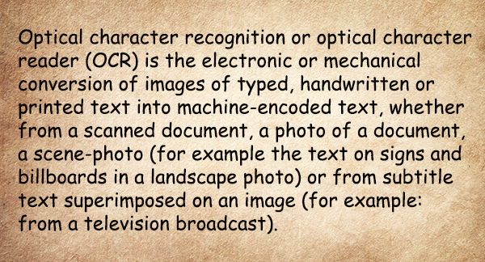

<style>
	button {
		cursor: pointer;
		margin-right: 20px;
		padding: 7px 15px;
		border: none;
		border-radius: 5px;
		background-color: #1a89d0;
		font-weight: 700;
		font-size: 15px;
		color: #ffffff;
	}

	button:hover {
		background-color: #3071a9;
	}

	button:focus {
		outline: none;
	}

	.duo {
		position: relative;
		width: 600px;
		height: 324px;
		margin-bottom: 20px;
	}

	.duo > img {
		position: absolute;
	}
</style>

Low contrast and blurring are the most typical distortions when text is photographed with a smartphone camera, especially in low light conditions. They make it difficult for the OCR algorithms to operate successfully, significantly reducing the recognition accuracy.

Aspose.OCR can automatically increase the contrast of images before proceeding to recognition.

{} 
Contrast correction automatically converts the image to [black and white](/ocr/net/binarization/#automatically-converting-the-image-to-black-and-white).
{}

## Automatic contrast adjustments

To automatically increase the image contrast before recognition, run the image through [`ContrastCorrectionFilter`](https://reference.aspose.com/ocr/net/aspose.ocr.models.preprocessingfilters/preprocessingfilter/contrastcorrectionfilter/) processing filter.

```csharp
Aspose.OCR.AsposeOcr recognitionEngine = new Aspose.OCR.AsposeOcr();
// Enable automatic contrast adjustments
Aspose.OCR.Models.PreprocessingFilters.PreprocessingFilter filters = new Aspose.OCR.Models.PreprocessingFilters.PreprocessingFilter();
filters.Add(Aspose.OCR.Models.PreprocessingFilters.PreprocessingFilter.ContrastCorrectionFilter());
// Add an image to OcrInput object and apply processing filters
Aspose.OCR.OcrInput input = new Aspose.OCR.OcrInput(Aspose.OCR.InputType.SingleImage, filters);
input.Add("source.png");
// Save processed image to the folder
Aspose.OCR.ImageProcessing.Save(input, @"C:\result");
// Recognize image
Aspose.OCR.OcrOutput results = recognitionEngine.Recognize(input);
foreach(Aspose.OCR.RecognitionResult result in results)
{
	Console.WriteLine(result.RecognitionText);
}
```

<div class="duo">
	
	
</div>
<button onclick="triggerSkew(this)">Increase contrast</button>
<script>
	function triggerSkew(obj)
	{
		let images = $(".duo > img");
		let skewed = images.eq(0).is(":visible");
		if(skewed)
		{
			images.eq(1).show(200);
			images.eq(0).hide(200);
			$(obj).text("Revert to original image");
		}
		else
		{
			images.eq(0).show(200);
			images.eq(1).hide(200);
			$(obj).text("Increase contrast");
		}
	}
</script>

## Image regions processing

You can automatically adjust the contrast of certain areas of the image. For example, increase the contrast of a photo in an article while leaving the rest of the content unchanged.

To apply a filter to an area, specify its top left corner along with width and height as [`Aspose.Drawing.Rectangle`](https://reference.aspose.com/drawing/net/system.drawing/rectangle/) object. If the region is omitted, the filter is applied to the entire image.

```csharp
Aspose.Drawing.Rectangle rectangle = new Aspose.Drawing.Rectangle(5, 161, 340, 113);
Aspose.OCR.Models.PreprocessingFilters.PreprocessingFilter filters = new Aspose.OCR.Models.PreprocessingFilters.PreprocessingFilter();
filters.Add(Aspose.OCR.Models.PreprocessingFilters.PreprocessingFilter.ContrastCorrectionFilter(rectangle));
```

## Usage scenarios

Automatic contrast adjustment is recommended for the following images:

- Photos, especially those taken in low light conditions without optical or digital image stabilization.
- Old papers.
- Text on a background.
