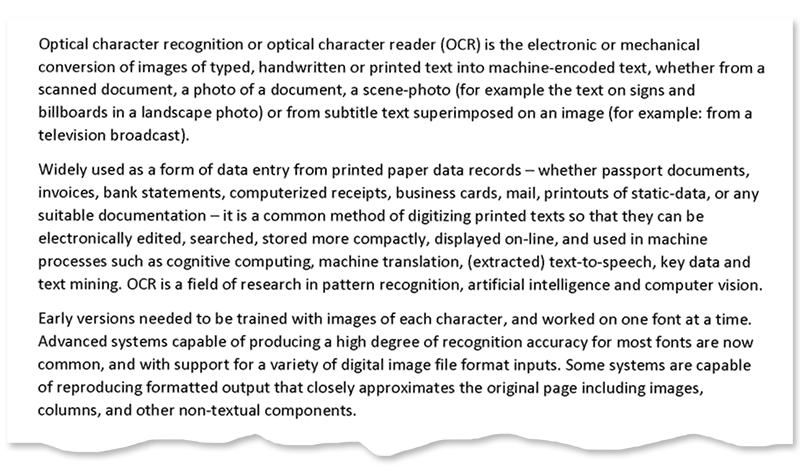

<style>
	button {
		cursor: pointer;
		margin-right: 20px;
		padding: 7px 15px;
		border: none;
		border-radius: 5px;
		background-color: #1a89d0;
		font-weight: 700;
		font-size: 15px;
		color: #ffffff;
	}

	button:hover {
		background-color: #3071a9;
	}

	button:focus {
		outline: none;
	}

	.code-sample {
		display: flex;
	}

	.code-sample > div {
		display: flex;
		align-items: center;
		padding: 5px 10px;
		border-radius: 5px;
		white-space: nowrap;
		background-color: rgba(0,0,0,5%);
		font-size: 16px;
		font-weight: 700;
	}

	.unseen {
		display: none !important;
	}

	.duo {
		position: relative;
		width: 800px;
		height: 474px;
	}

	.duo > img {
		position: absolute;
	}
</style>

When a page is fed to a flatbed scanner (mechanically or manually) or photographed with a smartphone, it is nearly impossible to achieve perfect alignment. As a result, a slight skew (tilt) inevitably occurs in scanned images or photographs.

Skew angle detection and image straightening is critical to the OCR process as it directly affects the reliability and efficiency of segmentation and text extraction. Aspose.OCR offers automated processing algorithms to correct image tilt (deskew) before proceeding to recognition.

## Detecting skew angle

To find out the skew angle, use [`CalculateSkew`](https://reference.aspose.com/ocr/net/aspose.ocr/asposeocr/calculateskew/) or [`CalculateSkewFromUri`](https://reference.aspose.com/ocr/net/aspose.ocr/asposeocr/calculateskewfromuri/) methods of [`Aspose.OCR.AsposeOcr`](https://reference.aspose.com/ocr/net/aspose.ocr/asposeocr/) class.



```csharp
Aspose.OCR.AsposeOcr recognitionEngine = new Aspose.OCR.AsposeOcr();
float skew = recognitionEngine.CalculateSkew("source.png");
Console.WriteLine($"Skew angle: {skew:N1}°");
```


```csharp
Aspose.OCR.AsposeOcr recognitionEngine = new Aspose.OCR.AsposeOcr();
using(MemoryStream ms = new MemoryStream())
{
	using(FileStream fs = new FileStream("source.png",FileMode.Open,FileAccess.Read))
	{
		fs.CopyTo(ms);
		float skew = recognitionEngine.CalculateSkew(ms);
		Console.WriteLine($"Skew angle: {skew:N1}°");
	}
}
```


```csharp
Aspose.OCR.AsposeOcr recognitionEngine = new Aspose.OCR.AsposeOcr();
float skew = recognitionEngine.CalculateSkewFromUri("https://www.aspose.com/sample-ocr-page.png");
Console.WriteLine($"Skew angle: {skew:N1}°");
```




<div id="skew-angle" class="code-sample">
	<button onclick="calculateSkewAngle(this)">Calculate skew angle</button>
	<div class="unseen"><code>&gt; Skew angle: 5.9°</code></div>
</div>
<script>
	function calculateSkewAngle(obj)
	{
		$(obj).siblings("div").removeClass("unseen");
	}
</script>

## Automatic skew correction

To automatically straighten skewed image before recognition, run the image through [`AutoSkew`](https://reference.aspose.com/ocr/net/aspose.ocr.models.preprocessingfilters/preprocessingfilter/autoskew/) preprocessing filter or enable [`AutoSkew`](https://reference.aspose.com/ocr/net/aspose.ocr/recognitionsettings/autoskew/) property in recognition settings.



```csharp
Aspose.OCR.AsposeOcr recognitionEngine = new Aspose.OCR.AsposeOcr();
// Add deskew filter
Aspose.OCR.Models.PreprocessingFilters.PreprocessingFilter filters = new Aspose.OCR.Models.PreprocessingFilters.PreprocessingFilter();
filters.Add(Aspose.OCR.Models.PreprocessingFilters.PreprocessingFilter.AutoSkew());
// Save preprocessed image to file for debugging purposes
using(MemoryStream ms = recognitionEngine.PreprocessImage("source.png", filters))
{
	using(FileStream fs = new FileStream("result.png", FileMode.Create, FileAccess.Write))
	{
		ms.WriteTo(fs);
	}
}
// Append preprocessing filters to recognition settings
Aspose.OCR.RecognitionSettings recognitionSettings = new Aspose.OCR.RecognitionSettings();
recognitionSettings.PreprocessingFilters = filters;
// Recognize image
Aspose.OCR.RecognitionResult result = recognitionEngine.RecognizeImage("source.png", recognitionSettings);
Console.WriteLine(result.RecognitionText);
```


```csharp
Aspose.OCR.AsposeOcr recognitionEngine = new Aspose.OCR.AsposeOcr();
// Enable automatic deskew in recognition settings
Aspose.OCR.RecognitionSettings recognitionSettings = new Aspose.OCR.RecognitionSettings();
recognitionSettings.AutoSkew = true;
// Recognize image
Aspose.OCR.RecognitionResult result = recognitionEngine.RecognizeImage("source.png", recognitionSettings);
Console.WriteLine(result.RecognitionText);
```



<div class="duo">
	
	
</div>
<button onclick="triggerSkew(this)">Deskew image</button>
<script>
	function triggerSkew(obj)
	{
		let images = $(".duo > img");
		let skewed = images.eq(0).is(":visible");
		if(skewed)
		{
			images.eq(1).show(200);
			images.eq(0).hide(200);
			$(obj).text("Revert to original image");
		}
		else
		{
			images.eq(0).show(200);
			images.eq(1).hide(200);
			$(obj).text("Deskew image");
		}
	}
</script>

## Manual skew correction

In rare cases, automatic skew correction may incorrectly determine the angle of the image. This can happen to poor quality photos with significant perspective distortions.

To deal with such situations, you can rotate the image by the specified degree using [Rotate](https://reference.aspose.com/ocr/net/aspose.ocr.models.preprocessingfilters/preprocessingfilter/rotate/) preprocessing filter or manually define the skew angle for such images using the [`SkewAngle`](https://reference.aspose.com/ocr/net/aspose.ocr/recognitionsettings/skewangle/) property of recognition settings. The rotation angle is passed in degrees:

- `-360` to `0`: rotate counterclockwise;
- `0` to `360`: rotate clockwise.



```csharp
Aspose.OCR.AsposeOcr recognitionEngine = new Aspose.OCR.AsposeOcr();
// Rotate the image 90 degrees counterclockwise
Aspose.OCR.Models.PreprocessingFilters.PreprocessingFilter filters = new Aspose.OCR.Models.PreprocessingFilters.PreprocessingFilter();
filters.Add(Aspose.OCR.Models.PreprocessingFilters.PreprocessingFilter.Rotate(-90));
// Save preprocessed image to file for debugging purposes
using(MemoryStream ms = recognitionEngine.PreprocessImage("source.png", filters))
{
	using(FileStream fs = new FileStream("result.png", FileMode.Create, FileAccess.Write))
	{
		ms.WriteTo(fs);
	}
}
// Append preprocessing filters to recognition settings
Aspose.OCR.RecognitionSettings recognitionSettings = new Aspose.OCR.RecognitionSettings();
recognitionSettings.PreprocessingFilters = filters;
// Recognize image
Aspose.OCR.RecognitionResult result = recognitionEngine.RecognizeImage("source.png", recognitionSettings);
Console.WriteLine(result.RecognitionText);
```


```csharp
Aspose.OCR.AsposeOcr recognitionEngine = new Aspose.OCR.AsposeOcr();
// Manually set the skew angle
Aspose.OCR.RecognitionSettings recognitionSettings = new Aspose.OCR.RecognitionSettings();
recognitionSettings.SkewAngle = 6;
// Recognize image
Aspose.OCR.RecognitionResult result = recognitionEngine.RecognizeImage("source.png", recognitionSettings);
Console.WriteLine(result.RecognitionText);
```


