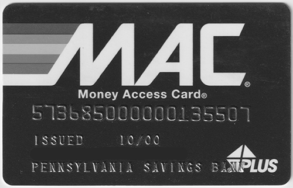

<style>
	button {
		cursor: pointer;
		margin-right: 20px;
		padding: 7px 15px;
		border: none;
		border-radius: 5px;
		background-color: #1a89d0;
		font-weight: 700;
		font-size: 15px;
		color: #ffffff;
	}

	button:hover {
		background-color: #3071a9;
	}

	button:focus {
		outline: none;
	}

	.duo {
		position: relative;
		width: 500px;
		height: 322px;
		margin-bottom: 20px;
	}

	.duo > img {
		position: absolute;
	}
</style>

In most cases, color is not needed for recognition and can even mislead OCR algorithms. Grayscale allows images to be processed more efficiently, resulting in less specks, cleaner backgrounds, and crisper text than color images. Converting to grayscale can also improve the results of other processing filters, such as automatic [deskewing](/ocr/net/deskew/).

Aspose.OCR provides a method for converting an image to grayscale before proceeding with image processing or OCR.

{}
Grayscale conversion is automatically performed when applying the [median filter](/ocr/net/median/).
{}

## Grayscale conversion

To convert the image to grayscale, run the image through [`ToGrayscale`](https://reference.aspose.com/ocr/net/aspose.ocr.models.preprocessingfilters/preprocessingfilter/tograyscale/) processing filter.

```csharp
Aspose.OCR.AsposeOcr recognitionEngine = new Aspose.OCR.AsposeOcr();
// Convert image to grayscale
Aspose.OCR.Models.PreprocessingFilters.PreprocessingFilter filters = new Aspose.OCR.Models.PreprocessingFilters.PreprocessingFilter();
filters.Add(Aspose.OCR.Models.PreprocessingFilters.PreprocessingFilter.ToGrayscale());
// Add an image to OcrInput object and apply processing filters
Aspose.OCR.OcrInput input = new Aspose.OCR.OcrInput(Aspose.OCR.InputType.SingleImage, filters);
input.Add("source.png");
// Save processed image to the folder
Aspose.OCR.ImageProcessing.Save(input, @"C:\result");
// Recognize image
Aspose.OCR.OcrOutput results = recognitionEngine.Recognize(input);
foreach(Aspose.OCR.RecognitionResult result in results)
{
	Console.WriteLine(result.RecognitionText);
}
```

<div class="duo">
	
	
</div>
<button onclick="triggerSkew(this)">Convert to grayscale</button>
<script>
	function triggerSkew(obj)
	{
		let images = $(".duo > img");
		let skewed = images.eq(0).is(":visible");
		if(skewed)
		{
			images.eq(1).show(200);
			images.eq(0).hide(200);
			$(obj).text("Revert to original image");
		}
		else
		{
			images.eq(0).show(200);
			images.eq(1).hide(200);
			$(obj).text("Convert to grayscale");
		}
	}
</script>

## Usage scenarios

Grayscale conversion is recommended for the following images:

- Photos.
- Scanned ID cards and other personal documents.
- Full-color scans.

In addition, grayscale conversion may decrease the original image size.

{}
Improvements in recognition accuracy and quality enhancements will be highly dependent on the original image and should be empirically tested.
{}
