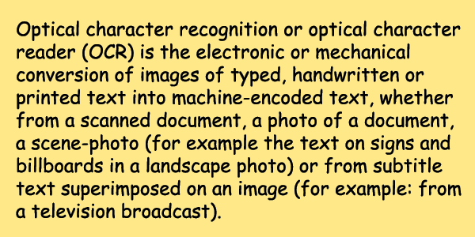

<style>
	button {
		cursor: pointer;
		margin-right: 20px;
		padding: 7px 15px;
		border: none;
		border-radius: 5px;
		background-color: #1a89d0;
		font-weight: 700;
		font-size: 15px;
		color: #ffffff;
	}

	button:hover {
		background-color: #3071a9;
	}

	button:focus {
		outline: none;
	}

	.duo {
		position: relative;
		width: 600px;
		height: 300px;
		margin-bottom: 20px;
	}

	.duo > img {
		position: absolute;
	}
</style>

When working with white (or light) text on a black (or other dark) background, recognition accuracy may suffer. It can be greatly improved by reversing the colors of the image so that light areas appear dark and dark areas appear light. In addition, other colors are also swapped: red becomes cyan, green becomes magenta, blue becomes yellow, and so on.

Aspose.OCR provides the automated preprocessing filter that inverts colors in the image before proceeding to recognition.

## Inverting image colors

To automatically invert colors in an image before recognition, run the image through [`Invert`](https://reference.aspose.com/ocr/net/aspose.ocr.models.preprocessingfilters/preprocessingfilter/invert/) preprocessing filter.

```csharp
Aspose.OCR.AsposeOcr recognitionEngine = new Aspose.OCR.AsposeOcr();
// Invert colors
Aspose.OCR.Models.PreprocessingFilters.PreprocessingFilter filters = new Aspose.OCR.Models.PreprocessingFilters.PreprocessingFilter();
filters.Add(Aspose.OCR.Models.PreprocessingFilters.PreprocessingFilter.Invert());
// Save preprocessed image to file for debugging purposes
using(MemoryStream ms = recognitionEngine.PreprocessImage("source.png", filters))
{
	using(FileStream fs = new FileStream("result.png", FileMode.Create, FileAccess.Write))
	{
		ms.WriteTo(fs);
	}
}
// Append preprocessing filters to recognition settings
Aspose.OCR.RecognitionSettings recognitionSettings = new Aspose.OCR.RecognitionSettings();
recognitionSettings.PreprocessingFilters = filters;
// Recognize image
Aspose.OCR.RecognitionResult result = recognitionEngine.RecognizeImage("source.png", recognitionSettings);
Console.WriteLine(result.RecognitionText);
```

<div class="duo">
	
	
</div>
<button onclick="triggerSkew(this)">Invert colors</button>
<script>
	function triggerSkew(obj)
	{
		let images = $(".duo > img");
		let skewed = images.eq(0).is(":visible");
		if(skewed)
		{
			images.eq(1).show(200);
			images.eq(0).hide(200);
			$(obj).text("Revert to original image");
		}
		else
		{
			images.eq(0).show(200);
			images.eq(1).hide(200);
			$(obj).text("Invert colors");
		}
	}
</script>

## Usage scenarios

Automatic color inversion is recommended for the following images:

- White text on black background.
- Advertisements.
- Business cards.
- Screenshots.
