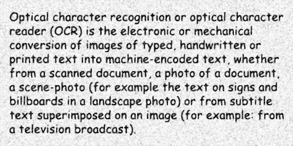

<style>
	button {
		cursor: pointer;
		margin-right: 20px;
		padding: 7px 15px;
		border: none;
		border-radius: 5px;
		background-color: #1a89d0;
		font-weight: 700;
		font-size: 15px;
		color: #ffffff;
	}

	button:hover {
		background-color: #3071a9;
	}

	button:focus {
		outline: none;
	}

	.duo {
		position: relative;
		width: 600px;
		height: 300px;
		margin-bottom: 20px;
	}

	.duo > img {
		position: absolute;
	}
</style>

Photos taken in low light conditions can have a lot of digital noise. Noise can also show up in highly compressed JPEG images in form of compression artifacts. This noise can mislead OCR algorithms and prevent other preprocessing filters from working properly.

Aspose.OCR provides an alternative method for [removing noise](/ocr/net/denoise/) from an image at the cost of some detail, called the _median filter_. This makes the image a little blurry while preserving the edges of high-contrast objects such as letters. The results can be further improved with the [auto-contrast](/ocr/net/contrast/) or [binarization](/ocr/net/binarization/) preprocessing filters.

## Applying the median filter

To smooth out noise in an image, run the image through [`Median`](https://reference.aspose.com/ocr/net/aspose.ocr.models.preprocessingfilters/preprocessingfilter/median/) preprocessing filter.

```csharp
Aspose.OCR.AsposeOcr recognitionEngine = new Aspose.OCR.AsposeOcr();
// Smooth out noise in an image
Aspose.OCR.Models.PreprocessingFilters.PreprocessingFilter filters = new Aspose.OCR.Models.PreprocessingFilters.PreprocessingFilter();
filters.Add(Aspose.OCR.Models.PreprocessingFilters.PreprocessingFilter.Median());
// Save preprocessed image to file for debugging purposes
using(MemoryStream ms = recognitionEngine.PreprocessImage("source.png", filters))
{
	using(FileStream fs = new FileStream("result.png", FileMode.Create, FileAccess.Write))
	{
		ms.WriteTo(fs);
	}
}
// Append preprocessing filters to recognition settings
Aspose.OCR.RecognitionSettings recognitionSettings = new Aspose.OCR.RecognitionSettings();
recognitionSettings.PreprocessingFilters = filters;
// Recognize image
Aspose.OCR.RecognitionResult result = recognitionEngine.RecognizeImage("source.png", recognitionSettings);
Console.WriteLine(result.RecognitionText);
```

<div class="duo">
	
	
</div>
<button onclick="triggerSkew(this)">Smooth noise</button>
<script>
	function triggerSkew(obj)
	{
		let images = $(".duo > img");
		let skewed = images.eq(0).is(":visible");
		if(skewed)
		{
			images.eq(1).show(200);
			images.eq(0).hide(200);
			$(obj).text("Revert to original image");
		}
		else
		{
			images.eq(0).show(200);
			images.eq(1).hide(200);
			$(obj).text("Smooth noise");
		}
	}
</script>

## Usage scenarios

Median filter is recommended for the following images:

- Photos that were taken in low light conditions.
- Poor quality printouts.
- Highly compressed / low quality JPEG's.

{}
Improvements in recognition accuracy will be highly dependent on the original image and should be empirically tested. Applying a median filter can sometimes result in the loss of important details such as very thin characters and punctuation.
{}
