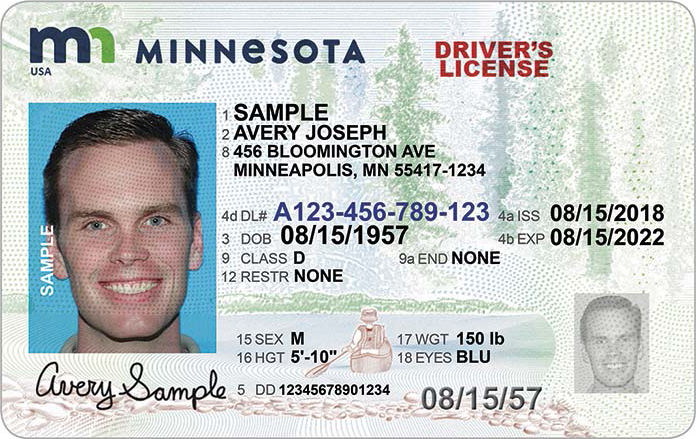

<style>
	button {
		cursor: pointer;
		margin-right: 20px;
		padding: 7px 15px;
		border: none;
		border-radius: 5px;
		background-color: #1a89d0;
		font-weight: 700;
		font-size: 15px;
		color: #ffffff;
	}

	button:hover {
		background-color: #3071a9;
	}

	button:focus {
		outline: none;
	}

	#sample {
		position: relative;
	}

	#sample > div {
		position: absolute;
		display: none;
		border: dashed 1px #de4444;
		background-color: rgba(222,68,68,0.2);
	}

	#dl-name {
		top: 101px;
		left: 231px;
		width: 430px;
		height: 42px;
	}

	#dl-exp {
		top: 224px;
		left: 546px;
		width: 123px;
		height: 26px;
	}

	#results {
		display: none;
		max-width: 50%;
	}
</style>

Aspose.OCR allows you to extract names, dates, numbers, and other blocks from certain areas of uniform images, such as ID cards, visas, driver's licenses, applications, and so on. Regions can be provided manually or automatically detected using the [`GetRectangles`](https://reference.aspose.com/ocr/net/aspose.ocr/asposeocr/getrectangles/) method of [`Aspose.OCR.AsposeOcr`](https://reference.aspose.com/ocr/net/aspose.ocr/asposeocr/) class.

To extract text from one or more areas of an image, provide a list of [`Aspose.Drawing.Rectangle`](https://reference.aspose.com/pdf/net/aspose.pdf.drawing/rectangle/) objects specifying the upper left corner and the width and height of the image area in [`RecognitionAreas`](https://reference.aspose.com/ocr/net/aspose.ocr/recognitionsettings/recognitionareas/) field of [`RecognitionSettings`](https://reference.aspose.com/ocr/net/aspose.ocr/recognitionsettings/).

```csharp
Aspose.OCR.AsposeOcr recognitionEngine = new Aspose.OCR.AsposeOcr();
List<Aspose.Drawing.Rectangle> rectangles = new List<Aspose.Drawing.Rectangle>(){
	new Aspose.Drawing.Rectangle(231,101,430,42),
	new Aspose.Drawing.Rectangle(546,224,123,26)
};
Aspose.OCR.RecognitionSettings recognitionSettings = new Aspose.OCR.RecognitionSettings();
recognitionSettings.AutoDenoising = true;
recognitionSettings.RecognitionAreas = rectangles;
Aspose.OCR.RecognitionResult result = recognitionEngine.RecognizeImage("dl.png", recognitionSettings);
Console.WriteLine("Name: "+result.RecognitionAreasText[0]);
Console.WriteLine("Expiry: "+result.RecognitionAreasText[1]);
```

The text from each rectangle is returned in the [`RecognitionAreasText`](https://reference.aspose.com/ocr/net/aspose.ocr/recognitionresult/recognitionareastext/) property of the recognition results.

## Live demo

<div id="sample">
	
	<div id="dl-name"></div>
	<div id="dl-exp"></div>
</div>

<button onclick="extract(this)">Extract name and expiry date</button>

<script>
	function extract(obj)
	{
		$("#sample > div").show(200);
		$("#results").show(200);
	}
</script>

<table id="results">
	<tr>
		<th>Block</th>
		<th>Coordinates</th>
		<th>Extracted text</th>
	</tr>
	<tr>
		<td>Name</td>
		<td>{X=231, Y=101, Width=430, Height=42}</td>
		<td>SAMPLE<br />AVERY JOSEPH</td>
	</tr>
	<tr>
		<td>Expiry date</td>
		<td>{X=546, Y=224, Width=123, Height=26}</td>
		<td>08/15/2022</td>
	</tr>
</table>
