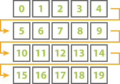
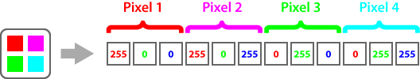
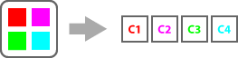

Aspose.OCR allows you to [provide](/ocr/net/ocrinput/#adding-source-content) an image for recognition as an array of pixels. This can be useful when working with [unsupported](/ocr/net/supported-file-formats/) file formats or with raw bitmap data.

Pixels are listed from left to right (by line), and each line is added to the array from top to bottom.



## Adding color image

The color image is added as a flat byte array representing the amount of each color per pixel. The amount ranges from 0 to 255, where 0 means no that color and 255 is the maximum amount of that color. For example, 2x2 pixels color bitmap is represented as the following byte array in RGB color model:



Because the pixel array does not contain an image header, you must directly specify the image's width and height, as well as its color model.

Color model | Bytes per pixel | Pixel color order
----------- | :-------------: | ------------------
`Aspose.OCR.PixelType.RGB` | 3 | <ol><li>Red</li><li>Green</li><li>Blue</li></ol>
`Aspose.OCR.PixelType.BGR` | 3 | <ol><li>Blue</li><li>Green</li><li>Red</li></ol>
`Aspose.OCR.PixelType.RGBA` | 4 | <ol><li>Red</li><li>Green</li><li>Blue</li><li>Opacity</li></ol>

### Example

```csharp
Aspose.OCR.OcrInput source = new Aspose.OCR.OcrInput(Aspose.OCR.InputType.SingleImage);
using(Aspose.Imaging.RasterImage image = (RasterImage)Aspose.Imaging.Image.Load("source.png"))
{
	Color[] c = image.LoadPixels(image.Bounds);
	byte[] pixels = new byte[c.Length*3];
	int idx = 0;
	for (int i = 0; i < c.Length*3; i += 3)
	{
		pixels[i] = c[idx].R;
		pixels[i+1] = c[idx].G;
		pixels[i+2] = c[idx].B;
		idx++;
	}
	source.Add(pixels, image.Width, image.Height, Aspose.OCR.PixelType.RGB);
}
```

## Adding grayscale image

The image is provided as a flat byte array, where each byte represents the degree of pixel brightness (one byte per pixel). The number ranges from 0 to 255, where 0 means black and 255 means white.


Because the pixel array does not contain an image header, you must directly specify the image's width and height, as well as the grayscale (`Aspose.OCR.PixelType.BYTE`) color model.

### Example

```csharp
Aspose.OCR.OcrInput source = new Aspose.OCR.OcrInput(Aspose.OCR.InputType.SingleImage);
using(Aspose.Imaging.RasterImage image = (RasterImage)Aspose.Imaging.Image.Load("source.png"))
{
	Color[] c = image.LoadPixels(image.Bounds);
	byte[] pixels = new byte[c.Length*3];
	for (int i = 0; i < c.Length; i++)
	{
		pixels[i] = (byte)((c[i].R + c[i].G +c[i].B)/3);
	}
	source.Add(pixels, image.Width, image.Height, Aspose.OCR.PixelType.BYTE);
}
```

## Adding image as Aspose.Drawing.Color array

The image can be provided as a flat array of [`Aspose.Drawing.Color`](https://reference.aspose.com/drawing/net/system.drawing/color/) objects.



Because the pixel array does not contain an image header, you must directly specify the image's width and height.

### Example

```csharp
Aspose.OCR.OcrInput source = new Aspose.OCR.OcrInput(Aspose.OCR.InputType.SingleImage);
using(Aspose.Imaging.RasterImage image = (RasterImage)Aspose.Imaging.Image.Load("source.png"))
{
	Color[] c = image.LoadPixels(image.Bounds);
	Aspose.Drawing.Color[] pixels = new Aspose.Drawing.Color[c.Length];
	for (int i = 0; i < c.Length; i++)
	{
		pixels[i] = Aspose.Drawing.Color.FromArgb(c[i].R, c[i].G, c[i].B);
	}
	source.Add(pixels, image.Width, image.Height);
}
```
