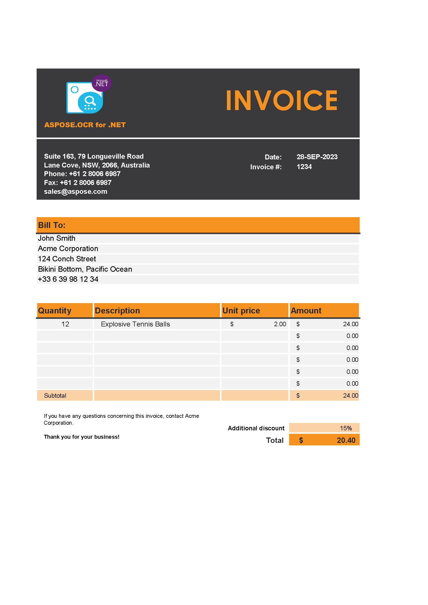
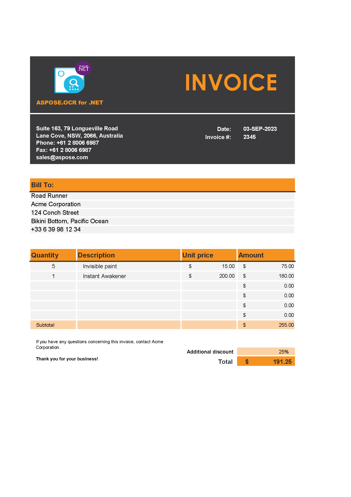

<style>
	.images {
		display: flex;
		flex-wrap: wrap;
	}
	.images > img {
		width: 200px;
		height: auto;
		margin: 0px 20px 20px 0px;
		box-shadow: 0 3px 10px rgb(0 0 0 / 0.2);
	}
</style>

Most organizations maintain large digital archives of scanned documents as part of their information management and preservation strategies. These digital archives often contain a wide range of business-critical materials, including historical records, legal documents, research papers and more. Effectively organizing and managing these archives is critical for efficient retrieval, compliance, and long-term retention. Here are some key considerations and best practices for maintaining image archives:

- Develop a consistent and descriptive file naming convention based on the content of the images. This helps you easily identify and organize your files.
- Organize scanned documents into a logical folder structure. You can categorize them by topic, date, department or any other relevant criteria.
- Generate complete metadata for every scanned document. Metadata should include information from the document and any other relevant details. This metadata is critical to searching and retrieving information.

The choice of how to process text associated with scans or photographs depends on your business needs: store them alongside image files, put them into a database, or analyze the data in real time.

Digital image archives can take up a significant amount of disk space. The size of the image archive depends on several factors, including the resolution and format of the images, the number of images, and the level of compression applied.

**Aspose.OCR for .NET** offers a wide range of features that make it easy to process any number of images. You can extract texts from images, archives and entire catalogues. You can also find and read only specific areas of an image rather than all the text, which is very useful for organizing standardized documents.

In addition to reading images, you can reduce the size of image files by converting them to black and white, downsizing, or converting them to other file formats.

The following example demonstrates how to organize a large number of uniform documents based on their content. The task can be achieved using only 78 lines of code, including comments.

## Sample images

Download sample invoice images (1.2 MB):

<div class="images">



</div>

## Preparation

1. Get a [trial license](/ocr/net/licensing/) to make sure that all text is recognized without limitations.
2. Create a new C# project in Visual Studio. You can use a very basic project template, such as **Console App**.
3. [Install](/ocr/net/installation/) **Aspose.OCR** (CPU-based) NuGet package to the project.
4. Create a folder named "_invoices_" under **bin\\Debug** or **bin\\Debug\\net6.0** directory of the project.
5. Save the downloaded invoice images to "_invoices_" folder.

## Coding

1. Declare the following namespaces to improve the code readability:
   ```csharp
   using Aspose.Drawing;
   using Aspose.Drawing.Imaging;
   using Aspose.OCR;
   using Aspose.OCR.Models.PreprocessingFilters;
   ```
2. Declare a class for storing extracted invoice data:
   ```csharp
   private class Invoice
   {
   	public string Number;
   	public string Date;
   	public string BillTo;

   	public string FileName => $"Invoice_{this.Number}_{this.Date}_{this.BillTo}.jpg";

   	public Invoice(List<string> recognitionAreas)
   	{
   		this.Number = recognitionAreas[1].Replace("\n", "");
   		this.Date = recognitionAreas[0].Replace("\n", "");
   		this.BillTo = recognitionAreas[2].Replace("\n", "");
   	}
   }
   ```
3. Apply a [license](/ocr/net/licensing/#applying-a-developer-or-site-license):
   ```csharp
   License license = new License();
   license.SetLicense("Aspose.OCR.lic");
   ```
4. Add scanned invoices to the batch:
   ```csharp
   OcrInput invoices = new OcrInput(InputType.SingleImage) {
   	"invoices/01.jpg",
   	"invoices/02.jpg",
   	"invoices/03.jpg"
   };
   ```
5. Invert header color to improve recognition accuracy:
   ```csharp
   PreprocessingFilter preprocess = new PreprocessingFilter() {
   	PreprocessingFilter.Invert(new Rectangle(149, 566, 1314, 247))
   };
   invoices.ReplaceFilters(preprocess);
   ```
6. Specify image areas which contain the required invoice parameters:
   ```csharp
   RecognitionSettings settings = new RecognitionSettings();
   settings.RecognitionAreas = new List<Aspose.Drawing.Rectangle> {
    new Rectangle(1200, 620, 200, 35), // invoice date
    new Rectangle(1200, 660, 200, 35), // invoice number
    new Rectangle(150, 955, 1310, 32)  // bill to name
   };
   ```
7. Fetch data from invoices:
   ```csharp
   List<Invoice> invoiceData = new List<Invoice>();
   AsposeOcr api = new AsposeOcr();
   List<RecognitionResult> results = api.Recognize(invoices, settings);
   foreach(var result in results)
   {
   	invoiceData.Add(new Invoice(result.RecognitionAreasText));
   }
   ```
8. Adjust image processing settings to save disk space when storing an archive:
   ```csharp
   PreprocessingFilter saveSpace = new PreprocessingFilter() {
   	PreprocessingFilter.Binarize(),
   	PreprocessingFilter.Scale(0.5F)
   };
   invoices.ReplaceFilters(saveSpace);
   ```
9. Save archived copies of the invoices:
   ```csharp
   string targetDirectoryName = "archive";
   Directory.CreateDirectory(targetDirectoryName);
   var convertedInvoices = ImageProcessing.Render(invoices);
   for(int i = 0; i<convertedInvoices.Count(); i++)
   {
   	using(Image image = Image.FromStream(convertedInvoices[i].Stream))
   	{
   		image.Save($"{targetDirectoryName}/{invoiceData[i].FileName}", ImageFormat.Jpeg);
   	}
   }
   ```

### Full code

```csharp
using Aspose.Drawing;
using Aspose.Drawing.Imaging;
using Aspose.OCR;
using Aspose.OCR.Models.PreprocessingFilters;

namespace ArchivalOCR
{
	internal class Program
	{
		private class Invoice
		{
			public string Number;
			public string Date;
			public string BillTo;

			public string FileName => $"Invoice_{this.Number}_{this.Date}_{this.BillTo}.jpg";

			public Invoice(List<string> recognitionAreas)
			{
				this.Number = recognitionAreas[1].Replace("\n", "");
				this.Date = recognitionAreas[0].Replace("\n", "");
				this.BillTo = recognitionAreas[2].Replace("\n", "");
			}
		}

		static void Main(string[] args)
		{
			// Apply license
			Aspose.OCR.License license = new Aspose.OCR.License();
			license.SetLicense("Aspose.OCR.lic");
			// Add scanned invoices to the batch
			OcrInput invoices = new OcrInput(InputType.SingleImage) {
				"invoices/01.jpg",
				"invoices/02.jpg",
				"invoices/03.jpg"
			};
			// Invert header colors
			PreprocessingFilter preprocess = new PreprocessingFilter() {
				PreprocessingFilter.Invert(new Rectangle(149, 566, 1314, 247))
			};
			invoices.ReplaceFilters(preprocess);
			// Specify recognition areas
			RecognitionSettings settings = new RecognitionSettings();
			settings.RecognitionAreas = new List<Aspose.Drawing.Rectangle> {
				new Rectangle(1200, 620, 200, 35), // invoice date
				new Rectangle(1200, 660, 200, 35), // invoice number
				new Rectangle(150, 955, 1310, 32)  // bill to name
			};
			// Fetch data from invoices
			List<Invoice> invoiceData = new List<Invoice>();
			AsposeOcr api = new AsposeOcr();
			List<RecognitionResult> results = api.Recognize(invoices, settings);
			foreach(var result in results)
			{
				invoiceData.Add(new Invoice(result.RecognitionAreasText));
			}
			// Adjust image processing to save disk space
			PreprocessingFilter saveSpace = new PreprocessingFilter() {
				PreprocessingFilter.Binarize(),
				PreprocessingFilter.Scale(0.5F)
			};
			invoices.ReplaceFilters(saveSpace);
			// Save archived copies of the invoices
			string targetDirectoryName = "archive";
			Directory.CreateDirectory(targetDirectoryName);
			var convertedInvoices = ImageProcessing.Render(invoices);
			for(int i = 0; i<convertedInvoices.Count(); i++)
			{
				using(Image image = Image.FromStream(convertedInvoices[i].Stream))
				{
					image.Save($"{targetDirectoryName}/{invoiceData[i].FileName}", ImageFormat.Jpeg);
				}
			}
			// Report progress
			Console.WriteLine($@"The invoices are organized into ""{Path.GetFullPath(targetDirectoryName)}"" folder.");
		}
	}
}
```

## Running

Run the program directly from the Visual Studio or build it and execute the file from the command line. Wait a few seconds, depending on your system performance, until "_The invoices are organized into "{project path}\\archive" folder._" message is displayed in the console.

Open **archive** folder in the project directory. As you can see, the invoice images have been converted to black and white to reduce file size and renamed to match the invoice details:

Original invoice image | Original invoice image size | New invoice file name | New invoice image size
---------------------- | --------------------------- | --------------------- | ----------------------
01.jpg | 404 KB | Invoice_1234_28-SEP-2023_John Smith.jpg | 63.4 KB
02.jpg | 411 KB | Invoice_2345_03-SEP-2023_Road Runner.jpg | 64.7 KB
03.jpg | 414 KB | Invoice_12_25-DEC-2000_Wile E. Covote.jpg | 64.3 KB

## Learn more

- Enhance the image using fully automated and manual [processing filters](/ocr/net/image-processing/).
- [Improve recognition accuracy](/ocr/net/recognition-settings-common/).
- Find and read only certain [areas](/ocr/net/image-regions/) of an image.
- Use [specialized OCR methods](/ocr/net/specialized-recognition-methods/) for extracting text from certain types of images.
- [Compare texts](/ocr/net/image-text-compare/) on two images, regardless of the font, text size, case, styles, and colors.
- [Find text on images](/ocr/net/find-text/).
- [Save](/ocr/net/save/) recognition results in multiple formats so they can be shared, stored in a database, displayed, or analyzed.
