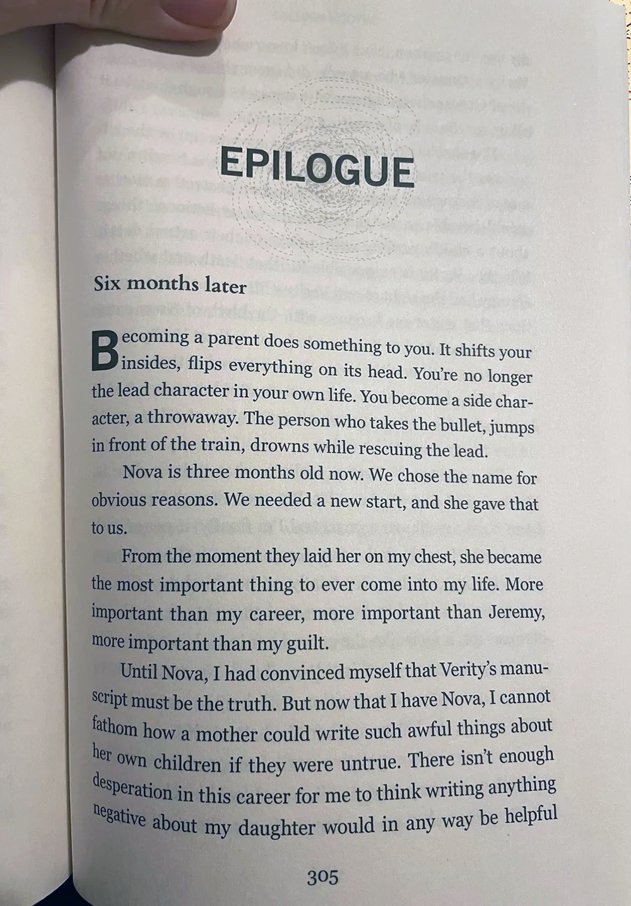

When people typically think of OCR (Optical Character Recognition), the first association is often with a scanner as the primary capture device. This association has historical reasons and is still prevalent in many contexts, providing consistent and controlled environment for capturing printed text from physical documents with unmatched quality. However, a scanner is specialized equipment that is not always at hand and requires a stationary workstation to operate.

Fortunately, the modern world provides a convenient alternative to traditional scanners - a smartphone camera. The advancements in smartphone camera technology ensure that even an entry-level smartphone provides sufficient quality to capture OCR-ready documents. And built-in memory makes it easier than ever to digitize large quantities of documents, newspapers, books, street signs and other text on the go. All you need is the right technology to convert those photos into machine-readable text.

When recognizing photographed texts, we inevitably encounter the following challenges:

- Skew - from a slight tilt to completely incorrect orientation.
- Glares, shadows, and unwanted gradients due to less-than-ideal lighting conditions.
- Digital noise, especially if the image was taken in low light.
- Geometric distortions caused by physical page curvature or camera lens distortion.

Aspose.OCR for .NET is specifically designed to recognize all types of images out-of-the-box and can be further fine-tuned to handle even the low-quality photos. Combined with a modern smartphone, it allows you to create powerful OCR applications for most everyday scanning and text recognition tasks. The most advanced image processing and document structure analysis are performed in a few lines of code, allowing you to focus on business rather than complex mathematical algorithms, neural networks and other technical intricacies.

In the example below, we will demonstrate how to convert a photographed book page into a text. You will only need 34 lines of code (including comments) - see for yourself.

## How to achieve maximum recognition accuracy

Quality of the photo is the cornerstone of accurate recognition. Just follow a few simple guidelines to get a good image from any smartphone or camera:

- Hold your smartphone parallel to the paper.
- Make the page well lit and avoid glares and deep shadows.
- The extracted text must cover the entire area of the photo.

## Sample document

Simply take a photo of any text with your smartphone or download the image below:



## Preparation

1. Get a [trial license](/ocr/net/licensing/) to make sure that all text is recognized without limitations.
2. Create a new C# project in Visual Studio. You can use a very basic project template, such as **Console App**.
3. [Install](/ocr/net/installation/) **Aspose.OCR** (CPU-based) NuGet package to the project.
4. Save the photo to **bin\\Debug** or **bin\\Debug\\net6.0** directory of the project under the name `photo.png`.

## Coding

1. Declare `Aspose.OCR` namespaces to improve the code readability:
   ```csharp
   using Aspose.OCR;
   using Aspose.OCR.Models.PreprocessingFilters;
   using Aspose.OCR.SpellChecker;
   ```
2. Apply a [license](/ocr/net/licensing/#applying-a-developer-or-site-license):
   ```csharp
   License license = new License();
   license.SetLicense("Aspose.OCR.lic");
   ```
3. Fix the [page curvature](/ocr/net/dewarp/) and increase the [contrast](/ocr/net/contrast/) by preprocessing the photo through automatic filters. We recommend using these filters every time you deal with a photo.
   ```csharp
   PreprocessingFilter filter = new PreprocessingFilter {
   	PreprocessingFilter.ContrastCorrectionFilter(),
   	PreprocessingFilter.AutoDewarping()
   };
   ```
4. [Load](/ocr/net/ocrinput/) the photo. You can also use a full path to the file.
   ```csharp
   OcrInput photos = new OcrInput(InputType.SingleImage, filters);
   photos.Add("photo.png");
   ```
5. Select the [recognition language](/ocr/net/languages/) to increase the recognition accuracy and choose the [structure analysis algorithm](/ocr/net/areas-detection/) that best suites [curved text](/ocr/net/areas-detection/curved_text/): 
   ```csharp
   RecognitionSettings settings = new RecognitionSettings();
   settings.Language = Language.Eng;
   settings.DetectAreasMode = DetectAreasMode.CURVED_TEXT;
   ```
6. [Recognize](/ocr/net/recognition/) the text from the page:
   ```csharp
   AsposeOcr api = new AsposeOcr();
   List<RecognitionResult> results = api.Recognize(photos, settings);
   ```
7. Automatically correct spelling errors to further improve recognition accuracy.
   ```csharp
   string text = results[0].GetSpellCheckCorrectedText(SpellCheckLanguage.Eng);
   ```
8. Display the recognized text:
   ```csharp
   Console.WriteLine(text);
   ```

### Full code

```csharp
using Aspose.OCR;
using Aspose.OCR.Models.PreprocessingFilters;
using Aspose.OCR.SpellChecker;

namespace PhotoOCR
{
	internal class Program
	{
		static void Main(string[] args)
		{
			License license = new License();
			license.SetLicense("Aspose.Total.Product.Family.lic");
			// Configure preprocessing filters
			PreprocessingFilter filters = new PreprocessingFilter {
				PreprocessingFilter.ContrastCorrectionFilter(),
				PreprocessingFilter.AutoDewarping()
			};
			// Add a photo for recognition
			OcrInput photos = new OcrInput(InputType.SingleImage, filters);
			photos.Add("photo.png");
			// Fine-tune recognition setings
			RecognitionSettings settings = new RecognitionSettings();
			settings.Language = Language.Eng;
			settings.DetectAreasMode = DetectAreasMode.CURVED_TEXT;
			// Extract text from a page
			AsposeOcr api = new AsposeOcr();
			List<RecognitionResult> results = api.Recognize(photos, settings);
			// Automatically correct spelling (English)
			string text = results[0].GetSpellCheckCorrectedText(SpellCheckLanguage.Eng);
			// Display recognized text
			Console.WriteLine(text);
		}
	}
}
```

## Running

Run the program directly from the Visual Studio or build it and execute the file from the command line. Wait for some time, depending on your system performance.

{}
Correcting page curvature is a long and resource-intensive process that can take up to a minute depending on the image size.
{}

The following text will be shown on the command line:

```
Epilogue
Six months later
Becoming a parent does something to you. It shifts to
:de?,perrin is eye. . .s
the lead character in your own life. You become a side char
after, a throwaway. The person who takes the bullet, jumps
in front of the train, drowns while rescuing the lead.
Nova is three months old now. We chose the name for
obvious reasons. We needed a new start, and she gave that
to us.
From the moment they laid hes on my chest, she became
the most important thing to ever come into my lite. More
important than my career, more important than Jeremy,
more important than my guilt.
Until! Nova, I had convinced myself that Verity many
script must be the truth. But now that l have Nova, 1 cannot
fathom how a mother could write such awful things about
her own children if they were untrue. There isn't enough
desperation in this career for me to think writing anything
ne;active about my daughter would in any way be helpful
305
```

## Learn more

- [Enhance](/ocr/net/image-processing/) a photo for best recognition accuracy.
- Select the recognition language, improve recognition accuracy, and configure other [recognition settings](/ocr/net/recognition-settings-common/).
- [Save](/ocr/net/save-file/) recognition results to a file.
- Provide specialized terminology in a [custom dictionary](/ocr/net/dictionaries/).
- [Compare text](/ocr/net/image-text-compare/) on two photos.
