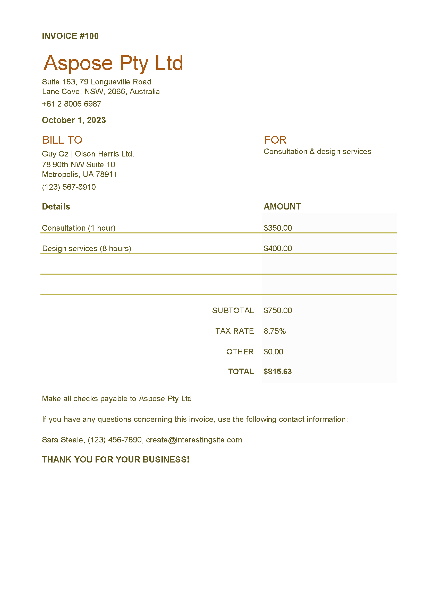

Combining optical character recognition with a natural language processing model like ChatGPT can be a great way and work with text data from photos or scanned documents. Since OCR converts the image to machine readable text, the result can be easily analyzed and you will get back specific information or answer questions related to the text. The answers can be used to generate summary reports, stored in a database, or shared with others.

This powerful combination can streamline processes, improve efficiency, and reduce manual data entry tasks:

- Extract information such as invoice numbers, dates, line items, and totals from scanned invoices.
- Validate and verify invoice data against predefined criteria or business rules.
- Respond to inquiries about invoice details and payment status.
- Automatically extract transaction details (date, merchant, amount) from receipts for expense tracking or reimbursement.
- Extract patient information, diagnoses, and treatment details from scanned medical records.
- Summarize lengthy documents, contracts or legal papers for quicker understanding.

{}
Consider security and privacy implications when handling sensitive information to external NLP systems.
{}

In this article, we will show you how to integrate Aspose.OCR for .NET with ChatGPT to process standardized documents such as invoices. You may interact with the language model in chat mode or use the API, making it easier to process with large volumes of data.

## Sample images

Download the sample invoice image:



## Preparation

1. Get a [trial license](/ocr/net/licensing/) to make sure that all text is recognized without limitations.
2. Create a new C# project in Visual Studio. You can use a very basic project template, such as **Console App**.
3. [Install](/ocr/net/installation/) **Aspose.OCR** (CPU-based) NuGet package to the project.
4. Save the invoice image to **bin\\Debug** or **bin\\Debug\\net6.0** directory of the project.

## Extracting text from the invoice

You only need 23 lines of code (including comments) to extract text from the invoice. Try yourself:

1. Declare `Aspose.OCR` namespace to improve the code readability:
   ```csharp
   using Aspose.OCR;
   ```
2. Apply a [license](/ocr/net/licensing/#applying-a-developer-or-site-license):
   ```csharp
   License license = new License();
   license.SetLicense("Aspose.OCR.lic");
   ```
3. Load an invoice image:
   ```csharp
   OcrInput invoices = new OcrInput(InputType.SingleImage);
   invoices.Add("invoice.png");
   ```
4. Extract text from the invoice using the [specialized recognition method](/ocr/net/recognition/invoice/):
   ```csharp
   AsposeOcr api = new AsposeOcr();
   List<RecognitionResult> results = api.RecognizeInvoice(invoices);
   ```
5. Save the invoice text to a file:
   ```csharp
   results[0].Save("invoice.txt", SaveFormat.Text);
   Console.WriteLine(@"Invoice text saved to ""invoice.txt"" file.");
   ```

### Full code

```csharp
using Aspose.OCR;

namespace ScanInvoice
{
	internal class Program
	{
		static void Main(string[] args)
		{
			// Apply license
			License license = new License();
			license.SetLicense("Aspose.OCR.lic");
			// Load invoice image
			OcrInput invoices = new OcrInput(InputType.SingleImage);
			invoices.Add("invoice.png");
			// Extract text from invoice
			AsposeOcr api = new AsposeOcr();
			List<RecognitionResult> results = api.RecognizeInvoice(invoices);
			// Save invoice text to file
			results[0].Save("invoice.txt", SaveFormat.Text);
			Console.WriteLine(@"Invoice text saved to ""invoice.txt"" file.");
		}
	}
}
```

### Running

Run the program directly from the Visual Studio or build it and execute the file from the command line. Wait a few seconds, depending on your system performance, until "_Invoice text saved to "invoice.txt" file._" message is displayed in the console.

## Parsing invoice text with ChatGPT

Visit [ChatGPT](https://chat.openai.com/) website . If you are not registered, sign up using your email address or Google, Microsoft or Apple account. You can use a free GPT-3.5 model.

Now let's create a query using the extracted invoice text. First of all, define the scope of the business task to get a more specific answer:

```
Parse invoice text and return answers for the following questions:
```

We then need to determine what information we need from the invoice. Thanks to the capabilities of ChatGPT, you can use free text questions rather than complex program queries. Let's try to extract some basic details:

- Invoice number.  
  ```
  Find and return the invoice number as integer
  ```
- Invoice date in some predefined format.  
  ```
  Find and return the invoice date in yyyy-MM-dd format
  ```
- List of services with prices.  
  ```
  Find and return the list of services with prices
  ```
- Tax amount.  
  ```
  Calculate the tax amount based on tax rate
  ```
- Total amount due.  
  ```
  Find and return the total amount
  ```

Feel free to add your own questions if you like.

Finally, provide the [extracted invoice text](#running) to be parsed:

```
INVOICE #100
 Aspose        Pty    Ltd
Suite 163, 79 Longueville Road
 Lane Cove, NSW, 2066, Australia
+61 2 8006 6987
October 1, 2023
 BILL TO                                 FOR
Guy Oz | Olson Harris Ltd.              Consultation & design services
78 90th NW Suite 10
Metropolis, UA 78911
(123) 567-8910
 Details                                 AMOUNT
Consultation (1 hour)                   $350.00
Design services (8 hours)               $400.00
                                                                         SUBTOTAL $750.00
                                                                          TAX RATE 8.75%
                                                                               OTHER  $0.00
                                                                                TOTAL $815.63
Make all checks payable to Aspose Pty Ltd
If you have any questions concerning this invoice, use the following contact information:
Sara Steale, (123) 456-7890, create@interestingsite.com
```

### Full query

```
Parse invoice text and return answers for the following questions:
Find and return the invoice number as integer
Find and return the invoice date in yyyy-MM-dd format
Find and return the list of services with prices
Calculate the tax amount based on tax rate
Find and return the total amount
Invoice text from OCR:
                  INVOICE #100
                   Aspose        Pty    Ltd
                  Suite 163, 79 Longueville Road
                   Lane Cove, NSW, 2066, Australia
                  +61 2 8006 6987
                  October 1, 2023
                   BILL TO                                 FOR
                  Guy Oz | Olson Harris Ltd.              Consultation & design services
                  78 90th NW Suite 10
                  Metropolis, UA 78911
                  (123) 567-8910
                   Details                                 AMOUNT
                  Consultation (1 hour)                   $350.00
                  Design services (8 hours)               $400.00
                                                                                           SUBTOTAL $750.00
                                                                                            TAX RATE 8.75%
                                                                                                 OTHER  $0.00
                                                                                                  TOTAL $815.63
                  Make all checks payable to Aspose Pty Ltd
                  If you have any questions concerning this invoice, use the following contact information:
                  Sara Steale, (123) 456-7890, create@interestingsite.com
```

### Fetching the results

Open the new chat and paste the query to the message field. You will get the following result:

```
Here are the answers to your questions based on the provided invoice text:

1. Invoice Number (as an integer): 100
2. Invoice Date (in yyyy-MM-dd format): 2023-10-01
3. List of Services with Prices:
   - Consultation (1 hour): $350.00
   - Design services (8 hours): $400.00
4. Tax Calculation (based on a tax rate of 8.75%):
   - Tax Amount: $65.63 (8.75% of $750.00)
5. Total Amount: $815.63

If you have any more questions or need further assistance, please let me know!
```
