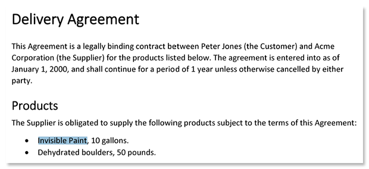

PDF (Portable Document Format) has become the de-facto standard for document storage and sharing in both personal and professional contexts. PDF documents can be viewed on virtually any computing platform, including Windows, macOS, Linux, and mobile operating systems like iOS and Android. This cross-platform compatibility ensures that PDFs can be easily shared and accessed by a wide range of users.

As a result, PDF has also become one of the most popular formats for scanning paper documents, especially due to its ability to combine multiple pages into a single file. This format is widely used for the exchange of contracts, invoices, legal documents, passports and ID cards, and many other documents between individuals, businesses, banks and government agencies.

However, any scanned PDF is essentially a collection of images, which leads to serious disadvantages, particularly in terms of accessibility and usability:

- Since the scanned PDFs do not contain machine-readable text, users cannot search, copy, or otherwise manipulate the document content.
- Scanned PDFs are not accessible to individuals with visual impairments who rely on screen readers or text-to-speech software.
- Scanned PDFs lack the metadata or structured information typically found in text documents. As such, they cannot be indexed or automatically classified, making them very difficult to organize into archives.
- Very large file sizes result in significantly increased storage space, slower document downloads, and increased traffic.

**Aspose.OCR for .NET** offers you a fast, easy and highly reliable way to convert any scanned PDF into a fully searchable and indexable document. It accurately recognizes page content, converting it into a machine-readable text layer that can be selected, copied, read by text-to-speech software, and even automatically processed by translators, summarizers, and other AI-powered analytics tools.

Moreover, you will not lose the original content. The original images are placed in the background, and the recognized text is placed as an invisible but searchable and selectable overlay on top of the images. This way, all notes, images, marks, signatures and other data remain in the document, allowing it to be used in digital archives.

In the example below, we will demonstrate how to digitize a signed contract sent to you as a scanned PDF. You will only need 24 lines of code (including comments) - see for yourself.

## Sample document

Use your own document or [download the sample delivery agreement](Delivery-Agreement.pdf).

## Preparation

1. Get a [trial license](/ocr/net/licensing/) to make sure that all text is recognized without limitations.
2. Create a new C# project in Visual Studio. You can use a very basic project template, such as **Console App**.
3. [Install](/ocr/net/installation/) **Aspose.OCR** (CPU-based) NuGet package to the project.
4. Save the scanned contract to **bin\\Debug** or **bin\\Debug\\net6.0** directory of the project under the name `Delivery-Agreement.pdf`.

## Coding

1. Declare `Aspose.OCR` namespace to improve the code readability:
   ```csharp
   using Aspose.OCR;
   ```
2. Apply a [license](/ocr/net/licensing/#applying-a-developer-or-site-license):
   ```csharp
   License license = new License();
   license.SetLicense("Aspose.OCR.lic");
   ```
3. [Load](/ocr/net/ocrinput/) the scanned PDF. You can also use a full path to the file.
   ```csharp
   OcrInput pdf = new OcrInput(InputType.PDF);
   pdf.Add("Delivery-Agreement.pdf");
   ```
4. [Recognize](/ocr/net/recognition/) the text from document:
   ```csharp
   AsposeOcr api = new AsposeOcr();
   OcrOutput result = api.Recognize(pdf);
   ```
5. Save the recognition result as a searchable PDF:
   ```csharp
   result.SavePdf("Readable-Contract.pdf");
   // Or the old approach
   AsposeOcr.SaveMultipageDocument("Readable-Contract.pdf", SaveFormat.Pdf, result);
   ```

### Full code

```csharp
using Aspose.OCR;

namespace ConvertScannedPDF
{
	internal class Program
	{
		static void Main(string[] args)
		{
			// Apply license
			License license = new License();
			license.SetLicense("Aspose.OCR.lic");
			// Load the scanned PDF
			OcrInput pdf = new OcrInput(InputType.PDF);
			pdf.Add("Delivery-Agreement.pdf");
			// Recognize the text from document
			AsposeOcr api = new AsposeOcr();
			List<RecognitionResult> result = api.Recognize(pdf);
			// Save searchable PDF
			result.SavePdf("Readable-Contract.pdf");
			// Report progress
			Console.WriteLine($@"Recognition finished. See '{Directory.GetCurrentDirectory()}\Readable-Contract.pdf'.");
		}
	}
}
```

## Running

Run the program directly from the Visual Studio or build it and execute the file from the command line. Wait a few seconds, depending on your system performance.

A [`Readable-Contract.pdf`](Readable-Contract.pdf) file will be created in the program working directory. As you see, you can select the text in the file, search it, and even read the text aloud.



## Learn more

- Select the recognition language, improve recognition accuracy, and configure other [recognition settings](/ocr/net/recognition-settings-common/).
- [Enhance](/ocr/net/image-processing/) page images before the scanned PDF is sent to the OCR.
- Get recognition results as [text](/ocr/net/save-text/).
- [Do not save the original images](/ocr/net/save-searchable-pdf/) in the searchable PDF. The resulting file will take up much less space.
- [Track](/ocr/net/track-progress/) recognition progress.
