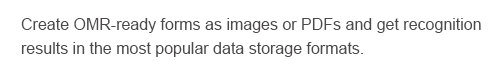
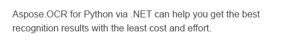

<style>
	.sample {
		display: block;
		margn-bottom: 10px;
		box-shadow: 0 3px 10px rgb(0 0 0 / 0.2);
	}
</style>

Digital archives, especially in large organizations, often consist of a vast collection of scans and photos, many of which may contain multi-page documents. Efficient management and organization of such archives effectively is essential for easy information retrieval and navigation:

- Organize your digital archive with a well-thought-out folder structure. Group related documents into subfolders based on their content.
- Establish a consistent file naming convention for your scans and photos. Include relevant details such as date, title, and document number to make it easier to identify and search for files.
- Add metadata to provide additional information about each file, such as document type, clauses, terms, and other keywords.

However, images do not contain machine-readable text, making it impossible to search and analyze document content.

**Aspose.OCR for .NET** allows you to easily search for text in images, regardless of the font, text size, style, and other parameters. The library also supports case-insensitive searches and regular expressions, which be extremely useful in various applications and industries.

This functionality can be used for categorizing documents based on the content, keywords, or patterns found in the text; searching for specific terms or clauses within agreements and contracts; reorganizing files based on keywords or content found within them; locate and identify personal data within documents, making it easier to ensure GDPR compliance and manage sensitive information more effectively. Searching withing images also allows for creating automated workflows and streamline various business processes upon receiving signed contracts and invoices.

Finding a word among all the images in a folder requires only 23 lines of code (including comments) - see for yourself.

## Sample images

Use your own scans or photos or download the sample images below:





## Preparation

1. Get a [trial license](/ocr/net/licensing/) to make sure that all text is recognized without limitations.
2. Create a new C# project in Visual Studio. You can use a very basic project template, such as **Console App**.
3. [Install](/ocr/net/installation/) **Aspose.OCR** (CPU-based) NuGet package to the project.
4. Create a folder named "_images_" under **bin\\Debug** or **bin\\Debug\\net6.0** directory of the project.
5. Save the downloaded images to "_images_" folder.

## Coding

1. Declare `Aspose.OCR` namespace to improve the code readability:
   ```csharp
   using Aspose.OCR;
   ```
2. Specify the folder with images (absolute or relative path):
   ```csharp
   string sourceFolder = "images";
   ```
3. Specify the string to search for:
   ```csharp
   string searchFor = "OCR";
   ```

4. Apply a [license](/ocr/net/licensing/#applying-a-developer-or-site-license):
   ```csharp
   License license = new License();
   license.SetLicense("Aspose.OCR.lic");
   ```
5. Iterate through images and search for text:
   ```csharp
   AsposeOcr api = new AsposeOcr();
   foreach(var image in Directory.GetFiles(sourceFolder,"*.png"))
   {
   	bool found = api.ImageHasText(image, searchFor);
   	if(found) Console.WriteLine($@"Found ""{searchFor}"" in image ""{image}""");
   }
   ```

### Full code

```csharp
using Aspose.OCR;

namespace SearchText
{
	internal class Program
	{
		static void Main(string[] args)
		{
			string sourceFolder = "images";
			string searchFor = "OCR";
			// Apply license
			License license = new License();
			license.SetLicense("Aspose.OCR.lic");
			// Search for text in images
			AsposeOcr api = new AsposeOcr();
			foreach(var image in Directory.GetFiles(sourceFolder,"*.png"))
			{
				bool found = api.ImageHasText(image, searchFor);
				if(found) Console.WriteLine($@"Found ""{searchFor}"" in image ""{image}""");
			}
		}
	}
}
```

## Running

Run the program directly from the Visual Studio or build it and execute the file from the command line. Wait a few seconds, depending on your system performance.

You should see the following results in the console output:

```
Found "OCR" in image "images\image1.png"
Found "OCR" in image "images\image3.png"
```

The program will only search for text. It will ignore font, text size, color, style, background and other non-textual differences.

## Learn more

- Select the [recognition language](/ocr/net/languages/).
- [Improve recognition accuracy](/ocr/net/recognition-settings-common/).
- [Compare texts](/ocr/net/image-text-compare/) on two images, regardless of the font, text size, case, styles, and colors.
