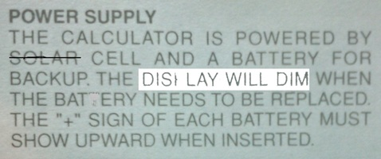

<style>
	button {
		cursor: pointer;
		margin-right: 20px;
		margin-bottom: 20px;
		padding: 7px 15px;
		border: none;
		border-radius: 5px;
		background-color: #1a89d0;
		font-weight: 700;
		font-size: 15px;
		color: #ffffff;
	}

	button:hover {
		background-color: #3071a9;
	}

	button:focus {
		outline: none;
	}

	.duo {
		display: flex;
		flex-direction: row;
		align-items: stretch;
		margin-bottom: 20px;
	}

	.duo > * {
		margin-bottom: 0 !important;
	}

	.duo > pre {
		display: none;
		margin-left: 15px;
		min-width: 300px;
	}
	
</style>

The `AsposeAI` class integrates external AI models (e.g., from Hugging Face) into OCR recognition results for **spell-check correction** and intelligent postprocessing.

## Constructor

```python
aspose.ocr.ai.AsposeAI()
aspose.ocr.ai.AsposeAI(logging)
```

You can also pass optional logging and customization callbacks.

### 🔤 SpellCheckAIProcessor Class – Postprocessor Module

- Implements: `IOcrAIPostProcessor`
- Description: A built-in module that performs AI-powered spell-check correction.
- Usage: Register using `aspose.ocr.ai.set_post_processor(processor, custom_settings)`

## 🔗 API References

- [`AsposeAI`](https://reference.aspose.com/ocr/python-net/aspose.ocr.ai/asposeai/)  
  Core class to load, configure, and apply AI models (e.g., for spell correction) to OCR results.

- [`SpellCheckAIProcessor`](https://reference.aspose.com/ocr/python-net/aspose.ocr.ai/spellcheckaiprocessor/)  
  Built-in AI postprocessor that uses a language model to fix spelling mistakes in recognized text.


```python 
   	modelConfig = new AsposeAIModelConfig()
	modelConfig.allow_auto_download = True
    modelConfig.directory_model_path = "D://test"

   ai = new AsposeAI(True)
   processor = new SpellCheckAIProcessor()
   ai.set_post_processor(processor, modelConfig)
   ai.run_postprocessor(res)

   print("CORRECTED RESULT\n");
   print(processor.get_result()[0].recognition_text)
   ai.free_resources()
```

## Live demo

<div class="duo">

<pre class="rec-result">
 POWER SUPPLY
 THE CALCULATOR IS POWERED BY
 SOLAR CELL AND A BATTERY FOR
 BACKUP.THE DIS LAY WILL DIM WHEN
 THE BATERY NEEDSTO BEREPLACED
 THE"+"SIGN OF EACH BATTERY MUST
 SHOW UPWARD WHEN INSERTEDI
</pre>
<pre class="ai-result">
 POWER SUPPLY
THE CALCULATOR IS POWERED BY
SOLAR CELL AND A BATTERY FOR
BACKUP THE DISPLAY WILL DIM WHEN
THE BATTERY NEEDS TO BE REPLACED
THE"+"SIGN OF EACH BATTERY MUST
SHOW UPRIGHT WHEN INSERTED
</pre>
</div>

<button onclick="$('.rec-result').slideDown(100); $('.ai-result').slideUp(100);">Extract text</button>
<button onclick="$('.ai-result').slideDown(100)">AI spell-check</button>

### 🐞 Logging & error handling
Pass `True` to constructor to track loading and inference.
