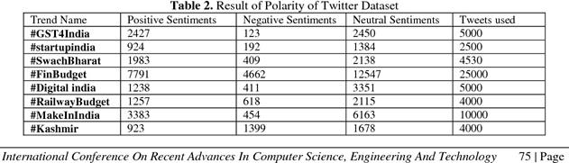

<style>
	button {
		cursor: pointer;
		margin-right: 20px;
		margin-bottom: 20px;
		padding: 7px 15px;
		border: none;
		border-radius: 5px;
		background-color: #1a89d0;
		font-weight: 700;
		font-size: 15px;
		color: #ffffff;
	}

	button:hover {
		background-color: #3071a9;
	}

	button:focus {
		outline: none;
	}

	.duo {
		display: flex;
		flex-direction: row;
		align-items: stretch;
		margin-bottom: 20px;
	}

	.duo > * {
		margin-bottom: 0 !important;
	}

	.duo > pre {
		display: none;
		margin-left: 15px;
		min-width: 300px;
	}
	
</style>

The `AsposeAI` class integrates external AI models (e.g., from Hugging Face) into OCR recognition results for **table layout correction** and intelligent postprocessing.

## Constructor

```python
aspose.ocr.ai.AsposeAI()
aspose.ocr.ai.AsposeAI(logging)
```

You can also pass optional logging and customization callbacks.

### 🔤 TableAIProcessor Class – Postprocessor Module

- Implements: `IOcrAIPostProcessor`
- Description: A built-in module that performs AI-powered table detection and layout correction.
- Usage: Register using `aspose.ocr.ai.set_post_processor(processor, custom_settings)`

## 🔗 API References

- [`AsposeAI`](https://reference.aspose.com/ocr/python-net/aspose.ocr.ai/asposeai/)  
  Core class to load, configure, and apply AI models (e.g., for table correction) to OCR results.

- [`TableAIProcessor`](https://reference.aspose.com/ocr/python-net/aspose.ocr.ai/tableaiprocessor/)  
  Built-in AI postprocessor that uses a language model to improve table layout detection and formatting.


```python
 modelConfig = new AsposeAIModelConfig()
	modelConfig.allow_auto_download = True
    modelConfig.directory_model_path = "D://test"

   ai = new AsposeAI(True)
   processor = new TableAIProcessor(AITableDetectionMode.AUTO)
   ai.set_post_processor(processor, modelConfig)
   ai.run_postprocessor(res)

   print("CORRECTED RESULT\n");
   print(processor.get_result()[0].recognition_text)
   ai.free_resources()
```

## Live demo

<div class="duo">

<pre class="rec-result">
Table 2. Result of Polarity of Twitter Dataset
Trend Name Positive Sentiments Negative Sentiments Neutral Sentiments Tweets used
#GST4India 2427 123 2450 5000
#startupindia 924 192 1384 2500
#SwachBharat 1983 409 2138 4530
#FinBudget 7791 4662 12547 25000
#Digital india 1238 411 3351 5000
#RailwayBudget 1257 618 2115 4000
#MakeInIndia 3383 454 6163 10000
#Kashmir 923 1399 1678 4000
International Conference On Recent Advances In Computer Science, Engineering And Technology 75|Page
</pre>
<pre class="ai-result">
| Trend Name | Positive Sentiments | Negative Sentiments | Neutral Sentiments | Tweets used |
| --- | --- | --- | --- | --- |
| #GST4India | 2427 | 123 | 2450 | 5000 |
| #startupindia | 924 | 192 | 1384 | 2500 |
| #SwachBharat | 1983 | 409 | 2138 | 4530 |
| #FinBudget | 7791 | 4662 | 12547 | 25000 |
| #Digital india | 1238 | 411 | 3351 | 5000 |
| #RailwayBudget | 1257 | 618 | 2115 | 4000 |
| #MakeInIndia | 3383 | 454 | 6163 | 10000 |
| #Kashmir | 923 | 1399 | 1678 | 4000 |
</pre>
</div>

<button onclick="$('.rec-result').slideDown(100); $('.ai-result').slideUp(100);">Extract text</button>
<button onclick="$('.ai-result').slideDown(100)">AI table extract</button>

### 🐞 Logging & error handling
Pass `True` to constructor to track loading and inference.
