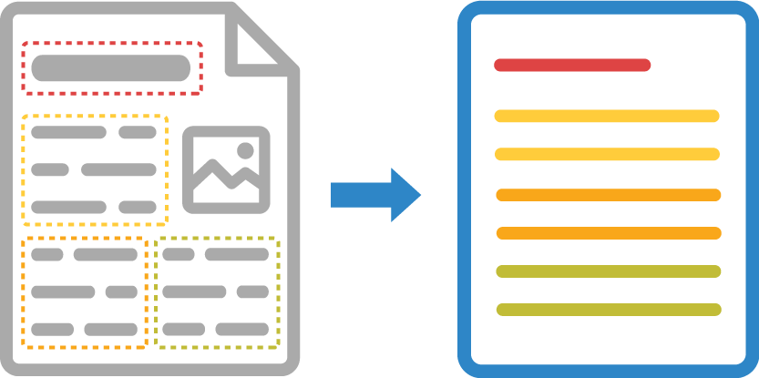

A scanned image or photograph of a text document may contain a large number of blocks of various content - text paragraphs, tables, illustrations, formulas, and the like. Detecting, ordering, and classifying areas of interest on a page is the cornerstone of successful and accurate OCR. This process is called _document areas detection_.



Aspose.OCR for Python via .NET offers several document areas detection algorithms, allowing you to choose the one that works best for your specific content.

## Area detection modes

You can manually override the default document areas detection method if you are unhappy with the results or get unwanted artifacts.

Document structure analysis algorithm is specified in an optional `detect_areas_mode` parameter of recognition settings.

```python
# Instantiate Aspose.OCR API
api = AsposeOcr()
# Add image to the recognition batch
input = OcrInput(InputType.SINGLE_IMAGE)
input.add("source.png")
# Set document areas detection mode
recognitionSettings = RecognitionSettings()
recognitionSettings.detect_areas_mode = DetectAreasMode.DOCUMENT
# Recognize the image
result = api.recognize(input, recognitionSettings)
# Print recognition result
print(result[0].recognition_text)
input("Press Enter to continue...")
```

Aspose.OCR for Python via .NET supports the following document structure analysis methods provided in `DetectAreasMode` enumeration:

Name              | Value | Description | Use cases
----------------- | :---: | ----------- | ---------
`DetectAreasMode.NONE` | 0 | Do not analyze document structure. | Simple images containing a few lines of text without illustrations or formatting.<br />Applications requiring maximum recognition speed<br />Web applications
`DetectAreasMode.DOCUMENT` | 1 | Detect large blocks of text, such as paragraphs and columns. Optimal for multi-column documents with illustrations.<br />See [**DetectAreasMode.DOCUMENT**](/ocr/python-net/areas-detection/document/) for additional details. | Contracts<br />Books<br />Articles<br />Newspapers<br />High-quality scans
`DetectAreasMode.PHOTO` | 2 | Finds small text blocks inside complex images.<br />See [**DetectAreasMode.PHOTO**](/ocr/python-net/areas-detection/photo/) for additional details. | Driver’s licenses<br />Social security cards<br />Government and work IDs<br />Visas<br />Photos<br />Screenshots<br />Advertisements
`DetectAreasMode.COMBINE` | 3 | The combination of _DetectAreasMode.DOCUMENT_ and _DetectAreasMode.PHOTO_.<br />See [**DetectAreasMode.COMBINE**](/ocr/python-net/areas-detection/combine/) for additional details. | Posters<br />Billboards<br />Datasheets<br />Random photos<br />Batch recognition
`DetectAreasMode.TABLE` | 4 | Detects cells in tabular structures.<br />See [**DetectAreasMode.TABLE**](/ocr/python-net/areas-detection/table/) for additional details. | Tables<br />Invoices
`DetectAreasMode.CURVED_TEXT` | 5 | Auto-straightens curved lines and finds text blocks inside the resulting image.<br />See [**DetectAreasMode.CURVED_TEXT**](/ocr/python-net/areas-detection/curved_text/) for additional details. | Photos of books, magazine articles, and other curved pages.
`DetectAreasMode.TEXT_IN_WILD` | 6 | Finds individual words on images with sparse text and colored backgrounds.<br />See [**DetectAreasMode.TEXT_IN_WILD**](/ocr/python-net/areas-detection/text-in-wild/) for additional details. | Street photos<br />Price tags<br />Food labels<br />Menus<br />Catalogs<br />Ads
