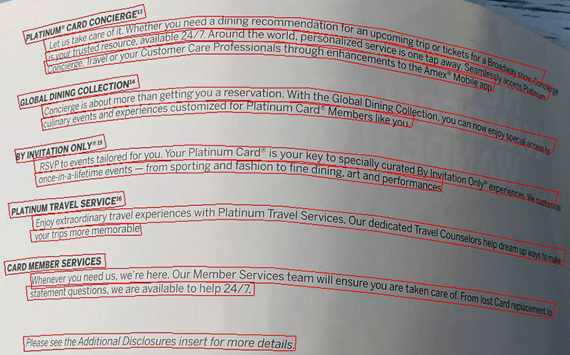

{} 
To use this structure detection algorithm, [install](/ocr/python-net/modules/) advanced OCR models (**aspose-ocr-advanced-recognition-v1**) in your project.
{}

When photographing pages of books and magazine articles, the cylindrical curvature of the page results in distortion of the image, causing the lines of text to curl. This 3D geometric distortion negatively affects recognition.

**DetectAreasMode.CURVED_TEXT** areas detection mode uses a specialized neural network that automatically tracks and rectifies curved lines of text. This greatly improves recognition accuracy and allows much more text to be recovered and extracted.



However, this algorithm is less efficient and consumes more resources when dealing with perfectly straight images, such as a single scanned sheet of paper. Try [**DetectAreasMode.DOCUMENT**](/ocr/python-net/areas-detection/document/) or [**DetectAreasMode.PHOTO**](/ocr/python-net/areas-detection/photo/) instead.

## Example

The following code sample demonstrates how to use this document areas detection algorithm:

```python
# Instantiate Aspose.OCR API
api = AsposeOcr()
# Add image to the recognition batch
input = OcrInput(InputType.SINGLE_IMAGE)
input.add("source.png")
# Set document areas detection mode
recognitionSettings = RecognitionSettings()
recognitionSettings.detect_areas_mode = DetectAreasMode.CURVED_TEXT
# Recognize the image
result = api.recognize(input, recognitionSettings)
# Print recognition result
print(result[0].recognition_text)
input("Press Enter to continue...")
```
