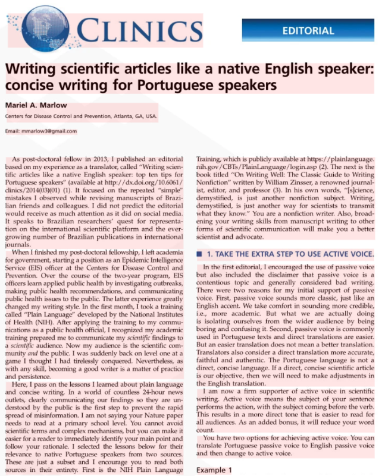

This algorithm works best with large amounts of structured text such as scanned contracts, book pages, articles, newspapers, and the like. It breaks content into larger blocks, such as paragraphs and columns. These blocks are then analyzed, read and combined into recognition results.



_\*The example article is Copyright &copy; 2016 CLINICS, distributed under the terms of the Creative Commons license._

However, it may not be suitable for analyzing photographs and small amounts of irregular text - try [**DetectAreasMode.PHOTO**](/ocr/python-net/areas-detection/photo/) instead.

## Example

The following code sample demonstrates how to use this document areas detection algorithm in Aspose.OCR for Python via .NET:

```python
# Instantiate Aspose.OCR API
api = AsposeOcr()
# Add image to the recognition batch
input = OcrInput(InputType.SINGLE_IMAGE)
input.add("source.png")
# Set document areas detection mode
recognitionSettings = RecognitionSettings()
recognitionSettings.detect_areas_mode = DetectAreasMode.DOCUMENT
# Recognize the image
result = api.recognize(input, recognitionSettings)
# Print recognition result
print(result[0].recognition_text)
input("Press Enter to continue...")
```
