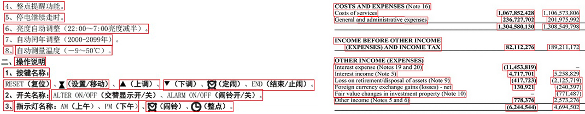

This algorithm works best with sparse irregular text, including street photos and screenshots. It detects smaller text areas in an image, such as individual words, phrases, or lines, and then positions them relative to each other in recognition results.



It is optimal for photos (including street photos), screenshots, driver's licenses, social security cards, government and work IDs, visas, math formulas, code snippets, price tags, and much more. It can also detect small texts such as notes, signatures or stamps. In addition, it is well suited for reading smartphone photos and low-quality scans. In general, it is a versatile option for most images.

However, this algorithm is inefficient when dealing with multi-column layouts and tables. Try [**DetectAreasMode.MULTICOLUMN**](/ocr/python-net/areas-detection/multicolumn/) or [**DetectAreasMode.TABLE**](/ocr/python-net/areas-detection/table/) instead.

## Example

The following code sample demonstrates how to use this content areas detection algorithm:

```python
# Instantiate Aspose.OCR API
api = AsposeOcr()
# Add image to the recognition batch
input = OcrInput(InputType.SINGLE_IMAGE)
input.add("source.png")
# Set document areas detection mode
recognitionSettings = RecognitionSettings()
recognitionSettings.detect_areas_mode = DetectAreasMode.UNIVERSAL
# Recognize the image
result = api.recognize(input, recognitionSettings)
# Print recognition result
print(result[0].recognition_text)
input("Press Enter to continue...")
```
