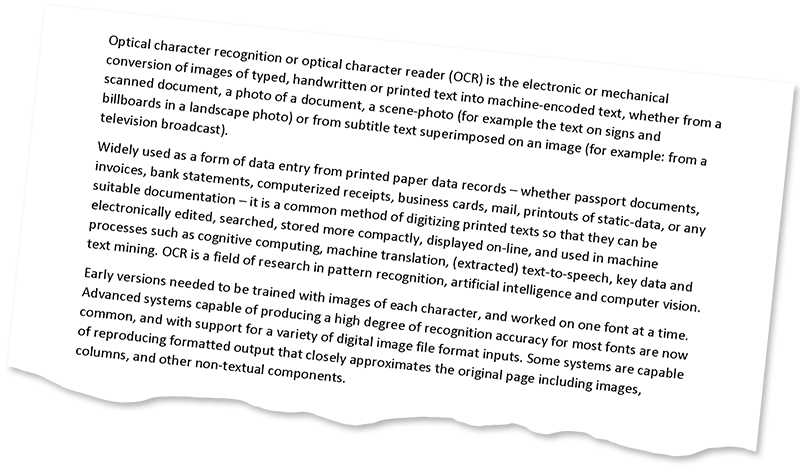

<style>
	button {
		cursor: pointer;
		margin-right: 20px;
		padding: 7px 15px;
		border: none;
		border-radius: 5px;
		background-color: #1a89d0;
		font-weight: 700;
		font-size: 15px;
		color: #ffffff;
	}

	button:hover {
		background-color: #3071a9;
	}

	button:focus {
		outline: none;
	}

	.code-sample {
		display: flex;
	}

	.code-sample > div {
		display: flex;
		align-items: center;
		padding: 5px 10px;
		border-radius: 5px;
		white-space: nowrap;
		background-color: rgba(0,0,0,5%);
		font-size: 16px;
		font-weight: 700;
	}

	.unseen {
		display: none !important;
	}

	.duo {
		position: relative;
		width: 800px;
		height: 474px;
	}

	.duo > img {
		position: absolute;
	}
</style>

When a page is fed to a flatbed scanner (mechanically or manually) or photographed with a smartphone, it is nearly impossible to achieve perfect alignment. As a result, a slight skew (tilt) inevitably occurs in scanned images or photographs.

Skew angle detection and image straightening is critical to the OCR process as it directly affects the reliability and efficiency of segmentation and text extraction. Aspose.OCR offers automated processing algorithms to correct image tilt (deskew) before proceeding to recognition.

## Detecting skew angles

To find out skew angles for all images in a [batch](/ocr/python-net/ocrinput/), use `calculate_skew()` method. It returns a list of [`SkewOutput`](https://reference.aspose.com/ocr/python-net/aspose.ocr/skewoutput/) objects, one per image.

Property | Type | Description
-------- | ---- | -----------
`angle` | `float` | Skew angle in degrees.
`image_index` | `int` | Sequence number of the image on the page. When working with single-page images, this value is always 0.
`page` | `int` | Page number. When working with single-page images, this value is always 0.
`source` | `string` | The full path or URL of the source file. If the file is provided as a stream, an array of pixels, or a Base64 string, this value will be empty.

{}
- Skew angles are calculated for all images in the batch, including those without text.
- PDF documents can contain more than one image per page. Therefore, the resulting list can contain more `SkewOutput` objects than the number of pages in the document.
{}

```python
# Instantiate Aspose.OCR API
api = AsposeOcr()
# Add image to the recognition batch
input = OcrInput(InputType.SINGLE_IMAGE)
input.add("source.png")
# Detect skew angle
angles = api.calculate_skew(input);
for angle in angles:
    print("File: " + angle.source + " | Angle: " + angle.angle + "°")
```



<div id="skew-angle" class="code-sample">
	<button onclick="calculateSkewAngle(this)">Calculate skew angle</button>
	<div class="unseen"><code>&gt; File: "C:\source.png" | Angle: 5.9°</code></div>
</div>
<script>
	function calculateSkewAngle(obj)
	{
		$(obj).siblings("div").removeClass("unseen");
	}
</script>

## Automatic skew correction

To automatically straighten skewed image before recognition, run the image through `auto_skew` processing filter.

```python
# Instantiate Aspose.OCR API
api = AsposeOcr()
# Initialize image processing
filters = PreprocessingFilter()
filters.add(PreprocessingFilter.auto_skew())
# Add image to the recognition batch and apply processing filter
input = OcrInput(InputType.SINGLE_IMAGE, filters)
input.add("source.png")
# Save processed image to the "result" folder
ImageProcessing.save(input, "result")
# Recognize the image
result = api.recognize(input)
# Print recognition result
print(result[0].recognition_text)
```

<div class="duo">
	
	
</div>
<button onclick="triggerSkew(this)">Deskew image</button>
<script>
	function triggerSkew(obj)
	{
		let images = $(".duo > img");
		let skewed = images.eq(0).is(":visible");
		if(skewed)
		{
			images.eq(1).show(200);
			images.eq(0).hide(200);
			$(obj).text("Revert to original image");
		}
		else
		{
			images.eq(0).show(200);
			images.eq(1).hide(200);
			$(obj).text("Deskew image");
		}
	}
</script>

## Manual skew correction

In some edge cases, automatic skew correction may not detect the angle of the image. This can happen with poor quality photographs with significant perspective distortion.

To deal with such situations, you can rotate the image by the specified degree using `rotate` image processing filter. The rotation angle is passed in degrees:

- `-360` to `0`: rotate counterclockwise;
- `0` to `360`: rotate clockwise.

```python
# Instantiate Aspose.OCR API
api = AsposeOcr()
# Initialize image processing
filters = PreprocessingFilter()
filters.add(PreprocessingFilter.rotate(-90))
# Add image to the recognition batch and apply processing filter
input = OcrInput(InputType.SINGLE_IMAGE, filters)
input.add("source.png")
# Save processed image to the "result" folder
ImageProcessing.save(input, "result")
# Recognize the image
result = api.recognize(input)
# Print recognition result
print(result[0].recognition_text)
```

## Usage scenarios

- Automatic skew correction is recommended in almost all cases, except for perfectly straight scans.
- Manual rotation is recommended for:
    - photos of low quality;
    - images with a significant angle of inclination.
