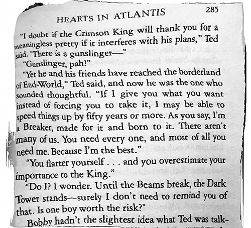

<style>
	button {
		cursor: pointer;
		margin-right: 20px;
		padding: 7px 15px;
		border: none;
		border-radius: 5px;
		background-color: #1a89d0;
		font-weight: 700;
		font-size: 15px;
		color: #ffffff;
	}

	button:hover {
		background-color: #3071a9;
	}

	button:focus {
		outline: none;
	}

	.duo {
		position: relative;
		width: 500px;
		height: 454px;
		margin-bottom: 20px;
	}

	.duo > img {
		position: absolute;
	}
</style>

Geometric distortions is a very common case when dealing with photos of books, magazines, multi-page documents, and similar content. They can be caused by physical page curvature or camera lens distortion (ultra-wide and fisheye lenses, as well as entry-level smartphone lenses).

Warped images are very hard to be processed by most OCR algorithms. Thus, image straightening and distortion removal is critical to the recognition process as it directly affects the reliability and efficiency of segmentation and text extraction. Aspose.OCR for Python via .NET implements a processing filter for automated correction of geometric distortions before proceeding to recognition.

{}
The dewarping filter automatically converts the image to [grayscale](/ocr/python-net/grayscale/).
{}

## Important considerations

{}
Due to the high complexity of the underlying neural network, dewarping requires a lot of resources and time. We recommend using it for pinpoint processing of individual images that are otherwise unrecognizable.

This processing filter is not recommended for high load web applications that recognize images close to real time.
{}

- Dewarping one image may take **up to 45 seconds**.
- Dewarping is very resource-intensive (CPU and RAM).
- After removing the image curvature, text lines will have some wave-like distortion. Thus, it is highly recommended to use [`DetectAreasMode.CURVED_TEXT`](/ocr/python-net/areas-detection/curved_text/) areas detection mode to extract text from the dewarped image. Other area detection modes may produce inaccurate results.
- Dewarping also corrects image tilt. We recommend disabling [automatic skew correction](/ocr/python-net/deskew/) - it will have no effect and may even result in severe image distortion.

## Dewarping

To straighten the curved image, run it through `auto_dewarping` processing filter.

```python
# Instantiate Aspose.OCR API
api = AsposeOcr()
# Initialize image processing
filters = PreprocessingFilter()
filters.add(PreprocessingFilter.auto_dewarping())
# Add image to the recognition batch and apply processing filter
input = OcrInput(InputType.SINGLE_IMAGE, filters)
input.add("source.png")
# Save processed image to the "result" folder
ImageProcessing.save(input, "result")
# Recognize the image
result = api.recognize(input)
# Print recognition result
print(result[0].recognition_text)
```

<div class="duo">
	
	
</div>
<button onclick="triggerSkew(this)">Dewarp image</button>
<script>
	function triggerSkew(obj)
	{
		let images = $(".duo > img");
		let skewed = images.eq(0).is(":visible");
		if(skewed)
		{
			images.eq(1).show(200);
			images.eq(0).hide(200);
			$(obj).text("Revert to original image");
		}
		else
		{
			images.eq(0).show(200);
			images.eq(1).hide(200);
			$(obj).text("Dewarp image");
		}
	}
</script>

## Usage scenarios

Automatic dewarping is recommended for:

- Photos of book pages, magazines.
- Curved paper.
- Ultra wide-angle and fisheye photos.
