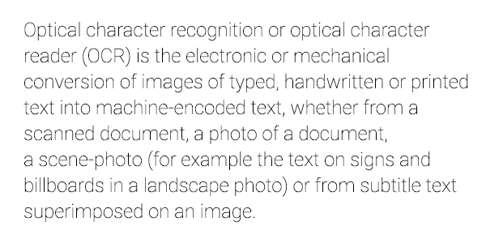

<style>
	button {
		cursor: pointer;
		margin-right: 20px;
		padding: 7px 15px;
		border: none;
		border-radius: 5px;
		background-color: #1a89d0;
		font-weight: 700;
		font-size: 15px;
		color: #ffffff;
	}

	button:hover {
		background-color: #3071a9;
	}

	button:focus {
		outline: none;
	}

	.duo {
		position: relative;
		width: 600px;
		height: 300px;
		margin-bottom: 20px;
	}

	.duo > img {
		position: absolute;
	}
</style>

Some images, such as store receipts, have very thin characters that may be damaged by [automatic contrast corrections](/ocr/python-net/contrast/) or [binarization](/ocr/python-net/binarization/). 

Aspose.OCR for Python via .NET provides a special processing filter called _dilation_ that can increase the thickness of characters in an image by adding pixels to the edges of high-contrast objects, such as letters.

{} 
Dilation automatically converts the image to [black and white](/ocr/python-net/binarization/#automatically-converting-the-image-to-black-and-white).
{}

## Dilation

To increase the thickness of characters in an image, run the image through `dilate` processing filter.

```python
# Instantiate Aspose.OCR API
api = AsposeOcr()
# Initialize image processing
filters = PreprocessingFilter()
filters.add(PreprocessingFilter.dilate())
# Add image to the recognition batch and apply processing filter
input = OcrInput(InputType.SINGLE_IMAGE, filters)
input.add("source.png")
# Save processed image to the "result" folder
ImageProcessing.save(input, "result")
# Recognize the image
result = api.recognize(input)
# Print recognition result
print(result[0].recognition_text)
```

<div class="duo">
	
	
</div>
<button onclick="triggerSkew(this)">Make text thicker</button>
<script>
	function triggerSkew(obj)
	{
		let images = $(".duo > img");
		let skewed = images.eq(0).is(":visible");
		if(skewed)
		{
			images.eq(1).show(200);
			images.eq(0).hide(200);
			$(obj).text("Revert to original image");
		}
		else
		{
			images.eq(0).show(200);
			images.eq(1).hide(200);
			$(obj).text("Make text thicker");
		}
	}
</script>

## Usage scenarios

Dilation is recommended for the following images:

- Receipts.
- Printouts with very thin font.
