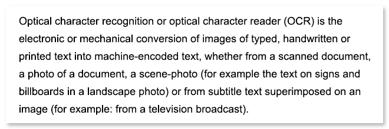

<style>
	button {
		cursor: pointer;
		margin-right: 20px;
		padding: 7px 15px;
		border: none;
		border-radius: 5px;
		background-color: #1a89d0;
		font-weight: 700;
		font-size: 15px;
		color: #ffffff;
	}

	button:hover {
		background-color: #3071a9;
	}

	button:focus {
		outline: none;
	}

	#sample {
		position: relative;
	}

	#sample > div {
		position: absolute;
		display: none;
		border: dashed 1px #de4444;
		background-color: rgba(222,68,68,0.2);
	}

	#results {
		display: none;
		max-width: 50%;
	}
</style>

Aspose.OCR for Python via .NET returns coordinates of each extracted line in recognition results. This can be useful for highlighting detected lines when previewing an image.

The lines are returned as a list of [`Rectangle`](https://reference.aspose.com/ocr/python-net/aspose.ocr/rectangle/) objects in `recognition_lines_result` property of [recognition result](https://reference.aspose.com/ocr/python-net/aspose.ocr/recognitionresult/) object.

```python
# Instantiate Aspose.OCR API
api = AsposeOcr()
# Add image to the recognition batch
input = OcrInput(InputType.SINGLE_IMAGE)
input.add("source.png")
# Detect lines
results = api.recognize_characters(source, DetectAreasMode.COMBINE)
lines = results[0].recognition_lines_result
```

## Live demo

<div id="sample">
	
	<div style="top:30px;left:32px;width:548px;height:17px;"></div>
	<div style="top:58px;left:32px;width:562px;height:19px;"></div>
	<div style="top:88px;left:32px;width:592px;height:15px;"></div>
	<div style="top:118px;left:32px;width:578px;height:19px;"></div>
	<div style="top:148px;left:32px;width:579px;height:19px;"></div>
	<div style="top:178px;left:32px;width:389px;height:19px;"></div>
</div>

<button onclick="extract(this)">Detect lines</button>

<script>
	function extract(obj)
	{
		$("#sample > div").show(200);
	}
</script>
