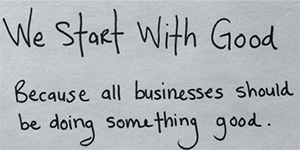

<style>
	button {
		cursor: pointer;
		margin-right: 20px;
		margin-bottom: 20px;
		padding: 7px 15px;
		border: none;
		border-radius: 5px;
		background-color: #1a89d0;
		font-weight: 700;
		font-size: 15px;
		color: #ffffff;
	}

	button:hover {
		background-color: #3071a9;
	}

	button:focus {
		outline: none;
	}

	.duo {
		display: flex;
		flex-direction: row;
		align-items: stretch;
		margin-bottom: 20px;
	}

	.duo > * {
		margin-bottom: 0 !important;
	}

	.duo > pre {
		display: none;
		margin-left: 15px;
		min-width: 300px;
	}
</style>

{} 
To use this method, [install](/ocr/python-net/installation/) handwriting recognition model in your project.
{}

Aspose.OCR offers a special recognition algorithm for extracting handwritten text from images. It supports a number of European languages based on [Extended Lain alphabet](/ocr/python-net/recognition-languages/#supported-handwritten-characters). Handwritten recognition has various business, government and personal applications:

- Extract text from notes, memos and letters.
- Convert historical records and documents into digital formats for archival purposes.
- Parse resumes and employee records.
- Analyze information from handwritten inventory lists to maintain accurate and up-to-date databases.
- Analyze customer feedback and reviews to gain insights into customer preferences.
- And many more.

To extract handwritten text from images, use `recognize_handwritten_text()` method of [`AsposeOcr`](https://reference.aspose.com/ocr/python-net/aspose.ocr/asposeocr/) class.

The method takes [`OcrInput` object](/ocr/python-net/ocrinput/) and returns a [`RecognitionResult`](https://reference.aspose.com/ocr/python-net/aspose.ocr/recognitionresult/) object containing the text from images.

```python
import aspose.ocr as ocr
# Initialize an instance of Aspose.OCR API
api = ocr.AsposeOcr()
# Add image to the recognition batch
input = ocr.OcrInput(ocr.InputType.SINGLE_IMAGE)
input.add("memo.jpg")
# Extract and show text
results = api.recognize_handwritten_text(input)
print(results[0].recognition_text)
```

## Live demo

<div class="duo">
	
	<pre class="rec-result">
WE STARF WITH GOOD
BECAUSE ALL BUSINESSES SHOULD
BE DOING SOMETHING GOOD
	</pre>
</div>
<button onclick="$('.duo > pre').slideDown(100)">Extract text</button>

## Limitations

- The method only supports a [limited subset](/ocr/python-net/recognition-languages/#supported-handwritten-characters) of Extended Latin letters and numbers.
- Both uppercase and lowercase letters are recognized. However, the resulting text will be in uppercase.
- This method does not support recognition settings. The recognition language is detected automatically.
